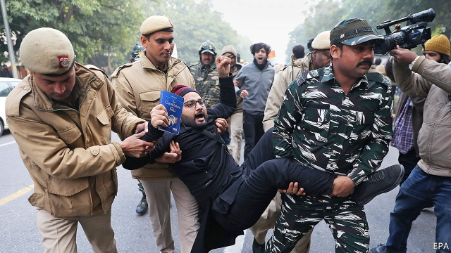

###### Papers, please

# Protests against India’s anti-Muslim citizenship law have turned bloody 

 

> print-edition iconPrint edition | Asia | Jan 4th 2020 

SINCE INDIA’S enacting of new citizenship rules on December 12th, widespread protests against them have left 27 dead, scores injured and tempers high. The prime minister, Narendra Modi, says he wants to make it easier for refugees to naturalise as Indians—unless they are Muslims. His government also plans to conduct a nationwide tally of citizens to hound out foreign “infiltrators”. Hindus and devotees of other named faiths who cannot prove they are citizens will probably be able to naturalise quickly. Muslims without the right papers—a common problem in rural areas—may not be so lucky. Mr Modi used his crushing parliamentary majority to pass the law, but the fury against it from across the political spectrum marks the strongest challenge to his Hindu-nationalist party since it won power in 2014. All eyes turn now to the Supreme Court, expected to rule later this month on whether the law is constitutional. 

