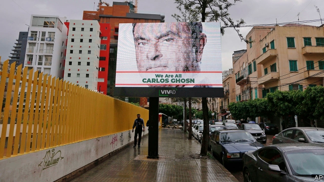

###### Ghosn, going, gone

# The flight of a car-industry megastar shocks Japan 

 

> print-edition iconPrint edition | Asia | Jan 4th 2020 

CARLOS GHOSN, a former chairman of Nissan and Renault, would ring in the new year at his luxurious home in Tokyo. Or so Japanese prosecutors thought until two days before the start of the 2020s. News that Mr Ghosn, 65, had other plans came from an unexpected source: a report by the Associated Press quoting Ricardo Karam, a Lebanese television host and friend of Mr Ghosn. He said the megastar executive had skipped bail and fled to Lebanon. In a statement released a day later through a spokeswoman, Mr Ghosn insisted: “I have not fled justice—I have escaped injustice and political persecution.” 

His dramatic escape has raised big questions for Japan. How did he do it, despite constant surveillance of his movements? And is there any truth to his claims that the charges against him were politically motivated? Before his arrest in Tokyo in November 2018, Mr Ghosn had been rumoured to be working on a merger between Renault, a French carmaker, and its partner Nissan, a Japanese company. This would have offended many in the Japanese establishment, as it would have looked like a foreign takeover of a Japanese industrial icon. 

How Mr Ghosn managed to flee was still a mystery as we went to press. Local media in Lebanon said he arrived in Beirut from Turkey on a private jet. Yet NHK, Japan’s state broadcaster, reported that Japanese immigration officials had no record of him leaving the country. Mr Ghosn’s lawyer, Hironaka Junichiro, said he was “surprised and baffled” by his client’s departure. He said he held Mr Ghosn’s passports from Lebanon, Brazil and France and it would have been difficult to pull off such a feat “without the assistance of some large organisation”. Mr Ghosn’s wife, contacted by Reuters news agency, described as “fiction” reports that her husband had left his house hidden in a musical-instrument case used by performers who had just played for him. 

Many in Japan do not agree that Mr Ghosn escaped injustice. Officials worry that his story could embolden other would-be fugitives. He got away despite his face being widely recognisable. Before his arrest he was a hero in Japan for having helped to revive Nissan, and had even featured in a manga comic series. An official from the prosecutor’s office told Japanese media that Mr Ghosn had made a mockery of the criminal-justice system. 

Mr Ghosn stands accused of misappropriating company funds—allegations he denies, saying he was framed by “back-stabbing” Nissan bosses. After more than 120 days in jail, he was released in April 2019 on bail of ¥1.5bn ($13.8m). His trial had been due to begin in April 2020. He is unlikely to attend it. Lebanon has no extradition treaty with Japan. Officials there say Mr Ghosn is in Lebanon legally (he reportedly arrived using a French passport). 

He has chosen a friendly refuge. Though now vilified in Japan, Mr Ghosn is a celebrity in Lebanon, where he lived as a child and has strong family ties (though he was born in Brazil). His face has appeared on Lebanese postage stamps. After his arrest, billboards proclaiming “We are all Carlos Ghosn” popped up across Beirut. Gibran Bassil, the foreign minister, has publicly expressed support for him. 

In the statement released after his arrival in Lebanon, Mr Ghosn referred to “a rigged Japanese justice system where guilt is presumed, discrimination is rampant, and basic human rights are denied”. He is not entirely wrong. Well over 99% of those who are indicted are convicted. Police may hold suspects for 23 days without charge and interrogate them without lawyers present. Courts regard the resulting confessions as the “king of evidence”, though some are clearly coerced. (Mr Ghosn did not provide one.) In the unlikely event that a defendant is found innocent, the state can appeal and subject him to double jeopardy—a process that can take years. Greg Kelly, a former aide to Mr Ghosn who has also been charged with financial misconduct, remains in Japan on bail, awaiting trial. He, too, maintains his innocence. 

Mr Ghosn will find it tough rebuilding his career. In September he, Mr Kelly and Nissan settled with America’s Securities and Exchange Commission over charges of filing fraudulent records of Mr Ghosn’s pay and retirement benefits. Mr Ghosn paid a $1m penalty and accepted a ten-year ban on serving as an officer or director of a public firm. He, Mr Kelly and Nissan neither admitted nor denied wrongdoing. 

However, few expect Mr Ghosn, a lover of the limelight who celebrated his second marriage and his new wife’s 50th birthday with a Marie Antoinette-themed party at Versailles, to fade into obscurity. “I can now finally communicate freely with the media, and look forward to starting next week,” he said in his statement. He will have many questions to answer. ■ 

