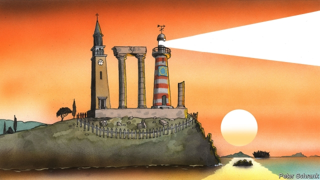

###### Charlemagne

# Huntington’s disease and the clash of civilisation-states 

 

> print-edition iconPrint edition | Europe | Jan 4th 2020 

SAMUEL HUNTINGTON was almost right. The late American professor pricked a bubble of Western triumphalism with a gloomy prediction of strife in “The Clash of Civilisations?” in 1993. Where he erred was the medium through which this friction would take place. Rather than civilisations rubbing against one another as groups of nation-states, as Mr Huntington forecast, the 21st century is witnessing the rise of the “civilisation-state”. 

The term is in vogue. Chinese academics herald China as the world’s sole civilisation-state, rather than an old-hat, 19th-century nation-state. Vladimir Putin, however, has hopped on the bandwagon, declaring that Russia’s status as a civilisation-state prevented the country “from dissolving in this diverse world”. Indian commentators have long wrestled with whether their country is one, too. Other potential candidates for civilisation-state status include the United States and even Turkey. Another name is rarely mentioned, but should be added to this growing list: the EU. 

A world of civilisation-states, where the state protects (and projects) an entire civilisation rather than a mere nation, fits the EU rather well. No longer would the bloc be a geopolitical duck-billed platypus, occupying its own weird category. Though it is clearly much more than a trading union, it is still far from being a nation-state. It has its own currency, budget rules and regulates everything from strawberry size to car emissions. It controls essential parts of state sovereignty, such as customs, as well as migration between its member states. And in the coming decades it will probably build something resembling a small army and even police its borders. But the EU member-states still wield far greater powers across much domestic, and even more foreign, policy. 

EU leaders of every flavour, meanwhile, have started banging on about civilisation. Viktor Orban, Hungary’s prime minister, has long couched his attacks on refugees as a defence of European civilisation. The European Commission has just offered its own rather bloodless and bureaucratic version of civilisation by introducing a commissioner for “Protecting The European Way of Life”, responsible for dealing with security, migration and integration. (After an outcry, the title was flipped with a spot of linguistic gymnastics to “Promoting Our European Way of Life”.) Emmanuel Macron, meanwhile, speaks of European civilisation in existential terms, demanding that the bloc gets its act together or be superseded by China and America. 

These visions of the European civilisation-state are different, which is potentially something of a problem. Mr Orban equates European civilisation with white Christendom, whereas the commission at least attempts to build on civic values. Mr Macron focuses on the geopolitical strength of America and China, which could undermine the enlightenment values represented by Europe. Still, they share common themes. 

All, for example, are defensive. European leaders talk about protecting Europe. Rather than engage in political evangelism, the EU is giving up on universalism, even though civilisation-states naturally tend to be expansive. Where European leaders once spoke of “Western” values, increasingly they speak of European ones. America has taken a nativist turn, and Brexit Britain is following suit. In such circumstances, a renewed focus on a specific European civilisation—and how to defend it—is only natural. 

Sadly, chatter about civilisations can swiftly become paranoid. The far right peddles conspiracy theories about European civilisation being “replaced”, whether by immigrants or rising powers such as China. Such talk is now echoed by moderate politicians. “We know that civilisations are disappearing,” declared Mr Macron last summer, warning that Europe would be wiped out too unless it changes fundamentally. A shared apocalyptic vision may bind the populist right into the European project, but it would do so only at a heavy cost to Europe’s self-proclaimed values. 

Likewise, the renewed emphasis on European civilisation is exclusive. In his book “The Rise of the Civilisational State”, Christopher Coker argues that questions of culture rather than political ideology are now the currency of politics. Such a shift changes the fundamental question asked of citizens, as Mr Huntington laid out two decades ago. If politics and economics dominate, then the question is “What do you think?” This has a mutable answer. If culture dominates, the question becomes “Who are you?”—an answer that can less easily be changed. 

A more benign analysis holds that European leaders have built on shared civilisational foundations since 1945, carving out a niche for Europe in the face of increasingly powerful allies and rivals, whether America, Russia or China. “The concept of the EU as civilisational state is so deeply embedded in European politics now that it shapes the rhetoric of all political actors involved in it,” argues Alexander Clarkson, a historian at King’s College London. In short, the urge has always been there, but now it has a natty name. 

If the vision of Mr Macron and his fellows triumphs, then this civilisational turn need not have a dark side. Limiting “universal” values to the European sphere shows a dearth of ambition but a practical admission of the EU’s place in an increasingly illiberal world order dominated by America and China. Yet the risks of this shift are also obvious. A paranoid continent, fearing for its continued existence, is not one that makes healthy decisions. An emphasis on specifically European values could lead to chauvinism. A political class that echoes far-right tropes about being replaced risks feeding the very populists they want to squeeze out. One of the EU’s crowning achievements has been tempering the nationalism that triggered two world wars in the space of three decades. Replacing “nationalism” with a crude form of “civilisationalism” would do little good. As Huntington might have said, a clash of civilisation-states would be ugly indeed. ■ 

