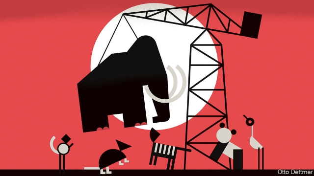

###### Free exchange

# China’s industrial policy has worked better than critics think 

 

> print-edition iconPrint edition | Finance and economics | Jan 4th 2020 

EARLY IN ITS trade dispute with China, America declared that Chinese industrial policy was a form of “economic aggression”. America’s negotiators hoped to rein it in. No such luck. The very week in December that America and China announced a mini-deal on trade, China’s president, Xi Jinping, vowed that the Chinese government would do more in 2020 to support strategic sectors, ranging from robotics to biomedicine. Having seen its vulnerability to American export controls, China is more determined to build up its domestic abilities than it was before the trade war began. 

This raises an obvious question: does industrial policy work? Since at least Jean-Baptiste Colbert, France’s finance minister under Louis XIV in the 17th century, governments have used taxes, tariffs and subsidies to cultivate national champions. Colbert worried about the dominance of Venetian glassmakers; Mr Xi worries about the dominance of American chipmakers. 

In principle industrial policy looks attractive. When markets are highly imperfect—a fact of life in developing countries—governments can use their muscle to stimulate activities that would otherwise be unthinkable for private entrepreneurs. When such policies succeed, the targeted sectors flourish, as South Korea’s chemicals industry did in the 1970s. That, in turn, can lead to technological advances and productivity gains for the wider economy. 

But in practice industrial policy is hard to get right. Helping companies is as likely to promote laziness as competitiveness. Moreover, officials may be no better—and perhaps much worse—than businesspeople in choosing which industries to support. 

Although China is far from alone in deploying industrial policy, it stands out for the sheer scale of its efforts. Since the 1980s it has produced dozens of plans and lavished public spending on sectors from solar power to film-making. One industry has been a big unintended beneficiary: the academic study of industrial policy. A large and growing economic literature considers China’s record. 

A recent volume, edited by Loren Brandt of the University of Toronto and Thomas Rawski of the University of Pittsburgh, examines the electricity and telecommunications sectors. These are natural candidates for government intervention, given the high cost of building power grids and phone networks, plus the benefits to society. But China has done more than build basic systems; it has also tried to reach the frontier of global innovation. 

It has had some success. State Grid Corporation of China is a world leader in ultra-high-voltage transmission. China has gone, the authors say, from “pygmy to emerging giant in civilian nuclear power”. But elsewhere it has come up short. Despite decades of support, its semiconductor firms are laggards. It has also failed to challenge Airbus and Boeing, or to produce any truly international car companies (see Technology Quarterly). 

One tentative conclusion is that China’s industrial policy works better when natural monopolies are involved. There is a clear role for a central authority with strong organising power to develop a power-transmission system or a high-speed rail network. Yet that same authority can stifle competition in sectors that need it. Alternatively, as often occurs in China, if lots of provincial governments try to foster their own champions, nominally in pursuit of national objectives, the outcome is extreme over-capacity, which undermines the targeted sector. 

China’s shipbuilding industry provides a textbook example. Panle Jia Barwick and Nahim Bin Zahur, both of Cornell University, and Myrto Kalouptsidi of Harvard University estimate in a recent paper that between 2006 and 2013 the government directed policy support worth 550bn yuan (roughly $80bn at the time) to shipbuilders. Most went as subsidies for entrants to the sector, attracting subpar firms. China became the world’s biggest producer of ships. But the increase in net profits was just a fifth of the subsidies. Even the electricity sector, an ostensible success, is plagued by excess. A well-run power network should have back-up generating capacity equivalent to about 15% of peak load. The average among China’s provinces is more than 90%. 

That, though, is not the end of the story. Ultimately, the value of industrial policy is in its wider economic impact. In a separate paper, Ernest Liu of Princeton University argues that state support is most effective when it targets those sectors that make the most essential inputs for others. Generally, these are upstream; turning raw materials into products used in a range of industries. Subsidies for them, even via state firms, can raise overall efficiency. As it happens, China has focused its support on the right sectors in Mr Liu’s calculations, such as steelmaking and machinery. China, put bluntly, might never have become the economic power that it is today without ambitious industrial policy. 

Mr Liu’s model does not indicate when subsidies are too high, nor does it set out how best to design policies. There is evidence that China’s heavy-handed intervention is becoming increasingly ineffective. Total factor productivity growth in China in recent years has been a third of what it was before the 2008 global financial crisis (see chart). Productivity has also slowed in other countries, but the World Bank, in a recent book about Chinese innovation, notes that China’s slowdown has been unusually sharp. 

After conducting extensive case studies of the vehicle and renewable-energy sectors, among others, the bank ascribes some of the blame to Chinese industrial policies that undermine fair competition. It argues that rather than targeting support at specific firms, China should shift to more market-oriented policies. Even-handed regulations and incentives, which treat state firms no differently from private companies or foreign investors, would do more than lavish subsidies to promote entrepreneurship. 

Such a shift would have the convenient side-effect of dealing with America’s concern that China’s mammoth subsidies undercut competitors globally. Industrial policy is always contentious. But it now looks like that rarest of things, an issue on which Chinese and American interests are aligned. Whether their leaders see it that way is another matter. ■ 

