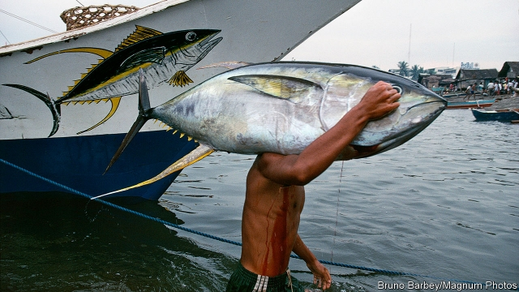

###### What’s the catch?

# Trade negotiators have missed a deadline to help protect fish stocks 

 

> print-edition iconPrint edition | Finance and economics | Jan 4th 2020 

IN 2015 WORLD leaders signed up to a long list of sustainable development goals, among them an agreement to limit government subsidies that contribute to overfishing. Negotiators at the World Trade Organisation (WTO) were told to finish the job “by 2020”. They have missed their deadline. 

Overfishing is a tragedy of the commons, with individuals and countries motivated by short-term self-interest to over-consume a limited resource. By one measure, the share of fish stocks being fished unsustainably has risen from 10% in 1974 to 33% in 2015. Governments make things worse with an estimated $22bn of annual subsidies that increase capacity, including for gear, ice, fuel and boat-building. One study estimated that half of fishing operations in the high seas (waters outside any national jurisdiction) would be unprofitable without government support. 

Trade ministers were supposed to sort it all out at a WTO meeting in December in Kazakhstan. But the meeting was postponed till June, and big political deals are rarely struck remotely. Moreover, the murky nature of subsidies for unregulated and unreported fishing makes their work unusually difficult. Governments do not have lines in their budget that say “subsidies for illegal fishing”, points out Alice Tipping of the International Institute for Sustainable Development, a think-tank. 

Negotiators are trying to devise a system that would alert governments to offending boats, which would become ineligible for future subsidies. That is tangling them up in arguments about what to do when a boat is found in disputed territory, how to deal with frivolous accusations and how to treat boats that are not associated with any country offering subsidies. 

When it comes to legal fishing of overfished stocks, it is easier to spot the subsidies in government budget lines, but no easier to agree on what to do about them. America and the European Union, for example, have been arguing over whether to allow subsidies up to a cap, or whether to ban some subsidies and take a lenient approach to the rest. The EU favours the second option, arguing that where fisheries are well-managed, subsidies are not harmful. To others this looks like an attempt to ensure any eventual deal has loopholes.  

Further complicating matters is a long-running row about how to treat developing countries. All WTO members agree that some need special consideration. But as an American representative pointed out at a recent WTO meeting, 17 of the world’s 26 most prolific fishing countries are developing ones. That means broad carve-outs for them would seriously weaken any deal. 

China, both the world’s biggest fisher and biggest subsidiser of fishing, has proposed capping subsidies in proportion to the number of people in each country who work in the industry. But it is the world leader here, too, with 10m at the last count (in 2016). Other countries fear such a rule would constrain China too little. 

Apart from the fish negotiations, almost nothing is happening at the WTO. Ms Tipping thinks this could be helpful, since the issue will not end up hostage to other, even more fraught, trade rows. But it also deprives negotiators of their most useful tool. Usually, trade talks make progress because the ambitious parties coax the foot-draggers forward by offering concessions on other matters. Now, though fish are on the table, the accompanying bargaining chips are off the menu. ■ 

