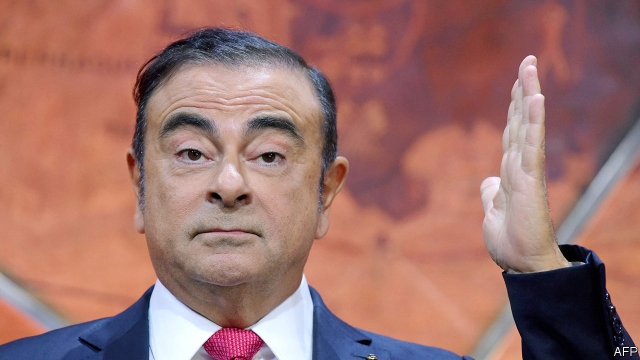

###### Fled to the Med

# No one comes out of the Carlos Ghosn affair smelling of roses 

 

> print-edition iconPrint edition | Leaders | Jan 2nd 2020 

THE LAST time there was an international fugitive from justice called Carlos lying low in Lebanon was in 1975, when Carlos the Jackal hid in Beirut. Today the man on the run is not a terrorist but a celebrity executive known for fanatical cost-cutting. On December 31st Carlos Ghosn, the former boss of Renault-Nissan, who was arrested in Japan in November 2018 on charges of financial misconduct, jumped bail and fled to Lebanon. He grew up there and it has no extradition arrangements with Japan. Mr Ghosn says he is a victim of “injustice and political persecution” by Japan’s legal system. Japan’s prosecutors, meanwhile, view him as a crook evading justice. In fact, this is far from being a simple morality tale. Each of the three main parties in the saga—Renault-Nissan, Japan’s authorities and Mr Ghosn himself—has hard questions to answer. 

Mr Ghosn took charge of Nissan in 2001 and then, in 2005, of Renault, too. The French car firm has a 43% stake in the Japanese one, and together with Mitsubishi they form an alliance that is the world’s biggest carmaker by volume. It sounds impressive, but even the laser-focused Mr Ghosn struggled to make the fiddly pact run smoothly. He claims that he was planning closer integration of Renault and Nissan, and that nationalistic Japanese executives and officials, who wanted to keep Nissan independent, foiled the plan by engineering his arrest. 

Mr Ghosn sees himself as a martyr and denies any wrongdoing, but his conduct merits investigation. In September America’s Securities and Exchange Commission said that he and a colleague concealed $140m of compensation payments from Nissan, involving secret contracts, backdated letters and misleading disclosures. Nissan, Mr Ghosn and his colleague settled the charges and paid fines while neither admitting nor denying guilt. Mr Ghosn is banned from being a company officer in America for ten years. There have been reports of other complex transactions between Nissan and its former boss which, if true, suggest that an imperious leader may have lost his sense of the boundary between his own finances and those of the firm he ran. 

You might hope that Japan’s justice system would swiftly and fairly get to the bottom of all this. But its use of confessions to secure a conviction rate of over 99% reflects a harsh treatment of suspects that has been on full display here (see article). Mr Ghosn was arrested, released, rearrested and then released on bail again. He was subject to interrogation without a lawyer. His lawyers say they have been unable to see key documents and that, while on bail, Mr Ghosn’s access to his wife and the internet were restricted. After 13 months of investigations, the trial has still not begun. What is more, rotten disclosure about pay is common across Japan Inc. 

As the stink around Mr Ghosn’s case worsens, Renault and Nissan, which together employ over 300,000 people, are tottering. Unable to reap the efficiencies of being a single company, they have long produced mediocre performance—their combined return on equity probably slipped below 5% in 2019. Paralysed by the scandal, both firms face shrinking sales and margins. In May Renault sought redemption through a merger with Fiat Chrysler to create a European champion, but managerial dithering and meddling by the French government caused the deal to collapse. (Fiat’s chairman sits on the board of The Economist’s parent company.) Fiat is now merging with another French car firm, PSA, instead. 

What next? Renault and Nissan should either merge or unwind their cross-shareholdings. Both need to cut costs in order to get fit again. Japan’s authorities must explain how Mr Ghosn absconded, and deal with his claims of persecution. As for the boss-turned-bolter, he has pledged to clear his name. But his position is extraordinary. He is an outlaw, holed up in a country half the size of New Jersey. From being king of the car industry he now risks a lifetime on the back seat, hiding under a blanket. ■ 

