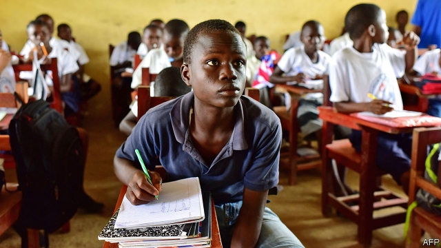

###### On trial

# Lessons from a radical education experiment in Liberia 

 

> print-edition iconPrint edition | Middle East and Africa | Jan 4th 2020 

IN 2016 GEORGE WERNER faced an unenviable task. Liberia’s education minister was in charge of one of the most difficult school systems in the world. More than a decade of civil war and an outbreak of Ebola in 2014 had stopped many children from going to class. Those who did learned little. Just 25% of Liberian women who completed primary school could read, one of the lowest shares anywhere. Mr Werner’s budget was a mere $50 per pupil per year. Many teachers on his payroll were “ghosts” who did not exist but somehow kept on drawing salaries. 

So Mr Werner signed off on one of the boldest public-policy experiments in recent African history. He outsourced 93 primary schools containing 8.6% of state-school pupils to eight private operators. Five charities and three companies were monitored in a randomised controlled trial (RCT). Researchers tracked test scores in the operators’ schools and nearby government ones. More than three years later, the results are in. They reveal the messy reality of education reform in one of the world’s poorest countries. 

On average children who began the study in outsourced schools learned more than those in government ones. But those gains were “modest”, says Justin Sandefur of the Centre for Global Development. Pupils beginning in privately run schools could on average read 15 words per minute three years later, versus 11 in state-run classrooms. Any boost is welcome, but the average reading level in the pilot schools is still behind the 45-60 words per minute deemed necessary to understand a simple passage (and far behind the more than 100 words per minute that peers in rich countries can read). Improvements in maths skills were of a similar magnitude. 

Unspectacular results are perhaps unsurprising. Running a school in Liberia is hard. Operators talk of building classrooms from scratch and being unable to reach schools during rainy seasons. Unlike in, say, charter schools in America, staff members were mostly recruited from the existing pool of teachers. Many were badly educated. Operators could not fire poor performers or reward good ones. 

They had an advantage nevertheless. With the help of philanthropic donations they could supplement the government’s budget of $50 per pupil—almost all of which goes on teachers’ salaries. In the first year they spent on average about $300 per pupil beyond the government’s contribution. Two years later that amount was $119. The figures suggest that after spending on startup costs, operators learned to do things more cheaply. Though this was more true of some than others. 

The biggest spender was Bridge International Academies, a company that opened its first schools in Kenya in 2009. It improved scores, but at a cost of $161 per pupil after three years. Children were also more likely to drop out of its schools. 

The case of Bridge does, however, point to one of the advantages of the study. Researchers were able to look at the performance of eight different operators, with eight different models. In theory that diversity allows them—and, more importantly, Liberian policymakers—to decide which approach worked best, and why. 

Three of the operators had no effect on pupils’ results whatsoever. The other five did improve scores. Some had downsides but two operators come out of the evaluation with their reputations enhanced. 

One is Rising Academies, which was founded in Sierra Leone in 2014 to teach children during the Ebola crisis. In June a research paper found that Rising pupils in that country learned as much in one year of schooling as peers in government schools learned in more than two. One reason for its success in both Sierra Leone and Liberia is that “we are willing to work with the grain of the system,” says Paul Skidmore, Rising’s chief executive. In Liberia it gave teachers coaching and feedback. Rising also spent more time than other operators talking with parents about, for example, why their children skipped school. 

Another success was Street Child. This was the cheapest operator ($37 per pupil per year on top of the government’s spending) that improved results. “Ensuring that our programme was sustainable and that Liberia could afford it was always the priority,” says Tom Dannatt, the charity’s founder. Whereas some operators splashed out on technology, Street Child kept things simple. Teachers would at times trace out words in the dirt with a stick. 

Some development types are unimpressed with Liberia’s experiment, pointing to how far behind many pupils remain. Yet one can be too cynical. Running such a programme in Liberia was always going to be messy, argues Mr Skidmore. Donors often say they want projects to be quick, cheap, rigorously evaluated and under the control of local politicians. Liberia’s scheme was all of that. It cost far less than a typical project (using just $23m of donor cash); it was set up in less than a year; and it was subjected to a RCT. It also survived a change of government. 

That hints at another success: the project was seen as useful by Liberian policymakers. Through the scheme Mr Werner and his successor were able to glean insights from school operators who would not otherwise have come to the country. The government is now encouraging those who improved scores to take on the running of more schools. Rising began with just five; today it has 87. Several African governments are mulling similar “public-private partnerships”. If designed well, they could help hundreds of thousands of children. But it is not only children who must learn lessons through these experiments. Policymakers must do so, too. ■ 

