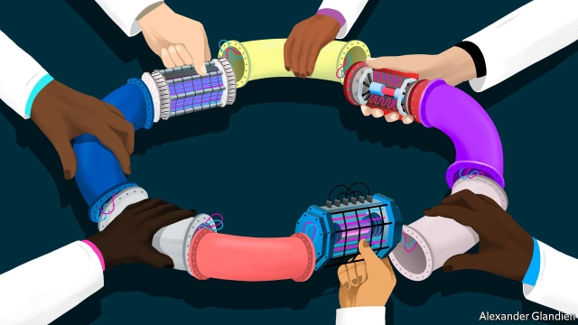
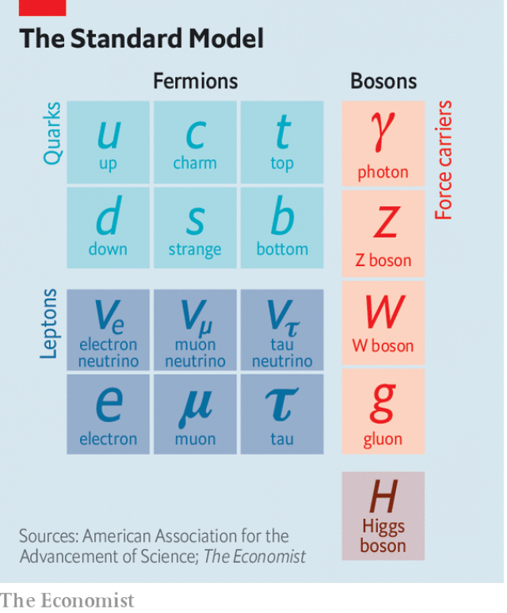
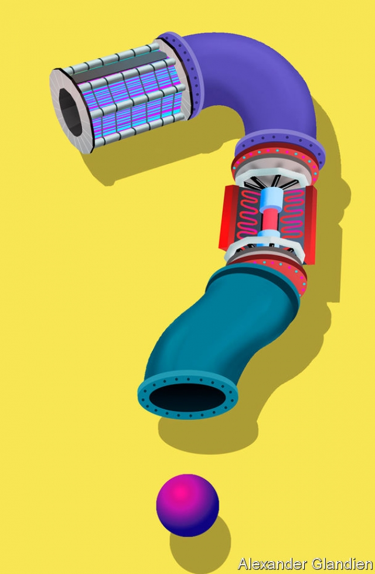

###### The future of physics

# Finding new physics will require a new particle collider 

 

> print-edition iconPrint edition | Science and technology | Jan 4th 2020 

DEEP UNDER the countryside north of Geneva, straddling the Franco-Swiss border, one of the most advanced scientific machines ever built has been banging subatomic particles together for more than a decade. This device, the Large Hadron Collider (LHC), accelerates beams of protons (members of a class of particle called hadrons) in opposite directions around a 27km ring until they reach almost the speed of light. Powerful magnets then force these protons into head-on collisions, causing the energy they carry to be converted—as described by Einstein’s best-known equation, E=mc2—into matter. And what matter! For sorting through the ejecta from the collisions gives physicists fleeting glimpses of the fundamental building blocks of the universe and the forces that bind or repel them. 

The LHC belongs to the world’s leading particle-physics laboratory, CERN. It is the latest in a long line of increasingly sophisticated machines built over the past century by researchers intent on finding out how the universe truly works. The result of this effort has been one of the most successful, most tested scientific ideas of all time: the Standard Model of particle physics (see chart). 

 

The Standard Model is not, however, a theory of everything. It leaves many things unexplained. So, even though their multi-billion-franc toy at CERN has at least two more decades of collisions left to run, physicists are already considering what comes next. That means building a yet more powerful machine that can reach yet higher energies, and thus generate yet heavier and more interesting particles. And building that machine means, in turn, building the political will to pay for it and deciding where it will be constructed. This might be at CERN, or perhaps in Japan, or maybe in China—a prospect unwelcome to the current primus inter pares of the field, America. 

The Standard Model is a quantum-mechanical description of all known elementary particles: from the quarks inside protons and neutrons, via the electrons that orbit atomic nuclei, to the photons that carry electromagnetic force and also light up the universe. Unlike Einstein’s General Relativity, its rival for the laurels of “most important theory in physics”, it is not the product of the musings of a lone genius. Though the name goes back only to 1975, the substance of the model was developed bit by bit by tens of thousands of scientists working for more than 80 years on hundreds of experiments around the world. The final piece of the jigsaw, the Higgs boson, which gives mass to certain other particles and thus ties the model together, was predicted by theoreticians in 1964 and found by the LHC in 2012. 

The discovery of the Higgs, though, was supposed to be a beginning as well as an end, for the Standard Model now needs to be extended into something bigger. It does not, for example, include gravity. That is the province of General Relativity. Dark matter is also absent. This is a substance, invisible but detectable by its gravitational effects, that makes up 27% of the universe—over five times as much as the so-called normal matter of stars, planets, people and so on. And it does not include dark energy, a thing of unknown nature which constitutes the remaining 68% of reality and somehow acts to push everything else in the cosmos apart. 

The Standard Model does include antimatter. But it predicts that equal amounts of matter and antimatter should have emerged at the beginning of time and, by now, these should have annihilated one another. Since this evidently has not happened—matter being common these days, and antimatter vanishingly rare—that prediction is in need of serious re-evaluation. 

Each of these inadequacies points to physical laws, particles and forces yet to be discovered—mysteries which physicists had expected that the LHC would have started cracking open by now. But it has not. That suggests their hypotheses about what lies beyond the Standard Model, which were the basis of those expectations, must be wrong. 

The weightiest expectation was placed on the shoulders of an elegant idea called supersymmetry. This theory, developed over the past 50 years, is a way of removing from the Standard Model a lot of things known in the trade as fudge factors. A fudge factor is an arbitrary value that makes a model work, but which itself defies deeper explanation. In the Standard Model, many such fudges can be erased by introducing, for each and every Standard Model particle, a heavier “supersymmetric” partner that has not yet been seen. The putative superpartners of the electron and quark, for example, are known as the selectron and squark. 

Supersymmetry might also eradicate one more of the Standard Model’s inadequacies. The supersymmetric partners of another type of Standard Model particle, the neutrino, would be things called neutralinos. And neutralinos are plausible candidates to be the components of which dark matter is composed. 

Unfortunately, after almost a decade of increasingly energetic collisions at the LHC, nothing new has emerged beyond the Higgs itself. No hidden dimensions. No unexplained phenomena. No supersymmetric particles. As a result supersymmetry has, for many physicists, lost its lustre. And of the myriad alternatives jostling to take its place, no one knows which, if any, might be closest to the truth. 

This is all a headache for the practitioners of particle physics—a field in which experiments are notoriously expensive and take decades to build. It is also confusing, because physicists had come to expect that they could more or less predict what they would see next in their machines. Eugene Wigner, an American theoretical physicist of the 20th century, called this expectation “the unreasonable effectiveness of mathematics in the natural sciences”, and it began with the discovery of positrons, the antimatter equivalent of electrons. 

Positrons were predicted in the 1920s by a formula that lies at the bedrock of the Standard Model. This formula, called the Dirac equation after its creator, Paul Dirac, suggested the existence of electrons with positive charges as well as the familiar negatively charged sort. Thus predicted, they were sought and found. Confidence in the prophetic power of maths was then confirmed over and over again, up to the triumphant discovery of the long-predicted Higgs. But the failure of supersymmetry has dented that confidence badly. 

Regardless of the details, though, the consensus is that the route to finding physics beyond the Standard Model runs through the Higgs boson itself. This means examining and characterising that object in exquisite detail. Physicists do not know, for example, if it is truly an elementary particle with no internal structure (like an electron or a quark) or is a composite of smaller objects (in the way that protons and neutrons are made of three quarks each). It is even possible that what has been identified as the Higgs is not actually the particle predicted by the Standard Model—but, rather, a different particle from an as-yet-unknown theory that happens to have the Higgs’s predicted mass. 

Annoyingly, while the LHC can now reliably produce what most people still do assume are Higgs bosons, its instruments cannot easily make the precision measurements needed to identify cracks in the Standard Model that would point to which of supersymmetry’s rivals looks most promising. One reason for this lies in the protons that the collider uses as its raw material. Because protons are made of quarks, which are held together by further particles called gluons, a proton-proton collision actually involves six quarks and multiple gluons, and is thus incredibly messy. 

There is, though, a way to cut through that mess: use electrons instead. Since electrons are truly elementary, collisions involving them are cleaner than those between protons. But there is a price to pay. Electrons have about a two-thousandth of the mass of protons, and proportionately less kinetic energy at a given speed. To make them energetic enough to yield Higgs bosons will thus require a new machine. 

Building an electron collider (or rather, in practice, a machine that collides electrons with positrons) to follow the LHC would have historical precedent. At CERN, in 1983, a hadron machine called the Super Proton Synchrotron, with a circumference of 7km, was used to find particles called the W and Z bosons, which are involved in a phenomenon known as the weak nuclear force. Subsequently, at the same laboratory, the Large Electron-Positron (LEP) collider began operating in 1989 to characterise and understand those newly discovered bosons in detail. The circular 27km tunnel built for the LEP now houses the LHC. 

Continuing this pattern, one group of physicists at CERN proposes building a new machine there to accelerate electrons and positrons around a 100km tunnel that would extend beneath the Jura mountains. This Future Circular Collider (FCC) would produce collisions at energies of a whopping 365 giga electron volts (GeV), in the units used by physicists to measure both the energy and the mass of subatomic particles. It would produce millions of Higgs bosons over a period of several decades. Such a Higgs “factory” would let physicists pin down the precise details of the particle. 

Higgs bosons are unstable. They decay into pairs of other particles almost as soon as they are created. The Standard Model predicts that around 60% of the time this will create a bottom quark and its antimatter equivalent. A further 21% of the time a pair of W bosons will emerge, and 9% of Higgs-boson decays should end up with a pair of gluons (the other 10% will result in yet further combinations). By making enormous numbers of Higgs bosons and then measuring the precise rates at which bottom quarks, W bosons, gluons and other elementary particles emerge, those running the FCC would be able to watch for discrepancies from the Standard Model’s predictions. The more Higgses created, the more statistical power the results will have, and the more confident researchers will be that any deviations from Standard Model predictions which they measure actually represent something real. 

The FCC would build on CERN’s decades of experience with circular colliders, and might seem like the LHC’s natural successor. But a rival group of physicists disagree. Though circular colliders have ruled the roost for a long time, they have a problem. When charged particles (protons, electrons, positrons etc) move in a circle they emit energy, known as synchrotron radiation, in the form of X-rays. The faster the particles go, the more energy they lose. At full power, the FCC could emit (ie, waste) around 100 megawatts of synchrotron radiation. The only way to compensate for this, and thus ensure the particles inside collide at the maximum energy, would be to pump in more electricity, which would drive up the cost of operating the machine. 

The rival group therefore propose to sidestep the hegemony of rings altogether, with a different successor to the LHC: a linear collider. This would accelerate electrons and positrons from opposite ends of a straight track and let them meet in the middle. Two such are on offer. CERN’s proposal is the Compact Linear Collider. A second is the diplomatically named International Linear Collider, which would probably be built in Japan. 

Unlike a ring, a linear collider can be constructed in stages, which helps with budgeting. Both designs would, though, end up about 50km long if brought to completion. They would have collision energies of a tera electron volt (1TeV, or 1,000 GeV) or more, and would operate as Higgs factories—turning out many millions of these bosons. 

If particle physics went down the linear-collider route, which of these machines would come out on top is moot. On the face of things, the International Linear Collider is ahead. Physicists from around the world have spent years working on the proposal and, in 2013, they secured Japan’s support to build it in Honshu. After that, however, progress slowed, and as yet there has been no decision on whether the project will go ahead. The Science Council of Japan, which advises the government on such matters, is still evaluating the scheme. It is expected to make its intentions clear in February. CERN, meanwhile, seems more interested in building a new ring. The Compact Linear Collider’s supporters in the organisation are a minority. 

While the old Great Powers of physics argue about what to do next, though, they may find themselves outflanked. For China is moving into the field at breakneck speed. Under the leadership of Wang Yifang, head of the Institute of High Energy Physics in Beijing, the country has been training young scientists and building an impressive research infrastructure. Its flagship proposal is the Circular Electron-Positron Collider (CEPC), conceived by Dr Wang after the discovery of the Higgs boson and which has now been through several stages of technical design. 

 

The latest iteration proposes a $5bn machine optimised to create and study Higgs bosons. It would sit in a tunnel with a circumference of 100km and achieve collisions at energies reaching around 240GeV. In its specification, it is not so far away from CERN’s FCC. Though the project is being developed by Chinese scientists, some of whom have worked at CERN, Dr Wang has also drawn on advice, support and critical feedback from other particle physicists around the world. 

Whether or not Dr Wang’s project gets a green light will depend on how the government decides to weigh its value against other proposed scientific-research facilities it might build. One rival, for example, is a demonstration nuclear-fusion power plant. If the government does give the collider the go-ahead, part of its calculation will surely be the increased visibility and prestige that comes from being able to build and operate such a technologically advanced machine. China has ambitions to become a world leader in science, and there is no doubt a particle accelerator would help it achieve that goal. 

China could certainly afford Dr Wang’s collider, though it would need to import a lot of accelerator scientists to beef up its capability to build and operate such a machine. If that did happen, CERN’s plans for a circular collider would look superfluous. But as CERN’s own history shows, big scientific projects tend to work best when access to the machine and its results is as open and internationally collaborative as possible. Dr Wang says he would welcome money, talent and in-kind contributions from other countries. If the CEPC became the world’s most powerful accelerator, those countries would no doubt jump at the chance to join in. Except one, that is: America. 

America is home to a thriving community of particle physicists, and they have garnered many of the Nobel prizes handed out over the second half of the 20th century for the prediction and testing of various bits of the Standard Model. American government scientists are, however, currently banned from collaborating with their Chinese counterparts, and federal funding agencies will not pay for academics to work in China—a restriction that would apply to the CEPC, should it be built. Yet, if China went ahead with its accelerator, the centre of gravity of fundamental physics, and probably the next set of Nobel prizes for that topic, would surely move there. 

The big holes in modern physics will not be solved by a single machine, however. All the groups proposing post-LHC electron-positron colliders are also working on plans for what comes after a couple of decades of using them to study the details of Higgs bosons. The FCC team proposes eventually ripping that machine from its 100km tunnel, just as the LEP was ripped from its, and replacing it, some time in the 2050s or later, with a hadron collider operating at 100TeV. In China Dr Wang’s team has begun work on a similar idea, in which a Super Proton-Proton Collider would sit in the tunnel alongside the previously built electron-positron collider. 

Some physicists, though, are impatient. They argue that the cautious, step-by-step approach should be abandoned. Instead of making precise measurements of the Higgs boson using electron-positron machines, researchers should embrace a 100TeV hadron machine as soon as possible, and see what happens. Their argument is that the uncertainty which now abounds in the field makes it risky to focus only on an electron-positron collider, as this might end up unable to operate at high-enough energies to push deep into the territory of new physics. Moreover, as detectors improve and the algorithms used to seek the most useful data from collisions get more sophisticated, the problem of hadron colliders’ messy output could disappear. Hadron colliders will, however, always maintain their superiority in pushing forward the energy barrier to finding new physics. 

As Jon Butterworth, a member of the team that discovered the Higgs boson in 2012, puts it, “My whole career there’s been a very clear road map of what we need to do next and now there isn’t one. We’ve outgrown our road map. Experiment is ahead of the theory. It’s an interesting and difficult time.” True. But then, making maps rather than following them is surely what exploration is about. ■ 

