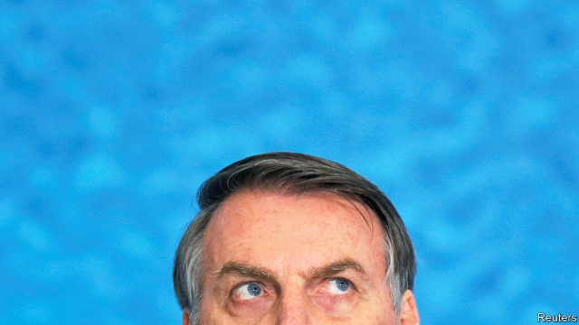
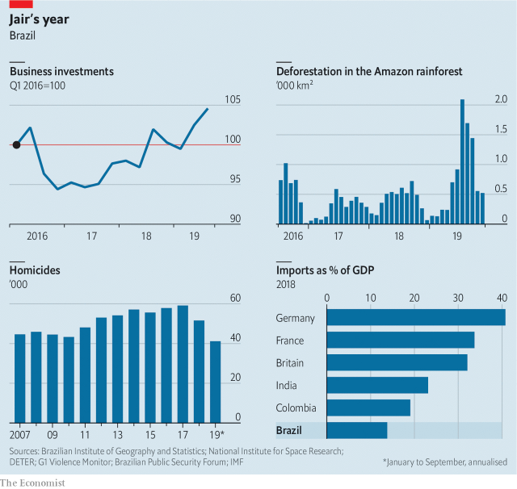

###### Please don’t let me be misunderstood

# Jair Bolsonaro’s contentious first year in office 

 

> print-edition iconPrint edition | The Americas | Jan 4th 2020 

SINCE JAIR BOLSONARO became Brazil’s president on January 1st 2019, he has quarrelled with an impressive array of foreign leaders and celebrities. After France’s president, Emmanuel Macron, accused him of encouraging deforestation of the Amazon, Mr Bolsonaro called his wife ugly. When Greta Thunberg, a young Swedish climate activist, highlighted the murder of indigenous people in the Amazon, the Brazilian president called her a “brat”. Michelle Bachelet, the UN human-rights commissioner (and a former president of Chile), criticised a rise in killings by police in Brazil. Mr Bolsonaro responded by praising Chile’s dictatorship of the 1970s and 1980s, which tortured her father. 

These spats are a sign of the gulf between Brazil’s far-right president, who has made a career out of attacking liberal ideas about tolerance, human rights and conservation, and the elites who espouse them. Mr Bolsonaro’s put-downs suggest he does not mind causing offence. But senior officials in his government do worry, especially when NGOs threaten to promote boycotts of Brazilian products and governments reconsider whether to ratify trade deals. 

The world is “misreading” Mr Bolsonaro, said the economy minister, Paulo Guedes, during an interview in Brasília, the country’s capital, last month. He has “bad manners, but great principles”. Mr Guedes hopes to change the conversation by shifting the focus from deforestation and police brutality to what he takes to be the president’s main project, a radical transformation of the economy that will enrich all Brazilians, including the poorest. “Instead of throwing stones at Brazil” people should be applauding, he says. 

There is much to admire in the plans that Mr Guedes described. But they do not answer some of the biggest doubts about Mr Bolsonaro’s presidency. And it is unclear how much of the programme he will carry out. The applause may have to wait. 

The vision is unapologetically liberal, or “neoliberal”, as its left-wing critics call it. Mr Guedes blames most of Brazil’s problems, including its high level of income inequality, on the overgrown state, which “spends a lot of money on the wrong things”. Since the 1980s public expenditure as a share of GDP has trebled to 42%, a level similar to that of European welfare states. The quality of services is that of much poorer countries. 

Red tape and a complex tax system thwart private enterprise, but the state also coddles some industries at the expense of everyone else. “Forty years of closed markets” have protected rent-seeking industries, he says. “Imagine, 200m suckers being exploited by six banks, six shipping companies. Everything in Brazil is six.” Social security and free universities benefit the relatively well-off more than the poor. 

Mr Guedes wants to roll all this back. He proposes to simplify the tax system radically, while reducing rates and expanding the base; to privatise nearly all state companies; and, after cutting red tape to enable businesses to withstand competition, to open the economy to the world. Ordinary Brazilians, he contends, will benefit in two ways: from the jobs that a freer economy will create, and from spending that focuses more on what they need, such as infrastructure and education. Ideally, states would take over more responsibility from the federal government. Mr Guedes calls for “more Brazil, less Brasília”. 

Mr Bolsonaro’s government made a start on this agenda, with a constitutional reform of the pension system. This will save the government 855bn reais ($210bn) over ten years and lessen the danger that public debt will reach crippling levels. As the reform took shape in 2019 confidence grew, leading to a recovery in investment (see chart). The economy grew by 0.6% between the second quarter and the third, more than expected. Annual growth for 2020 is forecast to be at least 2%. That may make Brazil one of Latin America’s fastest growing economies. 

 

But there are reasons to withhold applause. One is that the democratic governments that took over after the end of military rule in 1985 accomplished more than Mr Guedes gives them credit for. It was the Real Plan of Itamar Franco, president from 1992 to 1994, that finally licked inflation. Pension reform began under the left-wing Workers’ Party, which governed from 2003 to 2016, and Mr Bolsonaro’s predecessor, Michel Temer, put a constitutional cap on public spending. 

It is not clear what will follow pension reform. Mr Guedes’s plans are a “wish list, rather than a reform strategy”, says Ricardo Sennes of Prospectiva, a consultancy. In November Mr Guedes delivered to congress proposals for three constitutional amendments that would curb spending in order to honour the constitutional limit. Congress may water them down. 

Mr Bolsonaro recently told Mr Guedes to hold off on a public-sector reform that would have weakened civil servants’ job security. The economy minister has not endorsed a tax-reform proposal that has support in the lower house of congress, but has yet to present an alternative. The president of the senate recently said that a proposal to privatise Eletrobras, the state electric utility, would not get through congress. 

While Mr Guedes may be right to say that jobs are “the most important element of social inclusion”, that does not excuse the poor performance of most ministries besides his. The education ministry, led by a conservative ideologue, accomplished almost nothing in 2019. The health ministry has been slow to replace thousands of Cuban doctors expelled by Mr Bolsonaro at the beginning of his term. They served mainly poor Brazilians in remote areas. Although the number of people living on less than $1.90 a day is at its highest since 2012, the government has not raised spending on Bolsa Família, an income-transfer programme, enough to meet demand. Some 700,000 families are waiting for benefits. “The poor are not a priority for this government,” says Randolfe Rodrigues, the leader of the opposition in the senate. 

Mr Guedes’s defence of Mr Bolsonaro’s democratic record is less convincing than that of his economic programme. “We’re a democratic regime,” he says. But many Brazilians fear that the president’s commitment to that idea is weak. He continues to express admiration for the generals who ruled Brazil from 1964 to 1985. One of his sons, Eduardo, a congressman, recently said that if left-wing protests spread to Brazil and got out of hand, the government could issue a decree like one that shut down congress during the dictatorship. Mr Bolsonaro responded to negative coverage in Folha de S.Paulo, a newspaper, by threatening to cancel government subscriptions to it. “If Brazil takes an authoritarian turn, we will look back and say that the signs were all here,” says Pedro Abramovay of Open Society Foundations, an NGO. 

Congress has so far contained Mr Bolsonaro’s authoritarian instincts. It has rejected or not scheduled for debate a dozen or so radical proposals, such as a bill that would allow millions of Brazilians to carry guns and a misconceived project to purge schools of leftist ideology. 

Foreign critics focus less on the fate of democracy than on that of the forest. From January to November 2019 the Amazon lost 8,974 square km (3,465 square miles) of forest, an 80% rise over the same period in 2018, according to preliminary satellite data. Green groups accuse the government of weakening enforcement of environmental laws and encouraging loggers and ranchers to destroy the forest. That may spook foreign investors. “They’re afraid of being photographed with Bolsonaro,” says Matias Spektor of Fundação Getulio Vargas, a university in São Paulo. 

Such concerns could also wreck Mr Guedes’s hopes of opening up the economy through trade deals. Mercosur, a bloc dominated by Brazil and Argentina, signed a long-awaited accord with the European Union in June. But European anger about Brazil’s environmental policies could jeopardise its ratification (as could the recent election of Alberto Fernández, a left-wing protectionist, as Argentina’s president). 

Progress on economic issues may be helping Mr Bolsonaro’s reputation at home. So too is a reduction in the number of murders in 2019, although that has little to do with the president’s policies. Brazil has so far been spared the wave of protests that struck such neighbouring countries as Chile and Ecuador late in 2019. That may be in part because Brazil had such convulsions in 2015 and 2016, when the economy was in recession and some of the country’s most powerful politicians were being arrested for corruption. Public anger helped bring about the impeachment of one president, Dilma Rousseff, and eventually led to Mr Bolsonaro’s election. 

Now his family is dogged by scandal, and his vows to fight corruption are looking empty. A son, Flávio, a senator from Rio de Janeiro, is being investigated for money laundering. The president threatened to replace the director of the federal police after the investigation revealed links between Flávio and right-wing militia groups. Sergio Moro, the justice minister, failed to get through congress most of his proposals for curbing corruption. His credibility was undermined by revelations that when he was a corruption-fighting judge he had improperly close dealings with prosecutors. 

Six months ago it appeared that the scandals would delay economic reforms, and possibly end Mr Bolsonaro’s presidency early. There is little talk of that now. The streets are quiet. Mr Bolsonaro’s approval rating slumped in the first half of the year but has stabilised at about 30%. The public seem willing accept reforms even if they are disenchanted with the politicians who are leading them. “Brazilians are living through a distinct social moment in which society is favourable to change,” says Paulo Hartung, the former governor of Espírito Santo, a state that underwent a tough fiscal adjustment in 2015. Brazil may advance, despite its brawling president. ■ 

