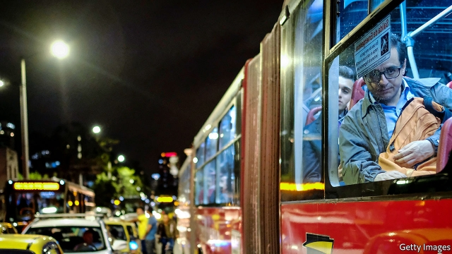

###### Not so fast

# The troubles of Bogotá’s TransMilenio 

 

> print-edition iconPrint edition | The Americas | Jan 4th 2020 

DURING ONE recent morning rush hour Yuraima Salas, a cleaner running late for work, found herself squeezed in a crowd of commuters waiting for a bus. When it arrived the crowd surged, she tripped and someone trod on her foot. She ended up in hospital, with severe bruises and a sprained ankle. 

Ms Salas was a casualty of Bogotá’s TransMilenio bus system, which uses stations on dedicated lanes to mimic an underground metro. Cities smaller than Colombia’s capital, such as Curitiba in Brazil, pioneered such bus rapid-transit (BRT) systems. Bogotá, with 8m people (four times the population of Curitiba), was the first to build one on a large scale. Enrique Peñalosa, the mayor who built it in the late 1990s, became a star among urban planners. Now the TransMilenio is overcrowded and unpopular. Bogotá’s mayor, Claudia López, who took office on January 1st, campaigned against expanding it and in favour of adding to a planned overground train system. Bogotá is the largest Latin American city without an urban rail network. She may have to reconsider those ideas. 

At first, the TransMilenio was a triumph. Bogotá built the first 40km (25 miles) of lanes in a third of the time and at a sixth of what it would have cost to create an overground metro of the same length. In 2000, its first year of operation, TransMilenio reduced average commuting times from 90 minutes to 70. The system’s buses are as fast as New York’s subway and carry 2.4m passengers a day, more than most European metros. Had TransMilenio not been built, Bogotá’s GDP would be 1% lower than it is, according to a study by Nick Tsivanidis, an economist at the University of California, Berkeley. The poor benefited as much as the rich. 

But the system is under strain. One line that runs through the city centre carries 45,000 people an hour, 15,000 more than it was built for. Riders can queue for 40 minutes to enter stations. Once inside, they wait some more to board packed buses. The TransMilenio is the least popular mode of transport in Bogotá, according to surveys. 

Recent mayors invested too little in it. Samuel Moreno, a leftist, won the mayorship in 2007 with the backing of bus companies who resented competition from TransMilenio. He favoured construction of a metro, a more popular project that posed a less immediate threat to the bus lobby. Once in office Mr Moreno decided to expand TransMilenio after all, by building a new line on Calle 26, one of the city’s most important arteries. He went to jail for taking millions of dollars in bribes from builders. The scandal delayed by two years (until 2012) the opening of the new line and further tarnished TransMilenio’s image. 

Mr Moreno’s successor, Gustavo Petro, today Colombia’s most prominent left-wing politician, did further damage. To please commuters he cut TransMilenio’s fare by 20%, which cost the system 600bn pesos ($180m) of revenue over three years. Starved of money, the system left broken turnstiles and jammed bus doors unrepaired. Mr Petro did not renew the bus fleet. Just 114km of a planned 380km of bus lanes were built by 2015. Meanwhile, Bogotá’s population exploded. The city’s drivers have the world’s third-longest commuting times. 

Mr Peñalosa, who returned as mayor in 2016, had hoped to repeat his public-transport triumphs. He awarded a contract to begin construction of a 24km overground metro line, which is due to open in 2026, and planned three more BRT lanes, which will connect to it. The plan to expand the TransMilenio enraged many bogotanos, who elected Ms López, a member of the Green Party, as mayor in part because she said she opposed it. 

She may change her mind. It could cost $1.5bn to build a second overground metro line. Bogotá does not have that money. Nor do commuters, who would have to pay a fare of 15,000 pesos, nearly 2% of a monthly minimum wage, to cover the cost of construction. Ms López cannot count on the central government paying most of the bill. 

She may look for cheaper ways to relieve commuters’ misery. She is said to be reconsidering her opposition to one of Mr Peñalosa’s proposals, a new BRT lane on Calle 68, which links western working-class suburbs to the city centre. That could ease congestion on existing lines. She has talked of fixing doors and turnstiles and upgrading TransMilenio stations. Such improvements would make Ms Salas’s journeys more bearable. To make them pleasant and fast will require much more investment—including more expansion.■ 

