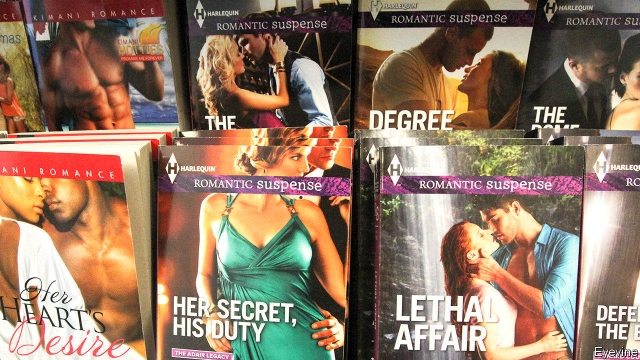

###### The wrong kind of racy

# A dispute over racism roils the world of romance novelists 

 

> print-edition iconPrint edition | United States | Jan 4th 2020 

IT BEGAN, like so many contemporary racial kerfuffles, on social media. Courtney Milan, a bestselling romance novelist and former chair of the Romance Writers of America (RWA)’s ethics committee (which sounds like fun) called “Somewhere Lies the Moon”, a historical novel by Kathryn Lynn Davis, “a fucking racist mess”. Ms Milan, who is Chinese-American, objected to physical descriptions (“slightly yellow” faces and “slanted almond eyes”) and to a character who said that Chinese women were “demure and quiet, as our mothers have trained us to be” and “modest and submissive, so they will make good wives.” 

Ms Davis and Suzan Tisdale, a writer who also runs a romance-publishing imprint that employs Ms Davis, accused Ms Milan of violating several sections of the RWA’s ethics code. The RWA’s ethics committee dismissed all of Ms Davis’s complaints save one: that Ms Milan’s comments violated “the organisation’s expressed purpose of creating a ‘safe and respectful environment’” for its members. The committee recommended a year’s suspension of Ms Milan’s RWA membership, and a lifetime ban on holding any RWA leadership position. 

Soon after that ruling was made public, a clutch of authors took to Twitter to support Ms Milan, and condemn the RWA. Several members of the RWA’s board resigned. The RWA swiftly rescinded Ms Milan’s punishment, but the controversy raged on. A petition urging the association’s sublimely named new president, Damon Suede, to resign began circulating online. Mr Suede says he does not plan to step down, but the petition’s backers say they have garnered enough signatories to force a recall election. 

The romance-writing world was already roiled by issues of race and representation. In 2017 just over 6% of books released by major romance publishers were written by non-white writers, according to a study by The Ripped Bodice, a romance-only bookstore. HelenKay Dimon, a former RWA president, believes that one of the reasons this dispute raised such strong feelings was that “coming out of last year...there was a little bit of hope” that things were getting better, and that using the RWA’s ethics code to punish a non-white writer for calling out what she saw as racist stereotypes “felt like a violation”. LaQuette, a mononymous African-American romance writer, says that before the row blew up, “we were one step closer to finding that...support” for non-white romance writers. But that “this event in a matter of days destroyed all that.” 

At this point, romance readers might wonder several things. Is it really unimaginable for a fictional woman in the 19th century—even a Chinese woman, with all the attendant stereotype warnings—to praise demureness and modesty? Why did Ms Davis not simply apologise for having given offence? Is there any fight more bitter than one among well-intentioned, decent people who are trying to convince each other that they are best intentioned and most decent? 

Ms Milan was initially punished, as Ms LaQuette notes, for “something that amounted to an argument on Twitter.” As Ms Dimon noted, the RWA’s board, which made the mess, was “incredibly diverse.” RWA board members seem broadly committed to the goal of improving things for writers from overlooked groups. Tone-deaf racial representations in bodice rippers may rank fairly low on the hierarchy of America’s social ills. Yet if a trade group that has done well by numerous writers sunders over it, romance authors of all backgrounds may find themselves bereft. 

