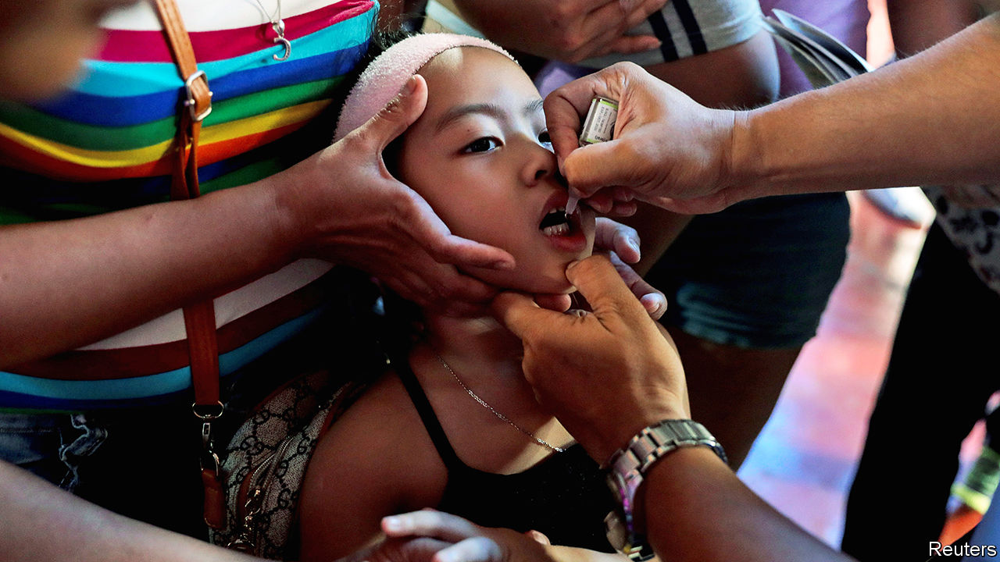

###### Sick days

# A rare outbreak of polio reflects the Philippines’ poor health care 

##### Distributing vaccines to 7,000 islands is not easy 

 

> Jan 9th 2020 

FOR NINETEEN years the Philippines was free from polio. But in September the announcement came that two children living in provinces 900 miles apart had been paralysed by a vaccine-derived strain of the disease. The strain was also found in sewage and in a waterway. Foreign and domestic health authorities have since jumped into action. The next in a series of immunisation drives starts on January 20th on the southern island of Mindanao.

Oral polio vaccines, such as those used in the Philippines, contain a weakened form of the virus, which lingers in children’s intestines for a short while after they ingest it. During that time the virus is excreted in faeces. In places where sewage is not properly managed, it can soon infect people without immunity. As it spreads from one such person to another the virus from the vaccine mutates, gradually gaining strength. This may take many months or even years. Eventually it evolves into a form that is capable of causing harm.


That this has been happening in the Philippines suggests that the country’s inoculation regime has become dangerously lax. To prevent polio from spreading, 95% of a population must be vaccinated against it. For years immunisation rates among infants in the Philippines have fallen far short of necessary levels. Official data say 70% of them received the full set of basic vaccinations in 2017. But 9% of infants got none at all.

The country’s challenging geography is one excuse. It is made up of around 7,000 islands, not all of them peaceful. Authorities struggle with the logistics of ensuring that vaccines are always available when and where they are needed. Busy parents find it difficult to visit clinics that are often open only during office hours. Some people put off trips to the doctor because of the cost. About 6m people—of 105m Filipinos in total—spend more than 10% of their income on health care. That is a larger share of the population than in either nearby Indonesia or Thailand, according to the World Bank.

The success of past vaccine programmes may have bred complacency. Fear also plays a role. In 2016 the botched introduction of a dengue vaccine created a huge controversy and led to criminal charges. Many children received the vaccine who, it later emerged, should have been excluded, given their medical histories.

The ongoing immunisation drive will probably control this polio outbreak. But completing broader health-care reforms would make a future one much less likely. Almost three decades ago the central government devolved many health services to local authorities. These days services are supplied by a fragmented mix of private and public providers, which lack oversight and accountability. Many rural areas struggle to attract doctors.

In 2019 President Rodrigo Duterte signed into law a Universal Health Care Bill, which automatically enrolls all Filipinos in the national insurance scheme, so as to give coverage to any who still lack it. The law also mandated better oversight of care providers and the more systematic collection of health data. A new government body is being created to assess the safety and efficacy of devices, procedures and, helpfully, vaccinations. All this is expected to cost 257bn pesos ($5bn) in the first year. It is worth a shot.■

