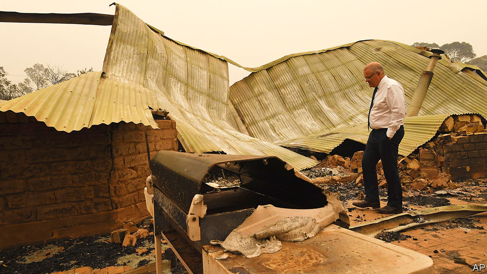
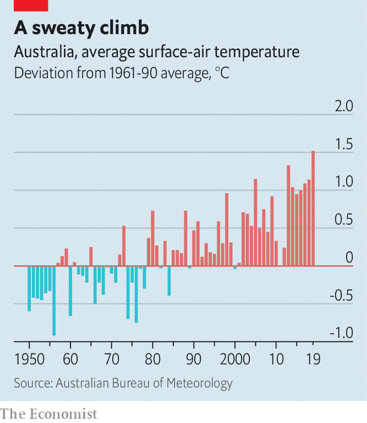

###### A burning question

# Why was Australia’s government so ill-prepared for the bushfires? 

##### The hot dry season is getting longer and hotter than before 

 

> Jan 9th 2020 

“A FEW BAGS and the cats” were all Brett Viewey could take when he fled his house in Kangaroo Valley, a small town in New South Wales. On January 4th he retreated to a bowling club in Nowra, a few hours south of Sydney, as a fire coursed towards his home. He is among tens of thousands of people who have moved out of the way of bushfires that are raging all across Australia, and especially in Victoria and New South Wales. So far the flames have burned across 11m hectares, larger than the area destroyed by recent fires in the Amazon and California combined. At least 26 people are dead and around 2,300 homes have been destroyed. And there are still several weeks of summer to go.

Fire-damaged towns have received Scott Morrison, the prime minister (pictured), with hostility. During a recent walk around Cobargo in New South Wales, angry locals called him an “idiot”. When two people refused to shake his hand, he forcibly took theirs. At a press conference on January 5th Mr Morrison said that “blame doesn’t help anybody” and that “over-analysis” is “not a productive exercise”. But Australians want to know how this extraordinary fire season could have been better handled. The rest of the world dares to wonder if it will prompt any acceleration of the country’s laggardly climate policies.


Bitter experience with seasonal conflagrations has left Australia with extensive codes related to wildfires, many introduced or expanded after the deaths of 173 people in fires in Victoria in 2009. Observers abroad say that fire-safety rules for housebuilders and home-fixers are perhaps the world’s most comprehensive. Whereas authorities had previously thought that well-prepared homes could be defended, Australians are now told to evacuate as fires bear down on them, nudged by emergency broadcasts, text messages and fire-watching mobile apps. To encourage them to do so, a new category of “catastrophic” or “code red” was added to risk warnings. All this has certainly saved lives this year.

 


Ross Bradstock, a bushfire expert at the University of Wollongong, notes that in recent years Australia has greatly expanded the use of preventive measures known as “hazard reduction”, in which controlled burns are carried out during the winter to reduce the amount of material available to ignite when temperatures rise. Some Australians grumble, without much evidence, that “greenies” worried about plants and wildlife have been holding this practice back. But the main obstacle is that the fire season is lengthening year by year, says Shane Fitzsimmons, a fire chief. This shrinks the amount of time available to carry out preventive work.

Many Australians think the government could have prepared better. Greg Mullins, the former fire commissioner of New South Wales, and other ex-chiefs warned authorities in April that extremely dry conditions in Eastern Australia were likely to lead to a very dangerous fire season. They wanted cash for water-bombing aircraft, but Mr Mullins says they were “fobbed off”. Money was eventually found, but not until December, when flames had already spread. Mr Morrison has since promised ongoing funding for firefighting planes and helicopters.

One of the most emotive issues is the pressure that is put on volunteer firefighters. On leave from their day jobs, volunteers are the primary defenders of most neighbourhoods. They often have to make do with limited kit. Brendon O’Connor, a volunteer firefighter in Balmoral, a village south of Sydney, recounts how his crew fought five fire fronts with two trucks before running out of water. Two of his team died. A challenge in the longer term is that, like the rest of Australia’s population, the volunteer fire service is ageing. It could become less effective, just as Australia’s fires are getting worse.

The underlying reason for the devastation is the exceptionally hot and dry weather, which made the bush more flammable (2019 was Australia’s hottest year on record). Mr Morrison says that his government has never denied that there is a link between climate change and the extreme weather that has made this year’s bushfires so grave. That marks a shift from rhetoric heard earlier in the disaster, when politicians on the right of Mr Morrison’s Liberal Party dismissed people who saw a connection between bush fires and climate change as “inner-city lunatics” and “climate alarmists”. The prime minister has promised that the country is on track to “meet and beat” its greenhouse-gas emissions reduction goals.

It is not, and those goals are anyway too modest. Per head of population, Australia’s carbon emissions are among the highest in the world. They have been rising since the Liberals came to power in 2013 and scrapped a carbon tax. Diplomats from other rich countries accused Australia of jeopardising international climate agreements at the UN’s climate conference in Madrid in December, even while the fires were raging. It wanted to meet its commitments under the Paris agreement by carrying over credits it earned from the 20-year-old Kyoto protocol. This fiddle would give much bigger emitters, such as China, a way to wriggle out of their promises too.

Last year 61% of Australians told pollsters that they thought climate change was a “serious and pressing” problem, up from 50% in 2015. Nevertheless, the government’s unambitious climate policies are one reason Mr Morrison clung onto his job at a general election in May, when pundits had expected a big victory for the Labor Party. He hoovered up votes in Queensland, a state full of marginal constituencies with an economy dependent on exporting natural resources, especially coal. He would like to keep that support.

If this season’s fires do not change calculations “then nothing will,” says Lesley Hughes, a biologist at Macquarie University. Even people far away from the flames are breathing filthy air. The disaster will do huge damage to tourism, which employs about 5% of Australians, and to agriculture, though it is too early to guess how much. During this year’s election campaigns the Liberals convinced Australians that they were the safest stewards of the economy. But they will find it difficult to hold that ground if more people decide that inaction on climate change has high and immediate direct costs, says Ian McAllister of the Australian National University.

Labor, still pulling itself together after its surprise defeat in May, has not applied much pressure. Its leader of seven months, Anthony Albanese, promises to do more to tackle climate change. But he disappointed green campaigners by touring Queensland in early December, a trip viewed by some as an effort to reassure big coal exporters. Australia’s two big parties are locked in a “hideous death dance”, reckons Sarah Maddison, a political scientist at the University of Melbourne. “This is the end result.”■

