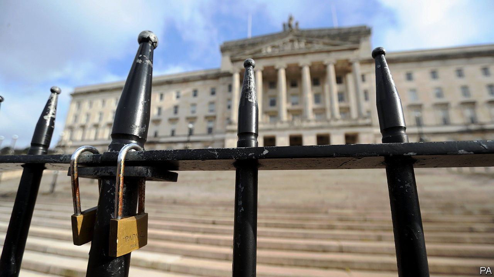

###### Stormont Assembly

# The prospects for reviving Northern Ireland’s government 

##### Why things are looking up at Stormont 

 

> Jan 9th 2020 

NORTHERN IRELAND’s devolved government may be about to come back to life. Since the Stormont assembly closed three years ago, several attempts to resuscitate it have fizzled out with varying degrees of rancour, but now the two main parties, the Democratic Unionist Party (DUP) and Sinn Fein, are back at the negotiating table and this time it could be different.

Both parties are smarting from the general election results. Sinn Fein won seven Westminster seats, as it did in 2017, but its vote dropped sharply in several areas. The DUP lost two of its ten seats. Unusually for Northern Ireland, the moderates fared better than the extremists. The Alliance party, which took votes from the DUP, and the Social Democratic and Labour Party (SDLP), which took votes from Sinn Fein, represent more moderate tendencies among unionists and republicans respectively.


Thanks to Boris Johnson’s big majority, the DUP has also lost the influence it had—or thought it had—over the Conservative Party. A painful internal debate has ensued, with members accusing Mr Johnson of betrayal and blaming Arlene Foster, the party leader, for trusting the Conservatives. She may get ousted.

The most alarming development, from the DUP’s point of view, is that Northern Ireland’s union with Britain looks increasingly insecure. Mr Johnson’s withdrawal bill, which returned to Parliament on January 7th, draws a dotted line between the province and the rest of the country by providing for different customs arrangements in the two areas. The latest poll in Northern Ireland showed a tiny majority in favour of the reunification of Ireland. The Good Friday Agreement, which brought peace to the province, mandates a referendum on reunification when it is clear that a majority in the province wants one.

The loss of its influence in London has propelled the DUP back to the conference table to negotiate a revival of the assembly. A tough new tactic the British government has adopted has encouraged Sinn Fein to do the same. It is threatening to call fresh assembly elections unless the two parties reach agreement on a resumption of the power-sharing deal by January 13th. The prospect that the Alliance and the SDLP might gain ground in such an election increases the pressure on the DUP and Sinn Fein to make a deal. Stormont’s shutters may therefore reopen before long.■

