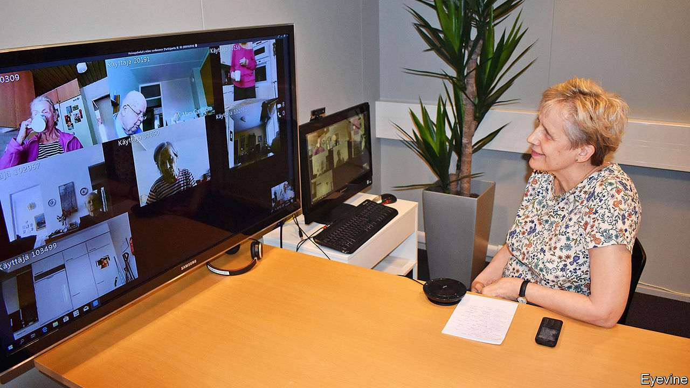

###### Prescribing tablets

# Finland turns to technology to help frail old people live at home 

##### Digital home visits, pill-dispensing robots and more 

 

> Jan 9th 2020 

IN A GREY office building on the outskirts of Helsinki, a chatty social worker is meeting six elderly people from around town for lunch—via tablets propped on their kitchen tables. For the next half-hour she talks to them about their day and reminds them to have something to drink, because dehydration is particularly dangerous for older people (making them more prone to falls, among other things). Glasses of milk and water are duly raised.

The virtual lunch group is part of Helsinki’s remote-care programme for its elderly. While many countries with bulging elderly populations are building new care homes, Finland is not planning to do so and, instead, is looking after people in their own homes for longer—even those with dementia who live alone.


The guiding principle in Finland is that for anyone, no matter what their age, “home is best”, says Anna-Liisa Lyytinen from Helsinki’s social-services department. Nurses and care workers drop in, often several times a day, to help with meals, bathing, medication, or just to check that everything is all right.

Such a painstaking service will be harder to provide as Finland ages. In the next ten years the number of residents older than 75 is expected to increase by around half, as people live longer and the baby-boomers become octogenarians.

Finland’s answer to this challenge is technology—unsurprising in a country that claims to have the biggest number of digital health startups per person. At a recent international health-tech fair in Helsinki many, if not most, of the offerings at the Finnish pavilion had to do with helping frail elderly people to live independently. That involves two challenges: making sure that care workers know immediately when something goes wrong (an old person falls over, for example) and slowing the decline of elderly minds and bodies.

In Helsinki’s municipal home-care programme, about 4,000 frail people are equipped with various safety gadgets. These include wristbands with GPS, a fall detector, an alarm button and a phone line linked to care workers, who monitor the wearer’s location on their computer screens. Some people who have dementia have sensors on their front doors, which send alerts to the care team if they go out. Most of them are too infirm to walk about much, so they rarely leave their homes, says Hanna Hamalainen, a former manager at the programme. When they do go out, she says, it is usually to drop in on friends nearby. But if they venture out in the middle of the night or stray too far from home, care workers are dispatched to find them.

Technology cannot replace care workers, but it can help. The most common reason for a home visit by a social worker in Helsinki is to check that Grandma is taking her medicine. A pill-dispensing robot in her home can do that. Each holds a two-week supply of multiple drugs, chimes a reminder when it is time to take them and dispenses the right combination. For one in five people who try them the robots don’t work, usually because Grandma is reluctant to take lots of pills or has advanced dementia. But for the rest, they have cut medication-related visits by nurses from 30 to just four a month.

Here’s looking at you

The idea of frail old folk living alone perhaps worries Finnish people less than many others; Finns pride themselves on their rugged self-reliance. A welcome pack for foreign journalists includes a book of cartoons depicting “Finnish nightmares”, such as having to say “hello” to a neighbour. Social isolation, however, is a big problem for the elderly because it leads to faster cognitive and physical decline. To deal with that, Helsinki runs virtual get-togethers for its homebound elderly that include quizzes, chair exercise classes, sing-alongs, book clubs and a religious discussion led by a priest. These should be regarded as extras, though. A degree of personal interaction, not just the virtual kind, is surely necessary even for Finns.

The biggest challenge for both humans and gadgets is to spot problems early. Some Finnish towns are testing technology to unobtrusively track the daily activity patterns of people who live alone. Local tech companies, including MariCare Oy and Benete, have developed systems that use a network of motion sensors to gather data on things like how much a person moves about, visits the bathroom or opens the fridge. Care workers use dashboard summaries of such data to prioritise whom to visit and what to check for. A jump in bathroom visits, for example, may be a sign of a urinary-tract infection. Not opening the fridge as much is a hint that memory problems may be getting worse.

Gizmos sometimes misfire. Wristbands give out the wrong co-ordinates, triggering false alarms. A sensor may fail because Grandpa draped a towel over it. Some elderly folk forget to charge their tablets. Such problems can be fixed. But even so, the share of contacts that home-care workers in Helsinki make virtually is not expected to rise much from its current 8% (out of 250,000 visits a month).

The biggest gain from technology may be that it makes it easier to keep old people fit enough to remain in their own homes for longer. This is much cheaper than an institution, and usually nicer, too.

A 65-year-old Finn can expect to live another 20 years, among the longest life expectancy in Europe. But Finland is in the bottom half of EU countries when it comes to how many of those years are spent in good health, thanks to a fatty diet and a relative lack of exercise, perhaps because the winters are so long. Not every problem has a technological fix. ■

