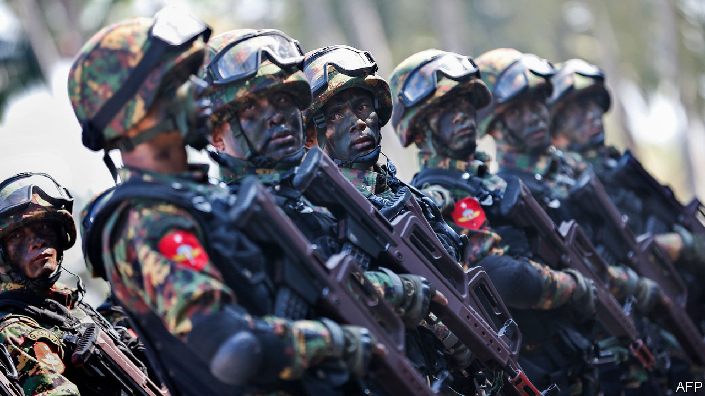

###### Pen, sword and scales

# Criticism of the army or government lands many Burmese in court 

##### The army, meanwhile, spreads whatever falsehoods it likes 

 

> Jan 18th 2020 

BURMESE GENERALS are not accustomed to criticism. During the long years of military rule, they tended to lock up anyone who crossed them. Even after they handed most authority back to a civilian government in 2016, they have continued to torment their critics—in the courts. Over the past four years the Tatmadaw, as the armed forces are known, has filed 47 lawsuits against nearly 100 individuals who have criticised it in the press or on social media. “We do not have lèse-majesté laws, but we seem to have lèse-militaire ones,” complains Mon Mon Myat, a journalist.

If anything, the army’s prickliness is growing. More than half of the 47 complaints were filed in 2019. In April the Tatmadaw sued two news outlets, Irrawaddy and Radio Free Asia, over their coverage of its clashes with one of Myanmar’s many ethnic militias. In June it sued three journalists for suggesting that it had seized land from farmers and suppressed the resulting protests. In August it filed a lawsuit against a pastor who had complained to Donald Trump, America’s president, about the army’s oppression of Christians. Last year it exhorted media outlets not to use the term “civil war” to refer to the various armed conflicts that rack the country, preferring instead “war of annihilation”. In 2017 it told reporters to call the people it is fighting in one such war “terrorists” rather than “militants” or “insurgents”.


Unfortunately, it is not just the army that is absurdly thin-skinned. Aung San Suu Kyi was one of the people the Tatmadaw detained for challenging military rule. But since she became the country’s de facto leader in 2016, at least ten people have been hauled into court for criticising her online, under a woolly and oppressive law on telecommunications.

All told, more than 250 people faced legal charges in 2019 for speaking out about the Tatmadaw, the government or ethnic tensions. Almost a third were prosecuted in criminal court for defamation, which is a civil offence in most Western countries but is punishable by up to three years in prison in Myanmar. Nearly a fifth were charged under the telecommunications law, which also provides for up to three years in prison for those “extorting, coercing, restraining wrongfully, defaming, disturbing, causing undue influence or threatening any person” on social media. “The problem has gotten worse with more arrests in recent months,” says Ye Wai Phyo Aung of Athan, a free-speech watchdog based in Yangon, the commercial capital.

The government has helped set up a body called the Myanmar Press Council to mediate disputes between journalists and officials, among other things. But one of its members, Myint Kyaw, says the government typically takes its complaints straight to the courts, sidestepping the council.

Ironically, it is the Tatmadaw itself which is one of the biggest sources of online falsehood in Myanmar. In 2018 executives at Facebook, which is extremely popular in Myanmar, said that the army had used it to mount a clandestine anti-Muslim hate campaign. Needless to say, none of those responsible was prosecuted. ■

