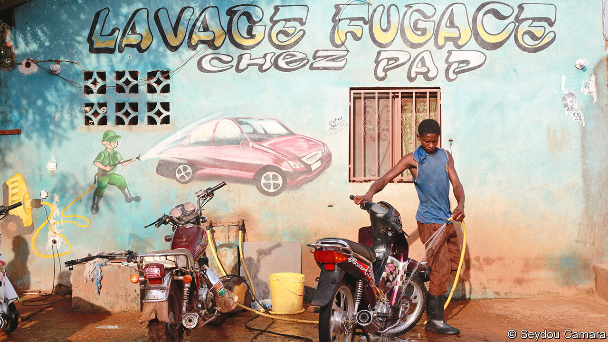

###### Pictures at an exhibition

# As violence spreads across Mali, artists in the capital resist 

##### “It is our duty to create something beautiful every day,” reckons Seydou Camara, a photographer 

 

> Jan 18th 2020 

ONCE A WEEK Seydou Camara leads several dozen photography students around Bamako, Mali’s sprawling capital. Most of them do not have equipment of their own, but that does not deter them. They troop through the sunburned streets, past countless motorbikes, vegetable-sellers and fabric-dealers, passing round a few old cameras between them as they walk. “We want to teach them how to tell their city’s stories,” says Mr Camara.

As vast swathes of the country are tormented by men with guns and machetes, Mr Camara’s free classes have become a small act of resistance. The wiry street photographer is determined to help sow the seeds of a new generation of artists who can prosper when the fighting stops. “I believe it is our duty to create something beautiful every day,” he says.


His country’s cultural history is unusually rich. In medieval times west African civilisation blossomed in territory along the banks of the Niger river that was to become modern Mali. In the 13th century, while Europe burned heretics, books were a status symbol in the Malian empire. Scholars and nobles collected many thousands of manuscripts and turned the cities of Timbuktu, Gao and Djenné into repositories of the world’s knowledge.

Since independence from France in 1960 Bamako—meaning “crocodile river” in the local Bambara tongue—has undergone a fresh renaissance. Its position at the crossroads between the arid Sahel region and the luxuriant Gulf of Guinea has made it a melting pot for artists and musicians from across west Africa. Legendary performers have emerged from the city. In the late 20th century Ali Farka Touré and Toumani Diabaté cemented Bamako’s status as a musical powerhouse with their desert blues. Malick Sidibé and Adama Kouyaté pioneered African photography, capturing the exuberance of a generation throwing off the shackles of colonialism.

Today, the city’s cultural scene is under threat. In 2012 rebels and jihadists swept out of the Sahara and captured the northern half of the country. The militants enforced an extremist Wahhabi ideology, looted libraries and damaged the ancient mud-brick mosques of Timbuktu. In 2013, after the gunmen began to advance on Bamako, thousands of French and Chadian soldiers intervened and drove them back into the desert. Over the past seven years, the jihadists have regrouped and set different ethnic groups against each other. Attacks and ethnic pogroms have once more spread from the remote north to within a few hundred miles of the capital.

Apart from a handful of incidents, Bamako itself has so far been largely unscathed by the violence. Unless the Malian armed forces disintegrate, or the French and United Nations contingents that are still stationed in the country are withdrawn, it will remain safe for the foreseeable future. Physically safe, at least; the conflict has already had a devastating impact on artistic life in the city. Take Mr Camara. Ten years ago, his future looked bright. A series of pictures he shot of the lives of his country’s albino population earned international praise. Collectors and foreign newspapers were keen on his intimate portrayals of urban life (see above).

Recently, tourists—and buyers—have become scarce; dealers of African art tend to skip Bamako in favour of Lagos, Nairobi or Dakar. Mr Camara and many of his peers are struggling to make ends meet. “It has become very difficult for us,” says Kadia Sogobo, a 24-year-old photographer. “Our heritage and our culture are under threat.” Mercedes Vilardell, who acquires African art for Tate Modern in London, says Malian artists do not have the same resources as South Africans or Nigerians to advertise their work internationally. Since “people are now too scared to come here”, she laments, “it just isn’t seen.”

For all the turmoil, life goes on in Bamako. The street bars still hum with the rhythms of Tuareg rock, Congolese rumba and Nigerian Afrobeats. Locals boast that, apart from Lagos, their city has the best nightlife on the continent. The embattled government has made a political statement simply by carrying on as normal. In December 2019 it oversaw the opening of Bamako Encounters, a biannual photography festival that has become one of Africa’s biggest. Photographers and artists came from all over the continent to tell African stories in dozens of small galleries. Regular visitors reckoned fewer people were attending than in the past, but given that the event had previously been cancelled altogether because of fears over security, staging it was a show of defiance. At the opening, speakers talked about the need to fight terror with culture and beauty.

For Mr Camara the festival is particularly important. His work was first noticed there in 2009, and he knows how valuable the exposure it brings can be for his students. Without such attention, he worries that Mali’s image will increasingly be defined not by its people, but by the Western journalists who have arrived to report on the bloodshed. “All they see is our misery,” he says. “They don’t see our happiness. No one can portray us better than ourselves.”

He cannot travel across his country as he once did. Yet, for him, Bamako itself is filled with hidden tales and significance. He says the cliffs surrounding the city have a metaphorical meaning that helps define its inhabitants. “On one side of us are the cliffs of power,” he says gesturing towards the president’s hilltop palace. “On the other, you have the cliffs of knowledge, where the university is. In between, the people of the Niger welcome all.” ■

