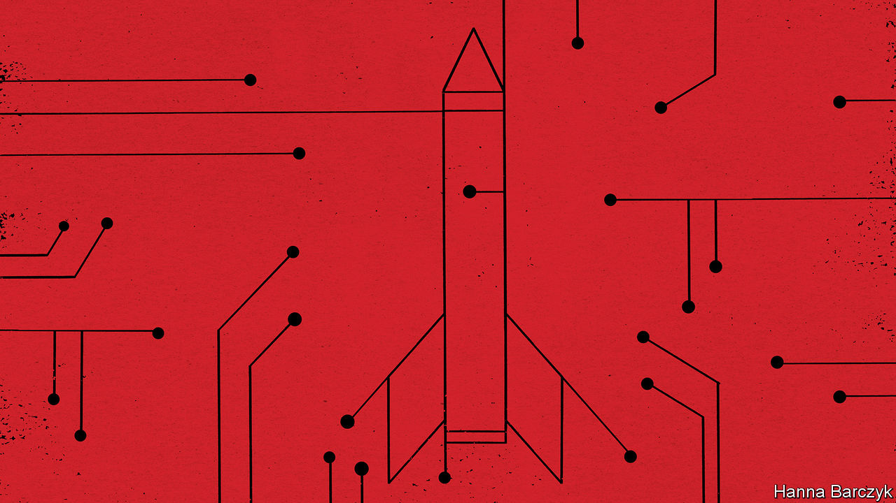

###### The digital divide

# Different views of AI fuel distrust between China and America 

##### The two countries talk past each other about its risks 

 

> Jan 18th 2020 

IN THE DEPTHS of the cold war, American and Soviet arms-control negotiators pulled off something remarkable: an agreement so grimly logical that their mutual distrust did not matter. The superpowers pledged to stop building new systems to defend their respective homelands against nuclear missiles. Their Anti-Ballistic Missile Treaty rested on a theory of mutual deterrence: the notion that the surest path to nuclear-armed co-existence lay in knowing that war would lead to catastrophe for both sides.

Today the rivalry between America and China is sliding into its own ice age of suspicion. Once again, new and unproved technologies—this time computer systems capable of performing superhuman tasks using machine learning and other forms of artificial intelligence (AI)—threaten to destabilise the global “strategic balance”, by seeming to offer ways to launch a knockout blow against a nuclear-armed adversary, without triggering an all-out war.


A report issued in November by America’s National Security Commission on Artificial Intelligence, a body created by Congress and chaired by Eric Schmidt, a former boss of Google, and Robert Work, who was deputy defence secretary from 2014-17, ponders how AI systems may reshape global balances of power, as dramatically as electricity changed warfare and society in the 19th century. Notably, it focuses on the ability of AI to “find the needle in the haystack”, by spotting patterns and anomalies in vast pools of data. In a medical setting AI can find tumours that radiologists miss. In a military context, it may one day find the stealthiest nuclear-armed submarines, wherever they lurk. The commission is blunt. Nuclear deterrence could be undermined if AI-equipped systems succeed in tracking and targeting previously invulnerable military assets. That in turn could increase incentives for states, in a crisis, to launch a devastating pre-emptive strike. China’s rise as an AI power represents the most complex strategic challenge that America faces, the commission adds, because the two rivals’ tech sectors are so entangled by commercial, academic and investment ties.

The good news is that China’s national-security establishment is also sobered by AI’s potential. Drawing on the example of arms-control talks during the cold war, Chinese officials and scholars have begun talking to Americans and Europeans about its dangers. With many government channels of communication suspended by the Trump administration, much of the jaw-jaw involves recently retired Americans meeting serving and former Chinese intelligence and military officers, diplomats and scholars. Chaguan was allowed to attend one such dialogue recently held in Beijing and Shanghai. The Americans were led by Mathew Burrows of the Atlantic Council, a Washington-based think-tank. His previous career in the CIA included preparing forecasts of global trends for incoming presidents. The Chinese organiser was Xiang Lanxin of the Graduate Institute of International and Development Studies in Geneva, who also heads the Shanghai-based Centre for One Belt, One Road and Eurasian Security.

Chinese views are not monolithic. Some officials sound gung-ho about AI as a path to prosperity and development, with few qualms about privacy or lost jobs. Still, other Chinese fret about AI that might put winning a war ahead of global stability, like some game-playing doomsday machine. Chinese officials have studied initiatives such as the “Digital Geneva Convention” drafted by Microsoft, a technology giant. This would require states to forswear cyber-attacks on such critical infrastructure as power grids, hospitals and international financial systems. AI would make it easier to locate and exploit vulnerabilities in these.

The bad news is that agreeing on rules for AI is even harder than wrangling over nuclear arsenals. One obstacle is physical. Warheads or missile defences can be counted by weapons inspectors. In contrast, rival powers cannot safely show off their most potent algorithms, or even describe AI capabilities in a verifiable way.

Other obstacles are philosophical. Seeking areas for co-operation, Chinese participants in the recent dialogue cited counter-terrorism. They suggested, for instance, that AI’s predictive powers might direct American and Chinese agents to shipping containers hiding drugs, or help police track extremists lurking among citizens returned from Syria, Iraq or other trouble-spots. Both sides readily agree on the need for co-operation in the search for smuggled fentanyl. But Western alarm bells quickly sound over China’s enthusiasm for algorithms trained to finger potential offenders before they break the law. Westerners worry especially about so-called “black box” algorithms, powerful systems that generate seemingly accurate results but whose reasoning is a mystery even to their designers. When machine learning uses past data to predict future actions, that prompts soul-searching about entrenching prejudice via algorithm. Last year a hearing in America’s Congress weighed the impact of facial-recognition technology on civil rights. Yet China shows few such qualms as it rolls out AI-powered surveillance systems that draw on data sets filled with past misdeeds and anti-social acts, or simple biases. Some use ethnic profiling, most notoriously in the western region of Xinjiang, where Muslim minorities are deemed prone to “mistaken thinking”.

Don’t trust, can’t verify

Repeatedly, Chinese participants in the dialogue downplayed their country’s AI prowess. One said that China’s military applications were ten or 20 years behind America’s. “If I were America, I wouldn’t worry,” he chuckled. There were many calls for America to remain open to Chinese students and tech firms. “Generally speaking, China wants to learn from the United States, while the US sees China as a rival,” a Chinese official complained. To hawks in Washington such talk is a trick: an appeal to keep assisting China’s mastery of AI, and to forget the risks. Chinese AI experts might protest that they are damned if they seek co-operation with America, and damned if they do not. That, alas, is the logic of distrust. ■

