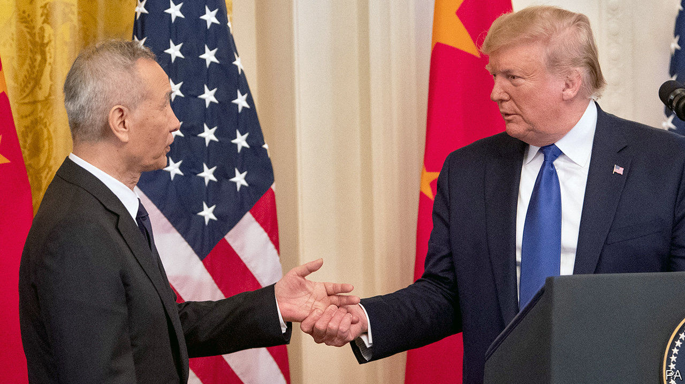

###### Between the lines

# America and China sign a trade deal 

##### But it will be an uneasy truce 

 

> Jan 16th 2020 

WITH HIS habit of announcing trade deals only for them to dissolve within weeks, President Donald Trump is a standing reminder that talk is cheap. But on January 15th he signed a phase one trade agreement with China alongside Liu He, the Chinese vice-premier, and published its contents for the world to see. The 86 pages set out the terms of a new economic relationship between these two giants. Alongside some welcome measures, there are some howlers—and glaring omissions.

Throughout the whole, however, runs a common pattern. Clauses that are in reality concessions wrung from the Chinese are often written in such a way that they formally apply to both sides—but with subclauses specifying the actions that the Chinese are to take. For example, pledges to protect trade secrets are accompanied by new processes by which American companies can complain about breaches.


The deal also addresses several long-standing American complaints about China’s foot-dragging. China pledged that approvals of agricultural biotechnology products will take less than two years. The deal sets deadlines for China to consider licence applications by MasterCard and Visa. And China will lower bureaucratic barriers to imports of American dairy, pork and beef.

As many a weary trade negotiator can attest, China has a history of reneging on promises. But this deal comes with a novel dispute-settlement mechanism. After a speedy consultation, either party may find fault with the other. (History suggests that the Americans are more likely to feel aggrieved.) If a solution cannot be reached, the accuser can unilaterally impose penalties. The accused cannot retaliate, short of pulling out of the deal altogether.

It is possible that this mechanism will force China to address American grievances. But it may also cause new problems. It hands huge discretion to Robert Lighthizer, the United States Trade Representative (USTR). Take China’s ever-contentious yuan regime. On January 13th, in a sign of thawing relations, the American Treasury removed China from its list of currency manipulators. But if at some point China is put back on the list, the USTR would now seem to have virtually unchecked power to slap tariffs on it.

Further problems may be caused by China’s pledge to buy an extra $200bn of American goods and services over the next two years, on top of a baseline of $187bn in purchases in 2017. That is intended to satisfy Mr Trump’s main desire: to close America’s trade deficit with China. But making it happen will probably require China’s government to direct Chinese companies to buy lots of American goods. Both countries will become more reliant on each other, which neither wants. And their other trading partners might be squeezed out.

The Americans do not seem overly concerned. Mr Lighthizer is keen to move on to implementation, saying that, as the first deal of its kind, “we have to make sure that it works”. The coming months will demonstrate whether the two countries can establish a friendlier dialogue, and whether their relationship can survive America’s more aggressive use of security-related export and investment restrictions.

The deal is far from a reset. As Mr Lighthizer noted, China’s cyber-intrusions and industrial subsidies still rankle with America. Chinese media, meanwhile, laid out an argument that may become more familiar: if American export restrictions prevent China from fulfilling its purchase commitments, the fault will lie with America.

A truly grand pact between the two countries is some way off—and indeed, may never arrive. But this modest trade agreement shows how much the status quo has changed. Tariffs on hundreds of billions of dollars’ worth of imports into both countries remain in place, with an ever-present threat of more. This is not trade peace, but rather a trade truce—and a tense one at that. ■

