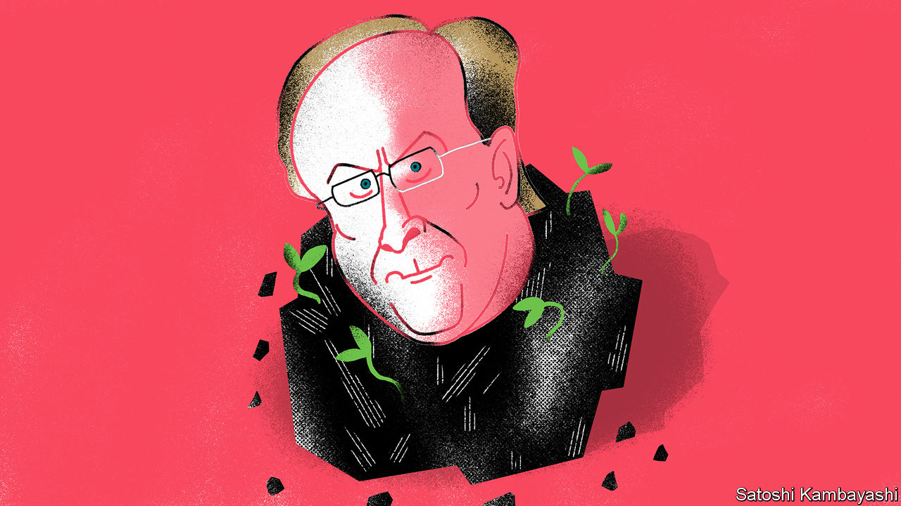

###### Green giant

# BlackRock says it wants to do more for the climate 

##### The proof will be in its investment and shareholder-voting strategies 

 

> Jan 16th 2020 

“I BELIEVE WE are on the edge of a fundamental reshaping of finance,” wrote Larry Fink, the boss of BlackRock, the planet’s biggest fund manager, in an open letter on January 14th. His annual missives, addressed to clients and the bosses of companies in which BlackRock invests, are widely read. This year’s, which argues that climate change is a big investment risk that could cause market havoc sooner than most expect, was no exception.

The letter also said what BlackRock, which has $7.43trn in assets under management, plans to do. First, it will demand greater disclosure from all firms on their carbon emissions and climate risks. Because BlackRock has huge clout, this will make a difference. Second, it will double its offering of sustainable funds to 150. The aim is that BlackRock’s sustainable assets will rise from $90bn to $1trn within a decade. Finally, it has pledged to change how it runs its actively managed portfolios, which account for 27% of its total assets. It will dispose of public securities issued by any firm that makes over a quarter of its revenue from thermal coal—the type used to generate electricity.


The direct impact will be limited: the pledged coal divestments, for example, are less than 0.1% of BlackRock’s assets. The indirect impacts may be larger, as firms are prodded to improve disclosure and the share of assets run under green mandates rises. Part of Mr Fink’s motivation is self-interest. Climate change is the biggest concern of BlackRock’s clients, he says. Even as a price war in passive fund management rages, demand for green investment funds is soaring. And BlackRock will integrate climate analysis into Aladdin, a risk-management system that it sells to many other financial firms.

Mr Fink’s professions of greenery did not come out of the blue. In 2018 his letter, entitled “A sense of purpose”, said that firms should do more than create shareholder value. But they imply big changes for BlackRock. In 2019 it opposed 93% of shareholder resolutions in America urging companies to become greener, compared with an industry average of 56%, according to Morningstar, a research firm. It only recently joined Climate Action 100+, a coalition of asset managers that presses big polluters to clean up.

So is the letter so much greenwash? A good test is whether BlackRock’s active and passive funds vote against the expansion plans of fossil-fuel firms they invest in. These imply big increases in carbon emissions, says Mark Campanale of Carbon Tracker, a think-tank. Over to you, Larry. ■

