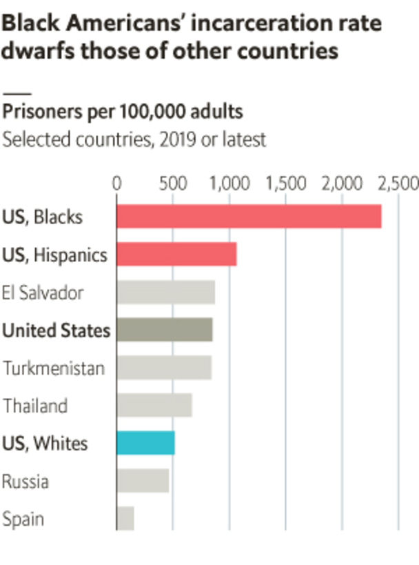

###### Crackdown

# Smoking-gun evidence emerges for racial bias in American courts 

##### Black defendants are suspiciously likely to be charged with carrying precise amounts of crack 

 

> Jan 18th 2020 


YOU DON’T need a degree in statistics to believe that racial disparities plague American law enforcement. Of every 100,000 black adults, 2,300 are incarcerated—five times the rate for whites. This gap is not proof of discrimination: blacks could be five times as likely to break the law. Yet critics say that courts treat blacks more harshly than whites who face similar charges. A recent working paper, by Cody Tuttle of the University of Maryland, bolsters this view by revealing striking evidence of bias.

When suspects are charged with drug possession, the quantities in their indictments only loosely reflect what they were carrying when arrested. Prosecutors can boost amounts using testimony about previous activity, or by charging people for drugs held by co-conspirators. Some convictions cite 100 times as much crack as the defendant had in hand. Such leeway makes these figures as much a measure of prosecutorial discretion as of suspects’ crimes.


In 1986 Congress passed a law requiring anyone possessing 50g or more of crack to serve at least ten years in prison. Legislators raised this cut-off to 280g in 2010, making the minimum sentence for possession of 279g half as long as for 280g. By creating a cliff, the law encouraged offenders to carry less than 280g. It also enabled prosecutors who sought extra-long sentences to secure them, by filing charges just above the limit.

Before 2010, convictions for 270-280g or 290-300g were just as common as for 280-290g. After that year, the share of sentences for 280-290g surged, from 0.5% to 4%; the rates for adjacent amounts barely changed. Moreover, the burden of these strategically sized charges fell disproportionately on minorities. In 2011-15, 4% of convictions of black and Hispanics for possession were for 280-290g, compared with 1.5% of sentences for whites. The shares for both races were similar at 270-280g and 290-300g.


Mr Tuttle finds that only a minority of prosecutors (around 20-30%) display this bias. These officials tend to work in states with above-median rates of searches on Google for racial slurs, suggesting racism is more common in their regions. In other states, “bunching” at 280-290g did occur, but affected blacks and whites equally.

On its own, ending this gap would barely dent the racial imbalance in American jails. But if prosecutors are biased against black suspects in these cases, they may carry that animus to other crimes as well. ■

Sources: US Bureau of Justice; World Prison Brief; World Bank; “Racial Disparities in Federal Sentencing: Evidence from Drug Mandatory Minimums”, by Cody Tuttle, University of Maryland; FBI; The Economist


