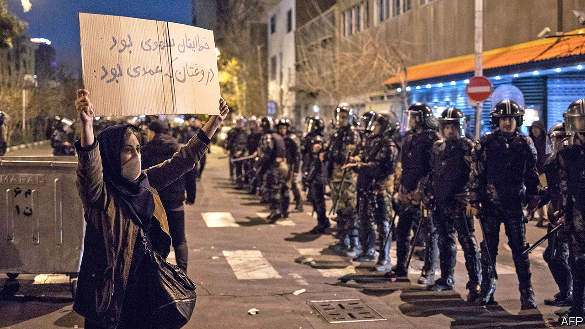

###### Sorry doesn’t cut it

# It’s time for the Iranian regime to talk to America 

##### And loosen up at home 

 

> Jan 18th 2020 

NOT SINCE the Ashura holiday, which some Shias mark by whipping themselves, had Iran witnessed so much self-flagellation. After three days of covering up the cause of the crash of a Ukrainian airliner near Tehran on January 8th, Iran’s leaders admitted that their own armed forces had mistaken the plane for an incoming cruise missile and shot it down, killing all 176 people on board. Hossein Salami, the head of the Islamic Revolutionary Guard Corps (IRGC), said he was sorrier than he had ever been in his life and wished he had died on the plane himself.

Coming from someone else, such remorse might have soothed the public. But this is Iran, where only two months ago the state killed hundreds of protesters. After a pause to berate America for killing Qassem Suleimani, Iran’s most prominent general, on January 3rd, Iranians are furious with their rulers again. Thousands have taken to the streets to challenge the regime’s lies and incompetence. Meanwhile Britain, France and Germany have taken steps that could lead to the reimposition of UN sanctions over Iran’s nuclear activity. The hard men of Tehran face pressure from all sides. They are not responding well.


Start at home, where beneath all the unrest lie broader grievances over a collapsing economy, stagnant politics and unaccountable leaders (see ). The regime seems concerned mostly with self-preservation. Officials promised a transparent investigation of the crash only after incontrovertible evidence of their lies was broadcast. Even so, some are resorting to tired tactics to deflect blame. “We will investigate the extent to which US warmongering caused this event,” said a spokesman for the judiciary, adding that several people have been detained. One is a person whom the authorities say posted a video of the missile hitting the plane.

President Hassan Rouhani, a moderate by Iranian standards, says IRGC leaders should be prosecuted. But more conservative clerics and the Guards, who together wield the real power, are already stifling dissent. General Salami has sent his thugs to club protesters. On January 13th the Council of Guardians, an appointed group of clerics and jurists, disqualified 90 MPs, nearly a third of parliament, from running for re-election next month. Most are moderates. (Imagine Britain’s Archbishop of Canterbury expelling all Labour MPs from Parliament. This is normal in Iran.)

So miserable is the situation, and so beaten down are the reformers, that some Iranians are pinning their hopes for change on the IRGC itself. After years of accumulating power, the Guards are in a position to challenge clerical rule and seek a rapprochement with America, or so the thinking goes. But such a volte-face is unlikely—and if the crash shows anything, it is that the IRGC needs to be reined in, not empowered. When he isn’t crushing protests, General Salami vows to continue Iran’s fruitless conflict with America.

The regime is not entirely to blame for the crisis with America. It was complying with the terms of a deal, signed in 2015, which curbed its nuclear programme in return for sanctions relief. President Donald Trump pulled America out of it in 2018. Since then, though, Iran has needlessly alienated the deal’s European signatories. This month it lifted all limits on its production of enriched uranium, used to make energy—or a bomb. Britain, France and Germany responded on January 14th by triggering the deal’s dispute mechanism, which could ultimately kill it.

“Let’s replace it with the Trump deal,” says Boris Johnson, Britain’s prime minister, perhaps hoping that Mr Trump would sign something like the current deal, but with his name on it—as he did with the North American Free Trade Agreement. That would be welcome but it is unlikely. For one thing, Iran’s leaders refuse to talk to Mr Trump. For most of the past 40 years they have chosen hostile posturing over constructive engagement. Iran is worse off as a result. Now would be a good time for the clerics to rethink their strategy. ■

