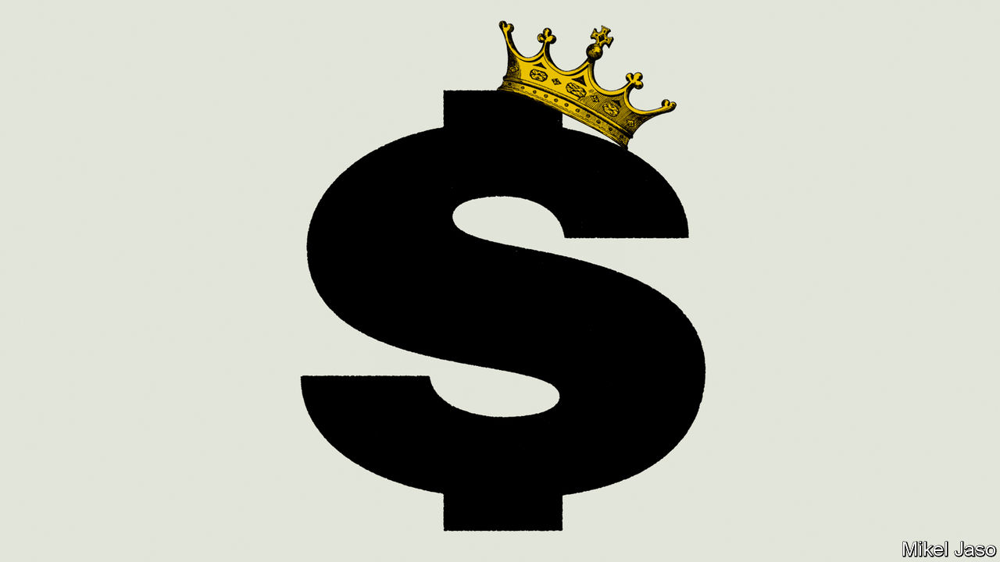

###### Dethroning the dollar

# The search to find an alternative to the dollar 

##### China, Russia and others don’t want to rely on American high-finance 

 

> Jan 18th 2020 

ON JANUARY 15TH America and China signed the first phase of a trade deal that eases tensions, with China agreeing to buy an additional $200bn of American products over two years. It may look as if peace is breaking out in global economic relations, but beneath the surface the tectonic plates of commerce are shifting (see ). America’s financial muscle-flexing—through the use of sanctions, tariffs and bans on blacklisted firms—has not escaped the attention of other countries, which have been intensifying efforts to avoid the global dollar-based financial plumbing. Though these could herald a more balanced international monetary system, they also carry risks for the world economy.

The Trump administration has turned its financial might on not only China but also Iran, Russia and a host of others—including even allies such as the European Union and Turkey. The latest Iranian sanctions, announced last week, will heap more pain on an economy already pummelled by economic missiles aimed at banks, oil production and shipping. So dollar-centric is global commerce that other countries have long found it difficult to trade, even among themselves, without recourse to America’s currency, banks and payments infrastructure. At least half of all trade invoices are in dollars. A majority of cross-border transactions are ultimately cleared through New York.


America started using the dollar system as a geopolitical weapon in earnest after the attacks of September 11th 2001. President Donald Trump has taken this policy to a new level of intensity, using sanctions as his main foreign-policy tool and even targeting allies with “secondary” sanctions that punish anyone who trades with states in America’s bad books. America’s power ultimately stems from its ability to prohibit firms from using its financial system, in turn leaving them isolated and unable to interact with most counterparties. Often the effect is fatal.

The moves to explore alternatives to dollar-dependence in the face of this bellicosity are varied. Russia has substantially de-dollarised its trade flows, foreign debt and bank assets. Its energy giants have started switching contracts to roubles. Russia, China, India and others are discussing—and signing—bilateral or wider deals to settle trade in national currencies. They are also exploring alternatives to SWIFT, the dominant payments-messaging network, over which America holds sway. Europe, meanwhile, has built Instex, a clearing-house, that could allow its firms to trade with Iran while bypassing America’s financial cops. 

The search for workarounds has been given further impetus by the technological revolution sweeping through finance. Central bankers from Europe to China are stepping up work on public digital currencies. These could help bring down the cost of electronic cross-border payments, which is still relatively high. Some foresee the creation of cryptobaskets of reserve currencies.

It would be overdoing it to say these initiatives pose an immediate threat to the dollar. Instex has yet to be used; the SWIFT alternatives have yet to gain traction. The dollar’s share is holding up on most measures (though in forex reserves it has slipped from around 70% to 60% since 2000). It continues to enjoy strong network effects. The most complex bits of global finance, including a huge mesh of derivatives, are generally dollar-based.

Moreover, potential rivals have drawbacks. The euro is hobbled by structural and governance problems, not least the lack of a proper banking or markets union in the euro zone, and a dearth, relative to America, of risk-free financial assets such as German bunds. Blockchains alone cannot overcome such flaws. The yuan, too, has had false dawns. The tightening of capital controls after a financial crash in 2015 put paid to brash predictions that it would overtake the dollar by the early 2020s.

Nevertheless, an inflection point has been reached. Since Mr Trump began firing off financial ordnance, his targets have gone from merely musing about breaking free from the dollar to doing something about it, albeit tentatively for most. It is hard to see those efforts being wound down, even if America eases up.

A world in which the dollar is tested from several sides will be unpredictable. In the longer term, more balance among global reserve currencies may make the global monetary system less vulnerable to shock. And the dollar’s current pre-eminence is not an unalloyed good for America: it distorts the currency’s value (upwards) and market interest rates (downwards).

In the interim, however, the new era of monetary experimentation carries three big risks. First, a further escalation of sanctions could cause a financial shock, for instance if China’s giant banks, which together have over $1trn of dollar assets, were targeted. The second worry is that the more politicised America’s financial hegemony becomes, the less reliable it will be in its long-standing role as a lender of last resort to offshore dollar-based financial markets and banks. The third is that transitions in the global monetary order are inherently unpredictable. Some economists believe the Depression was partly caused by the absence of a hegemon to steady the world economy. Mr Trump’s upping of the financial pressure will have repercussions far beyond Tehran or Moscow.■

