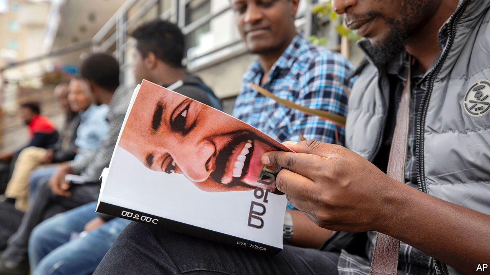

###### It’s all in your head

# Ethiopia embraces the power of positive thinking 

##### But reframing poverty as a state of mind may not solve it 

 

> Jan 18th 2020 

“I USED TO have pimples and everything. And I have big ears in case you haven’t noticed,” laughs Ebba Tesfaye, now fresh-faced and snappily dressed, in the lobby of a swanky hotel. Rattling through his life story—bullying, drugs, redemption—he pauses only to glad-hand a passing celebrity before rushing to the set of his new TV show.

Ebba T, as he is known, is among the most prominent of a rising generation of motivational speakers and life coaches in Addis Ababa, Ethiopia’s capital. Their rags-to-riches parables offer hope to legions of frustrated Ethiopians. A few, like Ebba, have found fame on the airwaves. Some are YouTube gurus. A handful write books, while others start consultancies. All preach a message of individual uplift in a country burdened by poverty and ethnic divisions.


Such positive thinking has a growing market. Translated versions of self-help bibles, such as “Releasing Your Potential” and “You Can Win”, fill the capital’s ubiquitous mobile bookstands. “Psychology books are so popular,” says Abraham Atalele, a young street vendor who switched from hawking clothes to books after reading “The Art of Self-Management”.

Self-help ideas have also reached the upper echelons of government. Abiy Ahmed, the prime minister, counts Mehret Debebe, a psychiatrist and popular TV host, as an adviser. Mehret, who argues that poverty is at root an attitude problem, was one of the first to turn positive thinking into big business by launching a series of conventions shortly after Abiy took office in 2018. “Most people learned about motivational speaking from Dr Mehret,” says Henok Begashaw, who sends out inspirational memes to his more than 100,000 subscribers on Telegram, a messaging app.

Yet the chief peddler of positivity is Abiy himself. “I believe we can realise the prosperity of Ethiopia in the coming ten years,” he has said. “The only problem is our thinking.” Last year he published a book called “Medemer” (pictured) which blames negative thinking for many of Ethiopia’s problems. Shortly after becoming prime minister he gave televised “trainings” to generals and cabinet ministers, during which he argued that “attitude problems” were holding the country back. Government initiatives, such as weekly cleaning days and a nationwide tree-planting project, are part of the solution. “A mind that doesn’t see a good thing will not create a good thing,” he said when asked to explain the flowers arranged along the road to the airport in Addis Ababa.

Not everyone is convinced. Self-help, with its focus on personal salvation, is often associated with Pentecostalism—and is thus regarded warily by traditionalists in the Ethiopian Orthodox Church. “Most Ethiopians believe loving yourself is selfish,” says Ebba T. And the stress on individual bootstrapping offends some in a ruling party with Marxist roots. “I’d rather rely on a structural analysis of poverty than a psychological one,” sniffs an intellectual close to the government.

But Abiy appears unfazed. At the end of last year he turned the ruling coalition, the Ethiopian People’s Revolutionary Democratic Front, into a single party—which he tellingly named the Prosperity Party.

