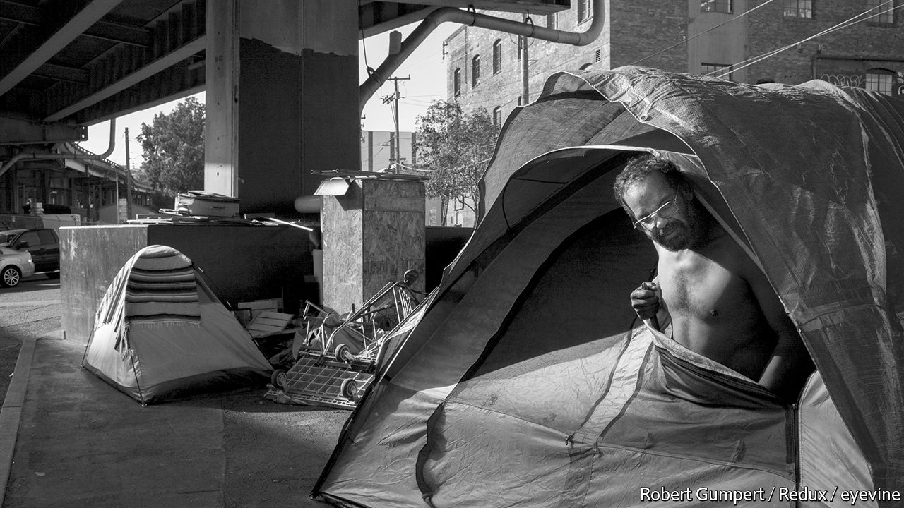

###### Housing

# Housing is at the root of many of the rich world’s problems 

##### Since the second world war, governments across the rich world have made three big mistakes, says Callum Williams 

 

> Jan 18th 2020 

THE FINANCIAL crisis of 2008-10 illustrated the immense dangers of a mismanaged housing market. In America during the early to mid-2000s irresponsible, sometimes illegal, mortgage lending led many households to accumulate more debt than they could sustain. Between 2000 and 2007 America’s household debt rose from 104% of household income to 144%. House prices rose by 50% in real terms. The ensuing wave of defaults led to a global recession and nearly brought down the financial system.

From the 1960s to the 2000s a quarter of recessions in the rich world were associated with steep declines in house prices. Recessions associated with credit crunches and house-price busts were deeper and lasted longer than other recessions did. Yet the damage caused by poorly managed housing markets goes much deeper than financial crises and recessions, as harmful as they are. In rich countries, and especially in the English-speaking world, housing is too expensive, damaging the economy and poisoning politics. And it is becoming ever more so: from their post-crisis low, global real house prices have since risen by 15%, taking them well past their pre-crisis peak.


Traditionally politicians like it when house prices rise. People feel richer and therefore borrow and spend more, giving the economy a nice boost, they think. When everyone is feeling good about their financial situation, incumbent politicians have a higher chance of re-election.

But there is another side. Costly housing is unambiguously bad for the rich world’s growing population of renters, forcing them to trim spending on other goods and services. And an economic policy which relies on homebuyers taking on large debts is not sustainable. In the short term, finds a study by the IMF, rising household debt boosts economic growth and employment. But households then need to rein in spending to repay their loans, so in three to five years, those effects are reversed: growth becomes slower than it would have been otherwise, and the odds of a financial crisis increase.

Malfunctioning housing markets also hit the supply side of the economy. The rich world’s most productive cities do not build enough new houses, constraining their growth and making them more expensive than they would otherwise be. People who would like to move to London, San Francisco or Sydney cannot afford to do so. Since productivity and wages are much higher in cities than outside, that reduces overall GDP.

So it is bad news that, in recent decades, the rich world has got worse at building new homes. A recent paper by Kyle Herkenhoff, Lee Ohanian and Edward Prescott argues that in America this process has “slowed interstate migration, reduced factor reallocation, and depressed output and productivity relative to historical trends”. Constraints on urban growth also make it harder to reduce carbon-dioxide emissions, since big cities are the most efficient built forms. In America there are more building restrictions in places which have lower emissions per household.

Housing is also a big reason why many people across the rich world feel that the economy does not work for them. Whereas baby-boomers tend to own big, expensive houses, youngsters must increasingly rent somewhere cramped with their friends, fomenting millennials’ resentment of their elders. Thomas Piketty, an economist, has claimed that in recent decades the return to capital has exceeded what is paid to labour in the form of wages, raising inequality. But others have critiqued Mr Piketty’s findings, pointing out that what truly explains the rise in the capital share is growing returns on housing.

Other research, meanwhile, has found that housing is behind some of the biggest political shocks of recent years. Housing markets and populism are closely linked. Britons living in areas where house prices are stagnant were more likely to vote for Brexit in 2016, and French people for the far-right National Front in the presidential elections of 2017, according to research from Ben Ansell of Oxford University and David Adler of the European University Institute. Political disputes sparked the protests in Hong Kong, but the outrageous cost of accommodation in the city-state has added economic fuel to the political flames.

This special report will argue that since the second world war, governments across the rich world have made three big mistakes. They have made it too difficult to build the accommodation that their populations require; they have created unwise economic incentives for households to funnel more money into the housing market; and they have failed to design a regulatory infrastructure to constrain housing bubbles.

Happily, they are at last starting to recognise the damage caused by these policies. In Britain the government now openly says that the housing market is “broken”. Scott Morrison, Australia’s prime minister, has pledged to make housing more affordable. Canada’s recent election was fought partly on who would do more to rein in the country’s spiralling housing costs. Carrie Lam, Hong Kong’s chief executive, has put housing front and centre in her response to the protesters.

They need to learn from places where the housing market broadly works—and those places do exist. As this report shows, flexible planning systems, appropriate taxation and financial regulation can turn housing into a force for social and economic stability. Singapore’s public-housing system helps improve social inclusion; mortgage finance in Germany helped the country avoid the worst of the 2008-10 crisis; Switzerland’s planning system goes a long way to explaining why populism has so far not taken off there. Governments across the world need to act decisively, and without delay. Nothing less than the world’s economic and political stability is at stake. ■

