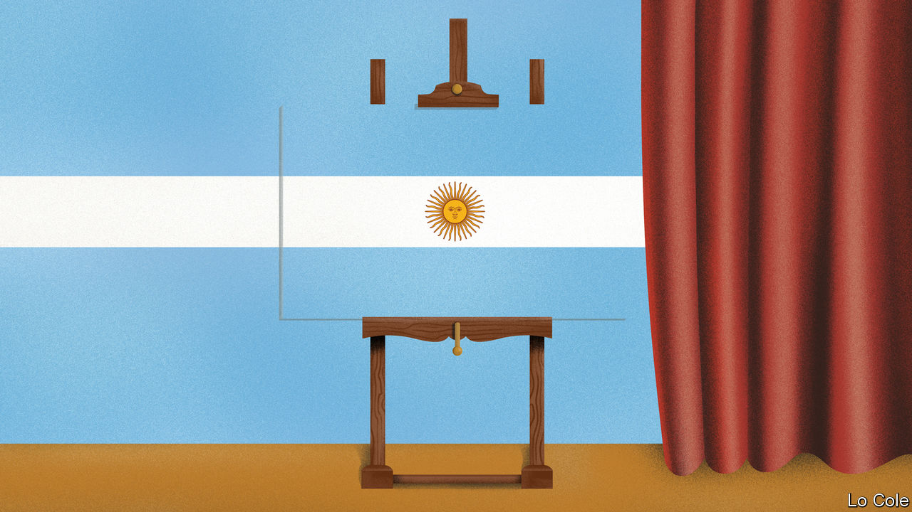

###### Bello

# Argentina’s new government gets to grips with the economy 

##### The Peronists are fuzzy about their long-term plans 

 

> Jan 18th 2020 

IT IS A MONTH now since Alberto Fernández took over from Mauricio Macri as Argentina’s president and, contrary to some forecasts, the sky over the Pampas has not yet fallen in. Having inherited a dire economic situation, including what Mr Fernández, a Peronist, called a “virtual default” on the country’s debts, his government has begun by doing more or less what he said it would. Adopting almost the opposite approach to its predecessor, it has laid out a tough fiscal policy and a loose monetary policy and has yet to say much about how it will handle the debt. Exchange and price controls, and the southern summer lull, have combined to buy the new team time. But will they use it wisely?

It was trying to buy time to reform a sick economy that got Mr Macri into trouble. A free-market conservative, he ran up debt to finance a gradual fiscal adjustment until investors took fright, prompting a run on the peso and forcing the government into the arms of the IMF. The economy slumped into recession, inflation surged to 54% last year and Mr Macri lost the presidential election. The new team’s first objective, according to Martin Guzmán, the economy minister, is “to halt the fall”.


They have swiftly pushed through an emergency package of mainly fiscal measures. These include tax increases on farm exports and travel abroad, and a six-month freeze of many prices, salaries and pensions. The impact on poorer Argentines has been softened with extra payments to them. According to Fundación Capital, a consultancy in Buenos Aires, the measures add up to a fiscal squeeze of around 1.5% of GDP. If fully implemented, they would balance the books before debt payments this year.

This has been offset by an opaque monetary policy. The central bank has said its intention is to maintain positive real interest rates and avoid “excessive” lending to the government. In practice the bank is driving interest rates towards negative territory and is “the printing press of the government”, as an economist who worked for a previous Peronist administration puts it. Officials think this monetary expansion will revive consumption and thus the economy. They are relying on price controls to blunt its inflationary impact. Critics reckon it will simply widen the gap between the official exchange rate of 60 pesos to the dollar and the free-market rate (at 77 this week). This will push up inflation.

Both Mr Fernández and his officials insist that Argentina wants to pay its debts (unlike in 2001, when Peronists cheered default) but that it needs more time to do so. That is broadly accepted by its creditors. An IMF mission is expected to visit Buenos Aires in the next few weeks. Mr Guzmán, a scholar of debt crises with no financial-market or government experience, says he wants a deal with the holders of $100bn of bonds by the end of March.

Time is of the essence. If the government moves quickly, the bonds will still be in the hands of institutional investors rather than litigious vulture funds, points out Héctor Torres, who was Argentina’s director on the IMF’s board. With the IMF itself, the government will probably seek a new standby agreement to stretch out the $43bn it is due to repay in 2022-23. It has eschewed drawing down $11bn outstanding from Mr Macri’s IMF loan. That is a mistake, argues Mr Torres, since the money might make it easier to reach a deal with the bondholders. It would be throwing good money after bad, reckons the new government team.

“We are navigating through a narrow passage,” according to Mr Guzmán. Missing is a chart for the other side of the corridor. Unless they are strictly temporary, the controls will create big distortions of the kind that built up under Cristina Fernández de Kirchner, the powerful vice-president, who held the top job from 2007 to 2015. The government has yet to link its emergency measures to a macroeconomic plan. That may be because Mr Fernández, a pragmatic moderate, must negotiate not just with creditors but also with his vice-president, a leftist populist.

His stance is thus ambiguous. On the one hand, he has rightly stressed that Argentina needs to boost its exports, and he has called for a national consensus on a long-term plan. On the other, in a reference to the IMF, he has lashed out at “recipes that have always failed”. In fact, they have always failed only in Argentina, which has long wanted to play by its own rules. “The world, unfortunately, is real,” as the writer Jorge Luis Borges put it. It is Mr Fernández’s task to persuade Argentines of that.

