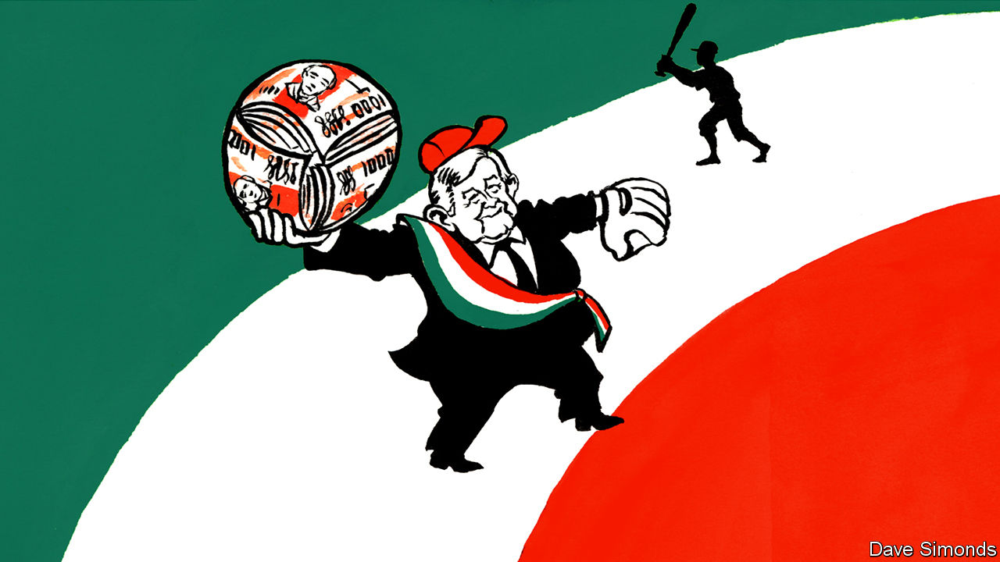

###### Out of left field

# Baseball-mad Andrés Manuel López Obrador throws money at the game 

##### Mexico’s penny-pinching president makes an exception for his favourite sport 

 

> Jan 18th 2020 

“TRAITOR. YOU ARE A TRAITOR.” That is how Eduardo Galeano, a leftist writer from Uruguay, greeted Che Guevara in Havana in the early 1960s. The Argentine’s crime had been to abandon Latin America’s favourite pastime, football, for North America’s. A Cuban newspaper had published a photo of him playing baseball. Guevara, who said it was “the first time someone calls me a traitor and keeps living”, learned to play in a Mexican prison while jailed with Fidel Castro in the 1950s. 

He is not the only left-wing leader to have caught the baseball bug in Mexico. Andrés Manuel López Obrador, the country’s president, has been a fanatic since childhood. He won the election in 2018 by pledging to go to bat for the poor and vows to “strike out” Mexico’s “mafia of power”.


Under his programme of “republican austerity”, the government has slashed spending on everything from child care to medicines. Baseball is an exception. In March Mr López Obrador opened an Office for the Promotion and Development of Baseball. It got 350m pesos ($19m) to spot and nurture talent. Bureaucrats at non-baseball agencies were enraged. 

Mexico’s constitution tells the government to “promote and stimulate” sport. It does not say which ones. Mr López Obrador has cut funding for Formula 1 and American-football events. Baseball, though, is “more than a sport. It is a fruitful passion that requires head, heart and character,” he said last year at the opening of a stadium in Mexico City. He became the first president in 72 years to throw an opening pitch. 

Mr López Obrador wants to spread the game beyond its strongholds near the American border. He dreams that 50 Mexicans will be playing in major leagues abroad, a fourfold increase, by the time his term ends in 2024. He wants to combine Mexico’s two regional leagues into a single 26-team competition. 

Baseball never caught on in Mexico as it did in Cuba and Venezuela. Mexican baseball’s best moments came before 1947, during the period when American leagues barred black players. Some played for Mexican teams. During the second world war Jorge Pasquel, the president of Mexico’s league, wangled draft deferments from the American government for American players heading to Mexico. That may have encouraged Mexico to continue a programme under which Mexican workers helped the war effort in the United States. 

Thanks no doubt in part to Mr López Obrador’s fandom, attendance at Mexican Baseball League games rose by 30% last year. In April Mexico City will host regular-season Major League Baseball games for the first time since 2004. Mexico’s national team is one of six to qualify for this summer’s Olympic games in Tokyo. 

Mr López Obrador, who is 66, says that had his army of scouts been around in his youth he would not have become a politician. But power has its perks. Hugo Chávez, a leftist (and left-handed pitcher) who governed Venezuela from 1999 to 2013, called the manager of Venezuela’s national team after each game to offer tips on tactics and selection. Mr López Obrador, who resists the trappings of power, may be tempted to ring up the Mexican manager.■

