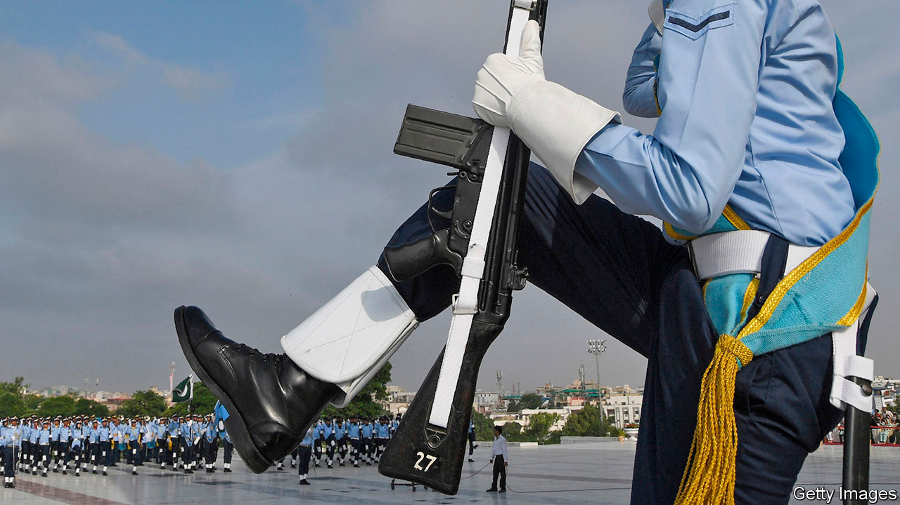

###### Extend and pretend

# Pakistan’s judges briefly stand up to the army 

##### Politicians, it seems, are not so principled 

 

> Jan 23rd 2020 

DURING AN EXCITED exchange on a Pakistani talk show earlier this month, a government minister produced a well-polished boot and placed it on the studio desk. Scorning the opposition’s claims to champion civilian authority over the armed forces, he accused them instead of “laying down and kissing” the boot. Even in the confrontational world of Pakistani politics shows, Faisal Vawda’s stunt had the power to shock.

Everyone in Pakistan knows the army gives instructions to politicians, not the other way around. But its supremacy is not publicly acknowledged except in coy references to “the establishment” or “the selectors”. Imran Khan, the prime minister, is said to have banned Mr Vawda from talk shows for his frankness.


The boot was under discussion because of a febrile few months in Pakistani politics. First came a confusing debate about the extension of the tenure of the country’s top soldier, Qamar Javed Bajwa, the chief of army staff. While no civilian prime minister has ever completed a full parliamentary term in Pakistan, several military chiefs have managed to stay on beyond their allotted three years. Mr Khan, doubtless hoping to prolong his own time in office, approved a second three years for General Bajwa with alacrity.

But that, surprisingly, was not that. The Supreme Court unexpectedly chose to take up an obscure petition challenging the extension, pressing on even when the petitioner got cold feet. Days before General Bajwa’s original term was due to expire in late November, his fresh stint was put on hold as Asif Saeed Khosa, the chief justice, deliberated. After three days of suspense, the court passed the buck to parliament. It gave MPs six months to legislate more clearly on the tenure of army chiefs, and said General Bajwa could stay on in the meantime.

Don’t provoke the brass hats

Parliament, predictably, approved the necessary legislation in record time, giving the government full discretion to extend the army chief’s term and banning legal challenges to such extensions. Even the two main opposition parties, the Pakistan Muslim League (PML-N) and the Pakistan People’s Party (PPP), which often bemoan military interference in politics, passed up the chance to clip the wings of the generals. Instead, both meekly voted with the government, thereby earning those gibes from Mr Vawda.

Next, in December, a special court handed a death sentence to Pervez Musharraf, a coup-leading former army chief, for suspending the constitution in 2007. The army again bristled. The sentence had been “received with a lot of pain and anguish”, the high command declared. Earlier this month an appeals court relented, and ruled that it was the set-up of the special court, not the suspension of the constitution, that was illegal.

Why is the judiciary making life difficult for the army when politicians are not? Some think Chief Justice Khosa, who retired in December, had an eye on his legacy. Some of his predecessors, after all, have cast themselves as fearless judicial superheroes. Alternatively, he may have wanted to restore some distance between the judiciary and the armed forces, after the courts were decried for doing the army’s bidding by ousting Nawaz Sharif, one of Mr Khan’s predecessors. Another theory holds that unease at the extension within the army itself emboldened the judges. General Bajwa’s now lengthy term will impede the promotion of many beneath him.

And the opposition parties? Many believe they have come to the conclusion that they can achieve power only with the backing of the generals, as Mr Khan did. The army is popular, after all. Better to wait for it to tire of Mr Khan than to campaign against military influence. Only this week members of the PML-N began propounding a rumour that it was on the verge of persuading the army to ditch Mr Khan and his Pakistan Tehreek-e-Insaf party, and put them back in office instead. ■

