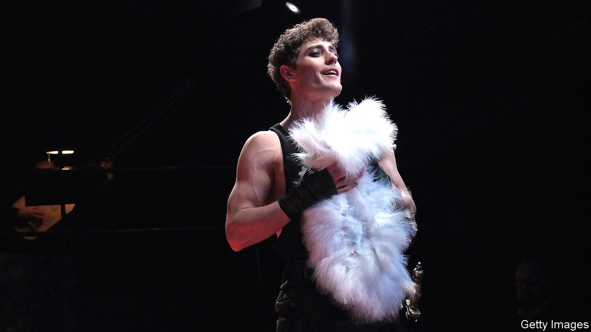

###### The high life

# Jakub Jozef Orlinski is not a typical opera star 

##### A distinguished countertenor, he is also a keen breakdancer 

 

> Jan 23rd 2020 

WHEN BREAKDANCING, splayed fingers jabbing to the beat, legs akimbo above improbable head-spins, he seems supremely macho. When performing arias and oratorios, brows arched above plaintive eyes, he seems as innocent as a chorister. In person, Jakub Jozef Orlinski is a vivacious yet plain-talking Polish opera star, who also maintains a deep commitment to street dance.

He grew up in the leafy Zoliborz district of Warsaw, where, with his friend Piotr, he joined a local choir as an alto at the age of eight. Piotr had the more beautiful voice, Mr Orlinski says modestly, but he had the staying power. He attended the Fryderyk Chopin University of Music in Warsaw, then the Juilliard School in New York. “He was like a sponge,” says Edith Wiens, who taught him there; “his disciplined work habits were astounding.” He knew nothing of harmony when he began his studies, and was unable to read music, but he emerged a masterful countertenor—the top of the vocal range for male voices—who sings in an ethereal falsetto.


Modern countertenors mostly sing parts originally intended for others. In previous centuries, castrati were the only male performers to reach these lofty registers; composers wrote specifically for them. In works by, for instance, Purcell and Handel, there were also roles for male singers whose natural range extended beyond their modern counterparts’. Men used to be smaller, explains Simon Ravens, a musicologist, and natural speaking and singing voices were generally much higher. The upshot is that there is very little music expressly designed for modern, falsetto countertenors like Mr Orlinski. They have to be adaptable.

“I started going to competitions,” Mr Orlinski says of his early career. “I wasn’t winning at first, but I met a lot of people.” Some were directors of opera festivals, who wield the same sort of clout as the scouts who determine the future of pop. The ploy paid off. Now 29, Mr Orlinski’s schedule is booked up for years to come. He has already made two records; last summer he sang the lead in Handel’s “Rinaldo” at the Glyndebourne festival in East Sussex, after the mezzo-soprano who had been cast pulled out.

Opera has a reputation for being staid and exclusive, but, perhaps because of his appealing looks as well as his artistry, Mr Orlinski is reaching new audiences. A former pin-up for Levi’s and Nike adverts, he has a big following on social media. When your correspondent met him, he had just performed at Sofia University in Bulgaria. The hall was packed with students who, he reckons, were impressed. So, he remembers, were a group of breakdancers on a recent trip to Switzerland.

“I looked up the local [breakdance] crew in Zurich and joined their training session,” Mr Orlinski says. After that, “I got them tickets and they came to see me sing. They couldn’t believe it!” His combination of talents and interests might seem eccentric, but look closely, and they chime. In breakdancing, anything goes. In ornamentation—the flourishes of notes that punctuate musical phrases—there is the same sort of licence, especially in the Baroque pieces that Mr Orlinski frequently sings. Both marry finely honed technique with the thrill of freedom. ■

