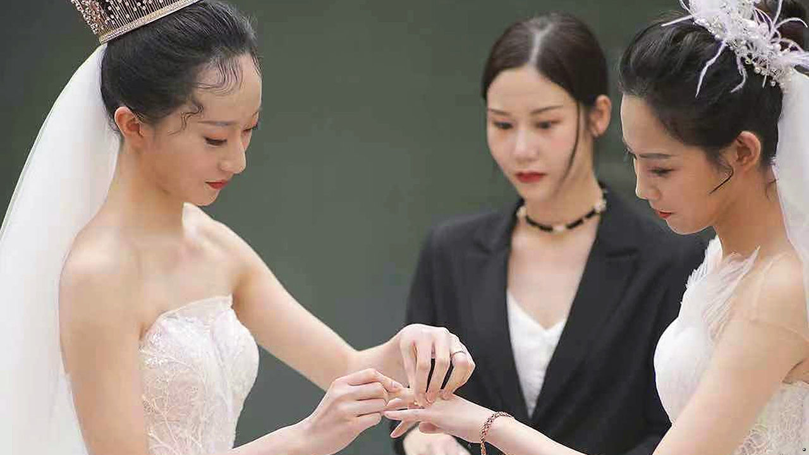

###### Gay prospects

# China’s government finds surprising support for same-sex marriage 

##### The law is unlikely to change soon, but activists are optimistic 

 

> Jan 23rd 2020 

AFTER A WHIRLWIND romance and two years of dating, Emma and her girlfriend, Han, have tied the knot (see picture). They invited about 100 people to their wedding on January 18th in the south-western city of Kunming. It involved a ceremony, with the two women in matching white wedding dresses, followed by a banquet and an after-party. Emma says she was both excited and nervous. The wedding meant “commitment and responsibility” and “the courage to spend the rest of my life with the one”. She is looking forward to starting a family with Han.

There is a catch. Chinese law does not recognise the couple’s marriage. This means they cannot legally adopt a child. Were one of them to give birth, the baby might even have difficulty obtaining a hukou, a form of internal passport that is essential for gaining access to many public services including education and health care. Any change in the status of gay marriage is probably some way off.


But there is a glimmer of hope. On December 20th a spokesman for China’s legislature, the National People’s Congress, said more than 230,000 suggestions had been offered by citizens during a recent public consultation on changing family-related law. He said these included views on legalising same-sex unions.

That was a bombshell. The official did not say what kind of opinions had been raised, but many people were surprised that he even mentioned the topic. They saw it as a hint that the government might be prepared to discuss it. Netizens flooded social media with comment, much of it supporting marriage equality. In the 24 hours after the publication of the spokesman’s remarks, messages containing a related hashtag were viewed nearly 600m times on Weibo, a Twitter-like service. The legalisation of same-sex marriage in Northern Ireland on January 13th also prompted an outpouring of messages on China’s social media, many hailing the news.

Recently, state media and local courts have run online opinion polls. In one of them, conducted by a court in Beijing, the idea that same-sex marriage was “worth considering” received 318,000 votes. Only 6,800 were cast in favour of the statement that this was “not desirable”.

Such open debate is progress for a country where homosexuality was, in effect, illegal before 1997 and classified as a mental illness until 2001. But a survey in 2014, cited by Chinese media, found about one-fifth of respondents supported same-sex marriage. Two years later a man in the southern city of Changsha, Sun Wenlin, sued the government for blocking his marriage to his male partner. The case was eventually dismissed, but the court’s consideration of it was a milestone. In 2017 the law was amended to allow adults to nominate a legal guardian. Officials turned a blind eye when some same-sex couples decided to nominate each other, thus forming a limited kind of civil partnership. Taiwan’s legalisation of gay marriage last year further encouraged China’s activists.

Since the spokesman’s announcement, another round of public consultation has been under way. It will end on January 26th. Officials have not revealed whether the 100,000-plus proposals raised include ones for gay marriage. Even if many of them do, the legislature is unlikely to add provisions for gay people when it revises family-related law at its annual plenary session in March (censors, apparently in deference to homophobes, took down an online video of Emma and Han’s ceremony after it had been viewed more than 6m times). But activists say it would be a step forward if the idea were even to be raised at the meeting. They are hopeful. Under Xi Jinping, China has become politically more repressive. But for them, there may be at least the prospect of change. ■

