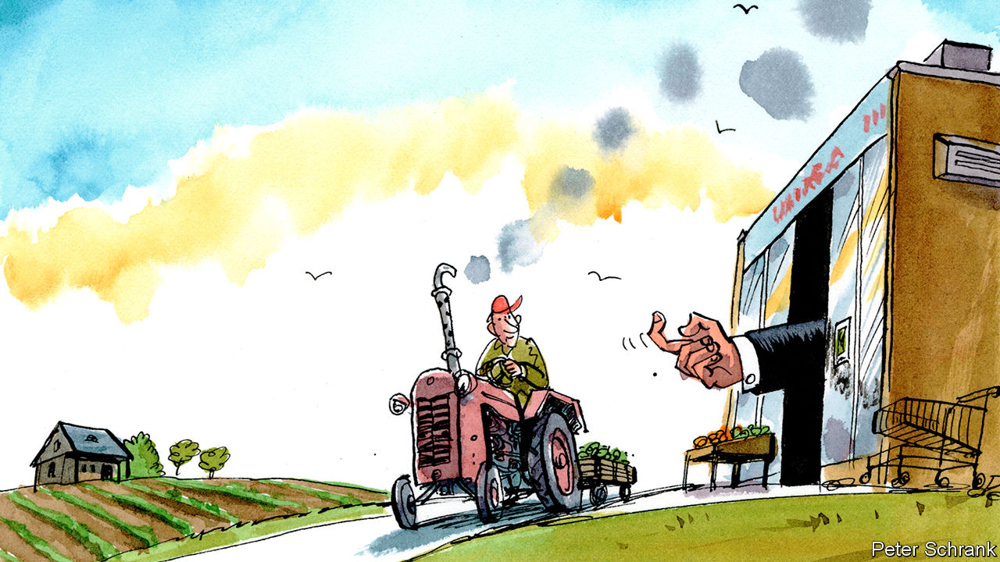

###### Rural informality

# A supermarket aims to make Romanian farmers pay tax 

##### So far, without much success 

 

> Jan 23rd 2020 

ROMANIA’S NEW state-owned supermarket, the Unirea Agro-Food Trade House, looks like a nod to the communist past. The first two stores, which opened in October, are bare-bones, their shelves stocked with mono-branded staples like pear jam and pork in lard. But this is not a food bank supplying cheap calories to the poor; prices are similar to those at private competitors. Rather, it is an effort to get Romanian agriculture, now largely off the books, to enter the formal economy—and start taxing it.

After the fall of communism, Romania divided its agricultural land between former collective farms (transformed into private companies) and the people who had worked on them. Many of those smallholders have since left the countryside or grown old. Some lease their land to big farming outfits, including foreign ones. But usually they let their neighbours farm it, in exchange for a portion of the harvest.


As a result, Romania has a huge number of farmers (one in three farms in the European Union is Romanian) but an unproductive agricultural sector. The big farms are patchy, and thus difficult to industrialise. The rest are mostly smaller than two football pitches. Farmers eat much of their crop, and sell the rest at informal markets or streetside kiosks.

The government has tried to scale up production by pushing farmers to get credit and insurance, and registering them to tax their sales. It has failed. Farmers complain that the state charges them taxes but provides no subsidies. Many cannot afford the cash registers they would need to collect taxes.

The new supermarket chain changes tactics, from push to pull. It buys only from small farmers, who get a guarantee that their crops will be purchased (and transported to market free). If enough farmers sign up, the agriculture ministry hopes to harvest some of the billions of dollars in taxes that it says go uncollected from farmers.

But the ministry may be counting its chickens before they hatch. So far most of the agricultural producers selling to the new store were already in the system. The agriculture minister who came up with the idea lost his job when the government changed hands in November. The supermarkets may lose their government backers before they win over the customers.

