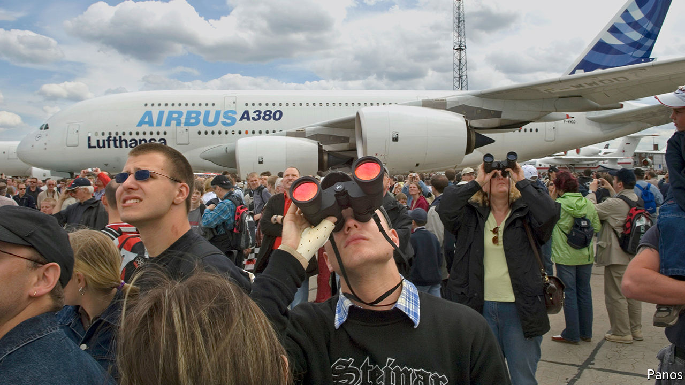

###### Fare play

# Airbus will help airlines hedge volatile ticket prices 

##### But will airlines and travel groups get on board? 

 

> Jan 23rd 2020 

THERE IS NOTHING that maddens online shoppers more than seeing air fares rocket just as they are about to click “buy”. Yet price turbulence may be an even bigger headache for airlines. Whereas carriers have some control over fares, these can be buffeted by surges in supply or demand, caused, say, by economic slumps or political rows. Over the past five years, ticket prices on a given date (net of taxes and fees) have varied by an average of 7% in Asia and 16% in Europe. Even in North America, where airlines have more pricing power, volatility hovers around 7%. Most carriers have to wait until less than 90 days before take-off for 90% of their ticket revenues. So they are hard to forecast—a big problem, as airlines often commit billions of dollars years in advance to buy planes.

Fortunately for them Airbus, the world’s largest planemaker, has a fix. On January 20th it launched Skytra, a London-based exchange through which airlines can access futures, options or swaps to hedge against big swings in ticket prices. Those derivatives contracts will be based on indices that track daily changes in the price of travel (measured as a cost per passenger per km). Airlines can buy these through banks and brokers that join the exchange. Skytra expects to get the thumbs-up from British regulators in the summer.


If the new tool helps carriers stabilise earnings, it would also reassure Airbus, which is sitting on an order backlog of 7,482 aircraft—nine years’ worth of production. Nineteen airlines folded last year; with better risk management the number might have been lower. Boeing, Airbus’s rival, has seen hundreds of its 737 MAX planes grounded after two crashes. Uncertainty over when they will fly again makes hedging all the more attractive. More data and greater processing power have also helped make hedging easier, says Elise Weber, one of Skytra’s founders.

Sceptics say the platform could struggle to take off. Airlines have not been voracious users of derivatives. Some do not even hedge fuel prices, their biggest cost: only 40% of the kerosene set to be consumed in the next year is hedged. Few Asian and Middle Eastern carriers buy hedges because they do not really understand them, says an executive at a rival exchange. More complex derivatives that reference ticket prices could flummox them.

For the market to work, the airlines need counterparties. These could include businesses that buy blocks of plane tickets, such as travel agents or hotel chains, suggests Matthew Tringham, a co-founder of Skytra. But few make use of simpler existing hedges against swings in weather or currency. And few would feel able to forecast ticket prices better than the airlines themselves. Low demand would limit liquidity and make trading dear. That could deter banks and brokers from acting as market makers, further sapping liquidity.

At least Skytra is well-equipped. On January 23rd it said it had chosen Nasdaq, the world’s second-largest stock exchange, as its technology provider. Mark Howarth, its boss, has worked at London’s stock exchange and Chi-X, an Asian venue. That will cheer City types who question Airbus’s markets nous. Airlines and travel groups may take longer to get on board. ■

