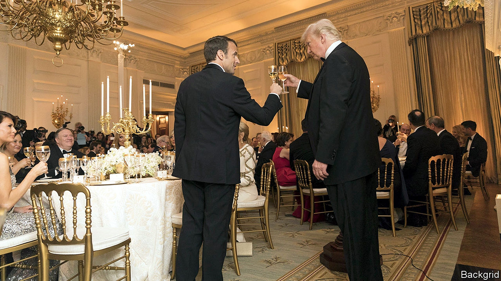

###### Still frosty

# Despite a truce, US-EU trade relations are still tense 

##### Posturing at Davos aside, little of substance has changed 

 

> Jan 25th 2020 

AS RECENTLY AS a week ago, a big transatlantic bust-up seemed inevitable, with the annual meeting of the World Economic Forum at Davos in Switzerland the most likely boxing ring. America had taken offence at France’s digital-services tax, which hits the likes of Amazon, Facebook and Google, on the ground that it discriminates against American companies. The French had insisted that the tax was only a temporary measure and would be repealed as soon as governments were able to reach a multilateral agreement on tax reform. The Americans, unconvinced, were poised to whack duties on $2.4bn of French champagne, beauty products and handbags.

But then on January 19th America’s president, Donald Trump, struck a temporary truce with his French counterpart, Emmanuel Macron. France would suspend the collection of revenues from its tech tax, and the Americans would suspend their tariff threats.


A love-in at Davos, then? Not quite. Soon after the apparent ceasefire, tensions began to rise again. The elite assembled at the Swiss resort were treated to plenty of theatrics. Steven Mnuchin, America’s treasury secretary, warned the British government that its version of a digital-services tax would not escape punishment. When Sajid Javid, the British chancellor of the exchequer, informed the audience that Britain would prioritise a trade agreement with the European Union (EU) over one with America, Mr Mnuchin seemed hurt, saying “I thought we’d go first.”

For his part Mr Trump, fresh from agreeing a “phase one” deal with China (see ), and expected soon to sign into law a revised trade deal with Canada and Mexico, flexed his dealmaking muscle. First he repeated an old threat to apply tariffs on imports of European cars. Then he said that he thought he could do a deal with the EU before the next presidential election in November. His administration has hobbled the dispute-settlement system of the World Trade Organisation (WTO). But on January 22nd he held an impromptu news conference with Roberto Azevêdo, the WTO’s director general, promising “dramatic” action.

How to interpret all the high-altitude hot air? In truth, there are few surprises. Few watching America’s reaction to France’s digital-services tax would have expected Britain to escape Mr Trump’s wrath. And it has been clear for some time that Britain will have to focus on establishing a new trading relationship with the EU, its largest and closest neighbour, before getting into serious talks with America.

As for the transatlantic trade relationship more broadly, Mr Trump’s statements this week were hardly new. They will not generate anything more than a shallow trade deal with the EU—though that might suffice for Mr Trump. Mr Azevêdo has no concessions to offer the president, as the WTO is driven by its members.

Even Mr Trump’s truce with Mr Macron may involve less than meets the eye. On January 22nd Bruno Le Maire, France’s finance minister, admitted that the biggest sticking point—that America wants companies to be able to opt out of an international tax agreement—had not been addressed. As The Economist went to press the squabbling parties were due to hold more meetings. Some still hope a deal can be forged before the end of this year, under the auspices of the OECD, a multilateral forum. If not, an almighty punch-up looms. ■

