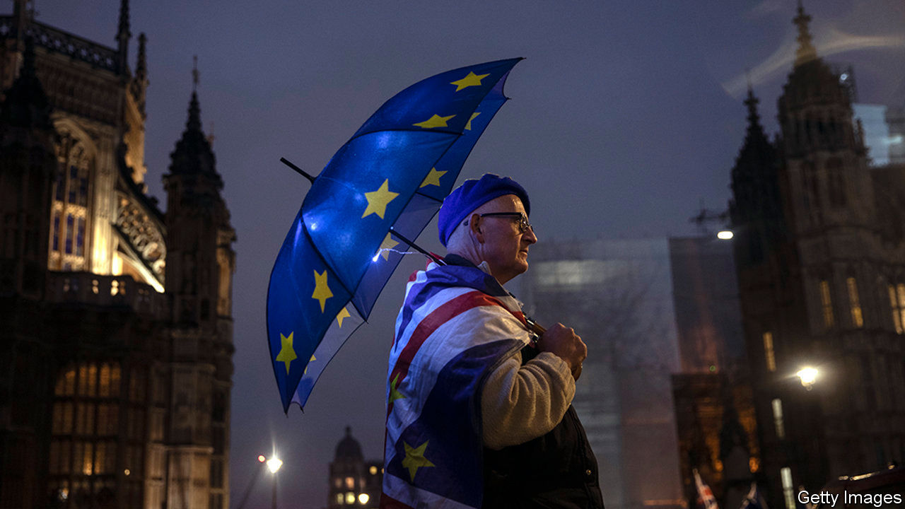
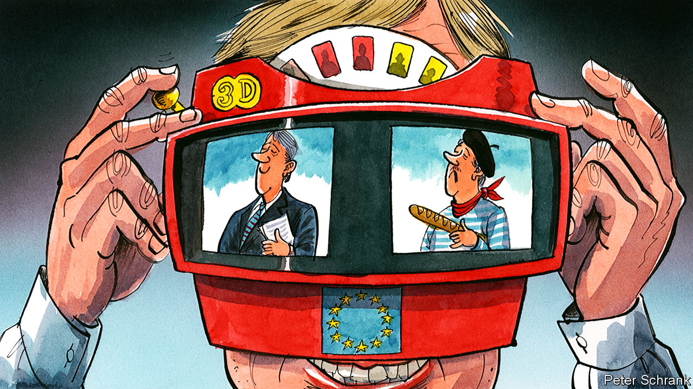

###### On Brexit, technology planning, the Viable System Model, the piano, words

# Letters to the editor 

##### A selection of correspondence 

> Jan 25th 2020 

Letters are welcome and should be addressed to the Editor at letters@economist.com

 


A sad farewell

So, three-and-a-half years after the Brexit referendum, Britain is leaving the European Union on January 31st (“It won’t be that easy”, ). For millions of people, particularly in eastern Europe, the country we tend to call “Anglia” has been a benchmark of nobility, of spirit and excellence. Britain is deeply embedded in our cultural make-up. During the war, our grandparents listened to Winston Churchill on the wireless, grateful to know that there was a place in this world where the bad guys’ writ did not run. For our generation, literature from an early age consisted mostly of “Alice’s Adventures in Wonderland”, “Treasure Island”, “Winnie-the-Pooh” and “The Wind in the Willows”. Later, the explosion of the Beatles, Rolling Stones, The Who, the Kinks, Deep Purple, Led Zeppelin and the rest literally blew the cobwebs of communist propaganda out of our souls. The Beatles made us, as New Wave, New Metal and the New Romantics were to make our children.


When the propagandists railed against “the Iron Lady of imperialism”, we would say to each other, “Iron Lady? Sounds promising.” As Margaret Thatcher defeated tin-pot dictators on the other side of the world, we were wishing she would do something about our lot over here. As she later did.

In the 1990s we were fully aware that France and Germany wanted no truck with us east Europeans, and it was Britain that ultimately engineered our entry into the EU. It is our EU membership that has kept us away both from the clutches of Russian imperialism and from the temptation to revive the ideology of provincial fascism that we experienced before the war.

Tens of millions of us are grateful that Britain has always been there for us. Which is why we watch Brexit with great sadness, feeling a wrenching sense of loss. Originally, we thought that the results of that wretched referendum were some kind of cosmic joke. Now we have become reconciled to the fact that the British are, indeed, leaving us, much as we would wish it otherwise.

EVGENII DAINOVProfessor of politicsNew Bulgarian UniversitySofia

 


Not content to have kept the peace, built a single market, launched a new currency and quadrupled membership in the space of a lifetime, the EU’s countries have also revelled in their national cultures and, yes, indulged their well-worn prejudices. You can have your gateau and eat it, after all.

But this is more than a “coping mechanism for complexity” (Charlemagne, ). It goes to the heart of the EU’s success. The member states never did try to “iron out” their distinctions, crass or otherwise, but instead wrote them into the union’s DNA, from a legal commitment to “respect its rich cultural and linguistic diversity” (Article 3 of the Treaty on European Union), to a daily workload that is negotiated in 24 official languages.

A close family, respectful of its differences, is stronger than the sum of its parts. Britain’s liberal instincts will be sorely missed after January 31st, but perhaps not as much as its knack of settling disputes with a good cup of tea.

JONATHAN HILLBrussels


Free technology

Coming from a publication founded in opposition to the Corn Laws, your flirtation with central planning for the deployment of technology was dismaying (“Pessimism v progress”, ). Granted, the emergence of Big Data opens up possibilities that Adam Smith or Milton Friedman could not have foreseen. However, centrally managed data could only work in a static economy, where everything is more or less the same year in and year out.

As little as 20 years ago, no one imagined that we would walk around with interconnected super computers that fit in our back pockets. Microwave ovens were a dream when I was a child in the 1960s. In turn, several goods and services that we will use in 20 years’ time do not yet exist. Without creative and sometimes crazy people determined to try new things, an economy does not advance. No computer, by the way, will ever detect an opportunity for a new Italian restaurant in Brooklyn.

YVES ARSENAULTGatineau, Canada


Beer’s Viable System Model

Your essay on “cybernetic dictatorship” was excellent (“Beware the Borg”, ). However, Chile’s “Project Cybersyn” in the early 1970s was not a design of a command-control economy. It was based on Stafford Beer’s Viable System Model (VSM), which specifies a recursive, hierarchical, distributed and decentralised control system. Each VSM is managed locally and has local autonomy.

Factory data were centrally analysed in Project Cybersyn and the results sent directly back to the factory managers for their consideration. The model explicitly incorporated the market mechanism, which is the environment (directly or indirectly) of each factory.

Beer was a passionate advocate for democracy, publishing a book on this titled “Designing Freedom”. He argued that it is possible to have effective and efficient control of economies democratically. The VSM was designed to do just that.

PROFESSOR GRAEME BRITTONSingapore


A love affair with the piano

I read with great pleasure your article on the popularity of the piano in China (“The Middle-C kingdom”, ). When I was the ambassador of Luxembourg to the Soviet Union from 1970 to 1973 I was asked by my government to help negotiate diplomatic relations between Luxembourg and China. As well as an ambassador I am also a concert pianist. As a sign of appreciation once the agreement was signed in May 1973, Zhou Enlai, China’s prime minister, arranged a concert for me with the Beijing Orchestra playing the famous “Yellow River Piano Concerto” with Madame Mao in attendance. I was also great friends with Sviatoslav Richter in Moscow and he came many times to my embassy to play, also with Slava Rostropovich. Richter had given me the names of Chinese pianists he had known when he visited there and I believe that it was indeed Yin Chengzong who performed, as his name was first on the list.

Many years later, I am privileged to know and appreciate the piano artistry of both Lang Lang and Yuja Wang. China has come a long way in classical music and will continue to do so well into the 21st century.

ADRIEN MEISCHAmbassador of Luxembourg to the USSR, 1970-73Luxembourg city

The article omitted any mention of Zhu Xiao-Mei, who transcribed the music of J.S. Bach while she was interned in Mao’s labour camps during the Cultural Revolution. Ms Zhu is such a miraculous pianist that she was invited to perform Bach’s “Goldberg Variations” in Bach’s church, the Thomaskirche in Leipzig, during Bachfest in 2014.

RICH SEIDNERBoulder Creek, Colorado


Obfu what?

Bartleby recommended cutting “pretentious phrases” from business jargon because they are “generally designed to obfuscate rather than elucidate” (). I’m glad that’s settled.

ROBERT DOMINIANNIWoodland Park, New Jersey

