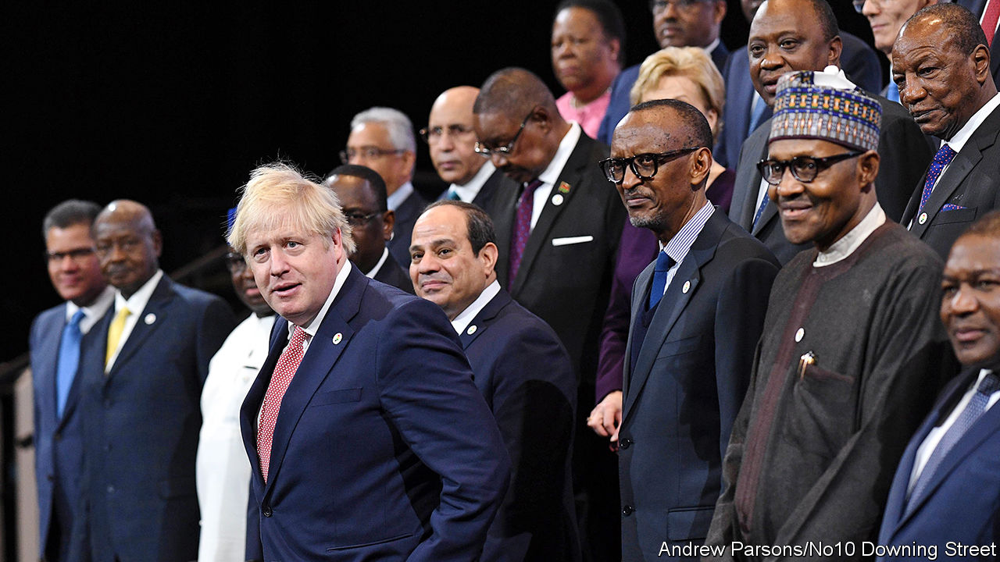

###### Scrambling again

# Boris Johnson woos Africa 

##### A post-Brexit Britain will need friends 

 

> Jan 25th 2020 

HOW TO PROMOTE a “global Britain” after Britain leaves the European Union? One possibility is to try to revive links with Africa, where Britain was once the leading colonial power. Boris Johnson, Britain’s prime minister, hosted about a third of the continent’s leaders at an “investment summit” in London on January 20th. Most of those running the beefier or friendlier African countries—including Egypt, Ethiopia, Ghana, Kenya, Nigeria and Rwanda—heard Mr Johnson declare that Britain, shorn of the European Union’s trade constraints, is keener than ever to do business and strengthen ties. “Africa is booming,” he said. “Africa is the future.”

But behind the virtuous talk of partnership and goodwill, British officials are arguing vigorously over how to deal with Africa. In the past two decades, the influence of Britain’s Department for International Development (DFID), responsible for dispensing aid to poor countries, has surged. At the same time the muscle of the Foreign and Commonwealth Office, responsible for the harder-nosed practice of traditional diplomacy, has shrunk. “Africa has become a development issue,” laments a diplomat, referring glumly to “the DFID-isation of foreign policy” in Africa.


Partly this is because of cash. Whereas the Foreign Office’s core budget, now £1.1bn ($1.4bn) a year, has shrunk greatly in the past decade, DFID’s has swollen steadily, since by law it must be at least 0.7% of GDP. In 2018 Britain disbursed foreign aid worth £14.6bn, mainly through DFID.

Britain needs friends

DFID gained its independence as a separate department in 1997, under Tony Blair. Mr Johnson has sounded keen to bring it back under the control of the Foreign Office. But he seems to have been persuaded that DFID should continue to stand alone. Nor has he bowed to the many Conservatives (and others) who want to break the 0.7% pledge. They complain that many departments are still chafing under the spending cuts imposed nearly a decade ago after the global financial crash, yet the aid budget continues to soar. For the time being, however, the 0.7% promise is kept.

In any event, it is widely agreed that Britain’s diminished network of diplomatic missions should be bumped up. As foreign secretary from 2016 to 2018, Mr Johnson promoted a plan to open or reopen a string of smaller ones. He visited more African countries than any foreign secretary since the Conservatives returned to office in 2010. In the past year Britain’s Treasury has been persuaded to pay for 400-odd extra diplomatic posts focused on Africa (based at home or in the continent).

Still, Britain’s diplomatic footprint in Africa is tiny compared with what it was. According to a report issued last year by the British Foreign Policy Group, a think-tank backed by former ambassadors, in 2017 Britain had 231 diplomats (excluding local hires) in 31 of sub-Saharan Africa’s 48 countries. In 16 of those British missions, only one or two diplomats were in situ. Missions to five more countries have since been opened or reopened. France, which had 42 embassies south of the Sahara, counted 1,373 diplomats (excluding local hires) in 2018; China probably has even more. Diplomats from Brazil, India and Turkey, eager to do business and diplomacy in Africa, also outnumber Britain on the ground in various countries.

Another token of Britain’s failure to punch its weight is the paucity of trips to Africa by British prime ministers, compared with the constant round of visits by French and Chinese leaders. The shrinkage of Britain’s diplomatic engagement in Africa in the past two decades was “a massive error of judgment”, says Rory Stewart, one of eight ministers for Africa since 2010. The extraordinarily rapid turnover in that post was yet another reason why Africans got the impression that Britain cared less about the continent than it should have.

Britain is sending 250 troops to Mali to assist a French-led UN force there, is helping to train Nigerian soldiers to fight the jihadists of Boko Haram in north-eastern Nigeria, has sought to bring peace to South Sudan and has deployed special forces in Somalia. But the French far outgun the British on the continent, with a base in Djibouti and more than 7,200 troops on the ground, mostly in the Sahel, where they have been seeking to beat back a sprawling jihadist insurgency.

However, Britain is the only member of the G7 group of rich countries to meet the goal of spending 0.7% of GDP on foreign aid. In absolute terms, only America and Germany are more generous; France is far behind both.

At the summit in London Mr Johnson stressed trade and investment over aid. His officials hail the African Continental Free Trade Area, a deal signed in 2018 by 44 members of the African Union, as a harbinger of Africa’s future as a trading bloc. His predecessor, Theresa May, declared on her sole trip to Africa as prime minister, in 2018, that Britain would strive to become the biggest single investor in Africa by 2022, with the CDC (formerly the Commonwealth Development Corporation), a government-owned private-equity group, leading the way. In terms of investment since 2014, Britain comes fourth after China, America and France, according to the Brookings Institution, a think-tank.

Britain will need to deploy a mix of hard and soft power to advance its interests in Africa. Mr Johnson acknowledged that an issue which particularly annoys Africans, especially businessmen, government officials and scholars, is getting a visa to visit Britain. It is time-consuming and often humiliating. Many of Britain’s understaffed diplomatic missions have no passport office, so would-be visitors are required to travel hundreds of miles to neighbouring countries. It may seem a petty impediment set against the wider aspects of British investment in Africa. But Africans are hardly likely to welcome British investors if they feel unwelcome in Britain themselves. ■

