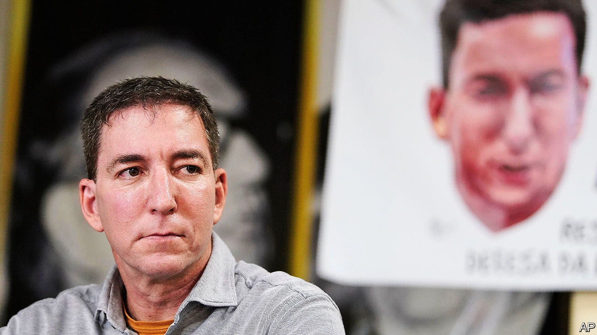

###### The press pressed

# Brazilian prosecutors go after Glenn Greenwald, an American journalist 

##### The charges against him are a threat to free speech 

 

> Jan 23rd 2020 

LAST JUNE the Intercept, a news site, published hacked messages that showed improper collaboration between Brazilian prosecutors and judges conducting the anti-corruption investigation known as Lava Jato (Car Wash). The leaks tarnished the image of Sergio Moro, the justice minister, who had been the judge in charge. They enraged Brazil’s nationalist president, Jair Bolsonaro, whose election in 2018 owed much to anger about corruption.

On January 21st prosecutors filed charges against Glenn Greenwald (pictured), a co-founder of the Intercept. They accused him of belonging to a “criminal organisation” that hacked the mobile phones of members of the Lava Jato task-force. The judge overseeing the case may throw out the charges. Even so, they raise questions about how free the press will be in Mr Bolsonaro’s Brazil and whether prosecutors will act independently.


Mr Greenwald, an American, became famous by helping publish Edward Snowden’s leaks of information from the United States’ National Security Agency. In July Mr Bolsonaro suggested that Mr Greenwald might “do jail time” for his Lava Jato revelations, and accused him of marrying his Brazilian husband to avoid deportation. That month, after a rumour surfaced that investigators were scrutinising Mr Greenwald’s bank accounts, a supreme-court judge barred the authorities from investigating him. The judge noted that it is not a crime to publish information obtained illegally. That was a warning to prosecutors: don’t mess with the press.

The case against Mr Greenwald has provoked an outcry. It represents “a threat to press freedom”, tweeted Rodrigo Maia, the president of the lower house of congress. It is not the first since Mr Bolsonaro became president. The government said it would reduce advertising in Folha de S. Paulo, a newspaper, in retaliation for its negative coverage, but relented. This month a judge banned Netflix from showing a comedy that portrayed Jesus as gay. A supreme-court judge quickly overruled him. 

Mr Bolsonaro is not responsible for every attempt to stifle speech. But his anti-gay views may have encouraged the judge who sought to ban the Netflix film. His son called the film “garbage”. In choosing a new attorney-general in September, Mr Bolsonaro ignored the candidates on a shortlist presented by prosecutors. That fuelled suspicion that he was seeking to curb prosecutors’ independence. Questioned by journalists about the case against Mr Greenwald, Mr Bolsonaro retorted, “Don’t you have faith in the justice system?” Brazilians are starting to wonder.■

