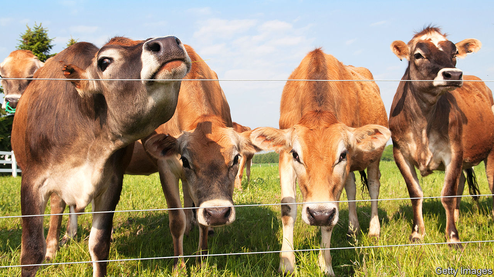
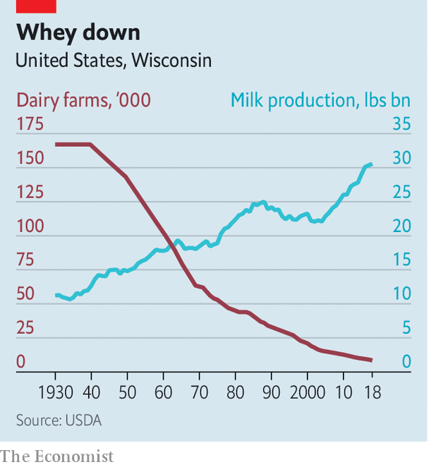

###### Changing tastes

# Business has gone sour in America’s dairy capital 

##### Wisconsin’s small farms are vanishing 

 

> Jan 23rd 2020 

TO WALK AROUND Dan Wegmueller’s farm in southern Wisconsin is to conjure up the past. He says each of his 50 Brown Swiss cows—with white-tipped ears and bells clanging from their necks—has a name and distinct personality. His red-painted barn is crowned by an elegantly arched roof. He trundles over the snow on a green John Deere tractor. Such small-scale farming looks wonderfully quaint. But it might as well exist in a museum.

The farm, set amid rolling hills on 350 acres, has been in Mr Wegmueller’s family since the 1930s, the decade when dairy farms in America peaked at 3.6m. Today the country has 37,000 left, with just over 7,000 in Wisconsin. The state still brands itself as “America’s Dairy Land” (though California has long produced more milk), and turns most of its white stuff into cheese. Farms are either going bust or industrial. Almost two dairy farms close each day in the state. In 2019 one-tenth of Wisconsin’s dairy farms shut down.


Wisconsin is witnessing what other states—especially in the south and west—saw in earlier decades. Consolidation has come late partly because its small farms had previously remained relatively productive. Mostly, now, it is the small that go.

Industrial-scale ones do well from technology, economies of scale and easier access to capital. A few minutes’ drive away from Mr Wegmueller’s farm is Pinnacle dairy. It opened in 2018 and has a 5,000-strong herd in six enormous white barns. Pumps at a warehouse fill several steel tanker trucks at a time. Tuls Dairies, a growing dairy firm, owns Pinnacle and six more big farms in Wisconsin and Nebraska. A state report last year noted that such big farms, with at least 200 cows, already churn out two-thirds of all Wisconsin’s milk. That share is likely to rise.

The industry is consolidating for several reasons. In the long run, blame an ageing rural population. Many older owners cannot persuade their adult children to take over. And why would they? It is ever tougher to turn a profit from a small herd of cows. Milk prices have slid for decades, largely because ever better techniques, genetics and technology ensure rising supply. Consumers at the same time are losing their taste for drinking milk. On average an American gulped 247lb (109 litres) of it in 1975, but only 146lb in 2018.

 


Tina Hinchie, who has 220 cows on another picturesque lot with red barns, mentions more recent problems. She laments volatile weather, especially floods, in the past few years. And although most milk is sold domestically (in Wisconsin 90% goes to local cheesemakers), exports that once accounted for 15-18% of national sales have been hit. China last year shunned many products, including whey, which it previously lapped up; after an outbreak of swine fever in China killed half its pigs, demand for whey as animal feed collapsed. Exports of cheese to Mexico have also suffered. Mrs Hinchie blames “horrific” trade disputes engineered by Donald Trump, although other difficulties are also to blame.

Farmers complain it is getting hard to find labour, even as wages rise. Mr Wegmueller can lure part-time help only by offering free accommodation. Mrs Hinchie last year invested $3.3m in a laser-guided robot milking system she calls the “Taj Mahal” of high-tech help. It means she can cut her labour force to a single farm hand, from four. She boosts income with farm tours—with as many as 10,000 visitors a year—that city folk enjoy. Mr Wegmueller is also betting that farm stays will be a bigger business than milk sales. Small farms that do not diversify are unlikely to hang on.

Somewhat bigger ones do better. Travis Tranel, a Republican state representative, co-owns a 600-strong herd in south-west Wisconsin. It is getting by because he switched to organic milk, which sells at a higher price than regular. Yet he too sees problems, especially with supplies of labour. He says the federal government needs to “figure out a realistic immigration policy” so that more migrants “who want to work hard” can repopulate rural areas.

Could that matter in this year’s election? Attracting rural voters is part of Mr Trump’s plan for keeping the state in 2020. Democrats, in turn, are focusing on the dairy crisis in a push for votes beyond cities. The numbers are small. Mr Tranel says dairy farmers account for some 200,000 votes. But that is an important chunk, as Mr Trump won Wisconsin by just over 22,000 in 2016. And the issue may resonate more widely, because many Wisconsinites see dairy as a defining feature of their state.

More generally there is anxiety that rural Wisconsin is losing people as the more educated move to cities, leaving mostly the elderly behind. Schools in many places—especially where Hispanic migrants are not settling—are emptying. Small towns suffer as businesses such as local feed-suppliers go bust and shops, cafés and bars close. What might save Mr Wegmueller’s farm and a few others is that urban visitors are ready to pay for the experience of trudging in mud and milking a cow for a day. Even if dairy fails, tourism may yet boom.■

