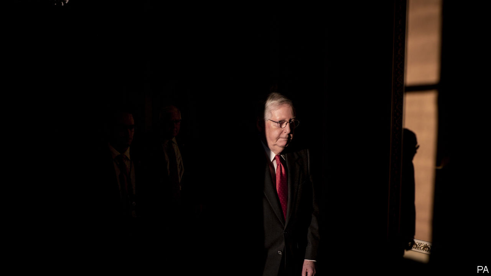

###### Designed to acquit

# The strange impeachment trial of Donald Trump 

##### As rivals wrangle over procedure, all eyes are on five vulnerable Republican senators 

 

> Jan 25th 2020 

OUTSIDE THE Capitol building on January 21st it was business as usual. A group of demonstrators chanted on the lawn. One man silently held up a sign warning “God is watching”. Another, with a placard taped to his purple shirt proclaiming, among several other things, “I am Jesus Christ”, screamed tirelessly.

The closer you drew to the Senate floor, however, the more unusual things became. Reporters who wished to enter the Senate’s half of the building required not just press credentials, but special tickets, and were confined to roped-off pens outside the Senate floor. The Senate’s presiding officer was not, as is customary, a senator or the vice-president, but John Roberts, the Supreme Court’s chief justice. During the proceeding, senators had to surrender their mobile phones, forswear coffee—only water or milk allowed on the Senate floor—and heed the sergeant-at-arms’s warning to “keep silence, on pain of imprisonment”.


For the most part, the customarily garrulous senators complied, notwithstanding the occasional passed note. After more than 12 hours of bitter debate, the Senate approved rules governing Donald Trump’s impeachment trial on a party-line vote. The trial began the next afternoon, and will probably be over by the time Mr Trump delivers his state-of-the-union address on February 4th. The outcome is not in doubt. To remove Mr Trump from office, 20 Republican senators would have to cross party lines, which is not about to happen. But the trial still reveals much about Mr Trump’s hold on his party.

The two sides gave previews of their arguments and tactics during the debate over rules. Adam Schiff, who chairs the House Intelligence Committee and is one of seven House managers acting as prosecutors, argued that Mr Trump had abused his power by subverting American foreign policy for his personal political benefit, had obstructed Congress by ordering his subordinates not to co-operate with its investigation, and that these comprise “the most serious [misconduct] ever charged against a president”. He also argued that the trial rules proposed by Mitch McConnell, the Senate majority leader, would make “a mockery of a [fair] trial”, because they threaten to block Democrats from introducing witnesses and evidence.

The president’s lawyers, by contrast, focused on process. Jay Sekulow, Mr Trump’s lead outside counsel, argued that Mr Trump was “denied the right to cross-examine witnesses” during the House inquiry, which is untrue. Pat Cipollone, the White House counsel, asserted that Republicans were denied access to a secure room where Mr Schiff held a hearing, which is also untrue. He accused Mr Schiff of having “manufactured a false version” of Mr Trump’s phone call with Ukraine’s president, when in fact Mr Schiff introduced it as a paraphrase.

Alan Dershowitz, a law professor who volubly defends Mr Trump, plans to argue that impeachment requires an actual crime or “criminal-like behaviour”—a view that is at odds with mainstream opinion and American history. (Richard Nixon was nearly impeached for abuse of power, which is not a crime, and Andrew Johnson was impeached for, among other things, “declar[ing] with a loud voice, certain intemperate, inflammatory and scandalous harangues”.) The debate between the two sides grew so heated that after 12 hours in session, the perennially decorous Mr Roberts moved to admonish them to “avoid…using language that is not conducive to civil discourse.”

An hour later Mr McConnell’s rules passed. Each side will get 24 hours to make its case, spread over three days. The Senate will be in session six days a week, excluding Sundays, until the trial ends. After the initial presentations, the Senate will get 16 hours to ask questions, submitted in writing for Mr Roberts to read aloud, followed by four hours of argument and deliberation. The Senate will then debate whether to call for more witnesses and evidence.

That last rule rankled Democrats. Since the House impeached Mr Trump, John Bolton, a former national security adviser, has said he would honour a subpoena for testimony. Lev Parnas, a Ukrainian-born Republican donor indicted for campaign-finance violations, said that Messrs Trump and Bolton, as well as Vice-President Mike Pence and William Barr, the attorney-general, were all aware of the scheme to press Ukraine’s president to open an investigation into Joe and Hunter Biden.

Democrats want to hear from them, as well as other witnesses whom the White House has blocked. On January 21st they forced—and lost—many votes on subpoenas for documents and witnesses, less because they thought they stood a chance of winning than because they wanted to force vulnerable incumbent Republican senators to cast votes that can be used against them in an election campaign.

These five senators, running this autumn in states where Mr Trump has a negative net-approval rating—Susan Collins of Maine, Martha McSally of Arizona, Thom Tillis of North Carolina, Cory Gardner of Colorado and Joni Ernst of Iowa—are in an unenviable position. Voting to convict Mr Trump risks prompting a Republican primary challenger. Helping to form majority support for more witnesses and evidence risks inviting a long court fight—Mr Trump will probably try to block Mr Bolton from testifying—which leaves time for questions from pesky reporters. Yet, appearing too eager to rush to a verdict risks harming them with the independent voters they need to hold on to their seats.

Mr Trump, watching the initial proceedings from Davos, appeared supremely unconcerned with anyone’s fate but his own. He called the House managers “major sleazebags”, and fantasised about attending his trial in order to “sit right in the front row and stare into their corrupt faces”. And he boasted, “Honestly, we have all the material. They don’t have the material.” That is, of course, precisely what is alleged in the second article of impeachment.■

