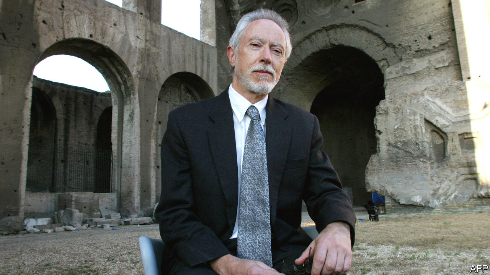

###### Ghost in the machine

# J.M. Coetzee’s new novel has many doors, but no key 

##### “The Death of Jesus” completes an enigmatic trilogy 

 

> Feb 1st 2020 

The Death of Jesus. By J.M. Coetzee. Harvill Secker; 208 pages; £18.99. To be published in America by Viking in May.

WHEN THE South African government condemned J.M. Coetzee’s portrayal of rape in “Disgrace” (1999) as racist, the charge ignored the way the story is refracted through the eyes of its central character, a white university lecturer sacked over an affair with a student. “Disgrace” was a #MeToo novel before its time, just as “Summertime” (2009), a book comprised of interviews with people who knew the late “John Coetzee”, was a prototype of what has since become known as “autofiction”. By the time pseudo-autobiographical game-playing had come into vogue, Mr Coetzee had embarked on an enigmatic project whose purpose is even harder to pin down.


His latest novel, “The Death of Jesus”, completes a trilogy that began with “The Childhood of Jesus” (2013). In that book, middle-aged Simón meets a lost boy, David, en route to a Spanish-speaking city populated by refugees who, like them, can’t remember who they are or where they come from (the state assigns their names). The story turns on David’s stubborn refusal to learn numbers in the conventional order. His arithmetical heresy forces Simón and his adoptive mother, Ines, to flee the authorities and—in “The Schooldays of Jesus” (2016)—to teach him at home.

David is ten when the tale resumes in the new book. His urge to represent a local football team, against Ines’s wishes, leads him to smear Simón as a child molester before running away. But soon the family are reunited when David falls mysteriously ill, and his talk of a “message” causes commotion at the hospital where he is confined.

As in previous volumes, the obvious question—where is Jesus?—generates suspense. The novels can be interpreted as a bid to dramatise the epistemic challenges of an encounter with the divine. Is David’s stubbornly irrational cast of mind a sign that he is anointed, or merely a child? The conundrum prompts the reader to reflect on how far those terms overlap.

Mr Coetzee’s tone is philosophical but not arid. The tender antagonism between David and Simón, left flat-footed by his precocious ward, brims with emotion, even comedy, which anyone who has ever tied themselves in knots answering a child’s whys will enjoy. When Simón attempts to console the boy by saying his illness is just bad luck, since “in ninety-nine cases out of a hundred” germs “fail to get in”, David upends the logic: “Simón says I am number one hundred, and number one hundred has to die.”

The characteristically concise present-tense narration creates a kind of crystalline opacity; “The Death of Jesus” is a novel with many doors, but no key. It is a remarkable achievement by a writer whose evolution, at the age of 79, continues to surprise. ■

