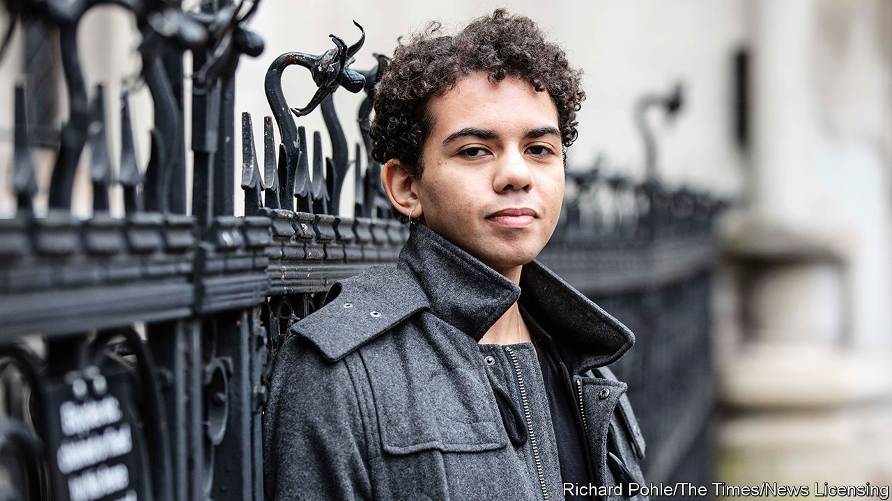

###### Judicial review

# A pushback against trans activism in Britain 

##### Three groups of people have applied for judicial reviews 

 

> Feb 1st 2020 

FOR SOME years now, schools, the NHS and the police have been accommodating the needs and concerns of transgender people. GIDS, Britain’s only gender identity clinic for children, based at the Tavistock NHS trust, has been making it easier for trans teenagers to transition medically. But now some critics of the moves are pushing back, claiming that GIDS is giving children puberty blockers too liberally, and that attempts by other bodies such as the police to combat transphobia are leading to an attack on free speech.

Three groups of people have recently applied for judicial reviews, the legal means to challenge public bodies. On January 22nd, a 23-year-old woman, Keira Bell (pictured), joined one of these lawsuits. She charges that GIDS is performing “experimental” treatment on children by giving puberty blockers and cross-sex hormones to more than 1,000 children and teenagers, including herself, some as young as 11. She had a double mastectomy, and subsequently detransitioned.


The number of referrals to GIDS has risen more than 30-fold in the past decade, reaching 2,590 in 2018-19. Yet there are no long-term studies that show the impact of puberty blockers, and there is concern that many kids with mental health issues or on the autism spectrum are pushed towards using them. Critics point out that they are the same drugs used to chemically castrate sex offenders. The head of GIDS, Paul Jenkins, said last year that puberty blockers are “reversible” but an NHS review has challenged his wording. And Carl Heneghan, the professor of evidence-based medicine at Oxford University, said last year, “Given the paucity of evidence, the off-label use of drugs…in gender dysphoria treatment largely means an unregulated live experiment on children.”

Supporters of Ms Bell say transgender activist groups such as Mermaids are encouraging liberal prescription of puberty blockers. “Mermaids are not medical professionals. They are a lobby group pushing for earlier medical intervention to prevent the natural development of children’s bodies,” says Stephanie Davies-Arai of Transgender Trend, an activists’ group. Mermaids denies exerting any pressure on clinics. “We have seen great distress caused to some children with the onset of puberty, and in some cases hormone blockers can go a considerable way to alleviating that distress,” said a spokesman.

An earlier judicial review was brought by Harry Miller, a 54-year-old small business owner and former policeman. Last year he retweeted a joke about trans women; shortly afterwards, he says, a police officer called him and said, “We need to check your thinking.” Mr Miller says he told the officer that “‘1984’ is a dystopian novel not a how-to manual.”

Mr Miller’s actions were logged as a “non-crime hate incident”, and thus might show up on a police background check carried out by a prospective employer. Police guidelines say that such incidents must be recorded when a complaint is made “irrespective of whether there is any evidence to identify the hate element”, and there is no chance of appeal.

The review is challenging the guidelines on the grounds that they do not adhere to the Equality Act of 2010, which bans discrimination on the basis of nine “protected characteristics”. The guidelines only recognise five: disability, race, religion, sexual orientation and, crucially, “transgender”. Mr Miller points out that “sex” has been omitted and that although “gender reassignment” is a protected characteristic, “transgender” is not. “So if you are a woman and I call you a bitch, you are not protected,” he says. “But if you are a man who identifies as a woman and I call you a bitch, then you are protected. It is madness.”

Mr Miller believes that advocacy groups, especially Stonewall, have undue influence over public bodies. “These organisations are lobby groups,” he says, “Yet their advice is being taken as impartial.” Stonewall would not answer specific questions but said that it “will continue to work with schools, employers, communities and policymakers until no one has to face this abuse in their everyday life.” The judge’s ruling is expected within weeks.

The third application for judicial review is being brought by two parents and a teacher in Oxfordshire, who say the guidance being used for primary schools is “unlawful and damaging to children”. One of the parents, Victoria Edwards, says the guidelines used in her local school, the Oxfordshire Trans Inclusion Toolkit, written in association with Allsorts and Gendered Intelligence, two other transgender lobby groups, “places the rights of trans identified children above the rights of all other children and staff”. It advises schools to allow boys who identify as girls to use girls’ changing rooms, toilets and dorm rooms on residential trips. A spokesperson for Oxfordshire County Council said “We utterly refute the suggestion that we are failing to safeguard children.”

The impetus for these legal challenges comes from several directions. Some feminists worry that the rise of trans rights poses a threat to safe spaces for women; the judicial reviews suggest sizeable parts of the country may agree. A Populus poll in 2018 asked if a person born male, identifying as a woman but still possessing male genitalia should be free to use a female changing room where women are undressing; 59% said no and 14% said yes. The experiences and scars of detransitioners like Ms Bell may reinforce doubts about the direction of travel. ■

