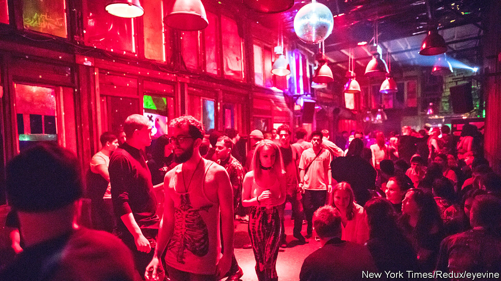

###### Strings of life

# Berliners fear “club death” 

##### But nightlife in the world’s clubbing capital is changing, not dying 

 

> Feb 1st 2020 

HALF PAST seven on a chilly Monday evening is hardly clubbing prime-time. Yet on January 27th a formidable queue extended outside Griessmuehle, a gritty techno spot in Berlin’s Neukölln district, from whose walls emanated hearty 4/4 kick drums. The party had been going since Sunday under the rubric “Is this the end?”, for on February 3rd Griessmuehle must close; the building’s Austrian owners wish to convert it into offices. The Club Commission, a lobby group, reckons 24 Berlin clubs may face closure. Some, like KitKat, an entry-level fetish den in Mitte, are as much part of the city’s fabric as the Brandenburg Gate.

Hand-wringing over Clubsterben (“dying clubs”) is nothing new in a growing city where the pressures of gentrification have long rubbed up against the fly-by-night world of clubbing. Yet the threat to Griessmuehle touched a nerve, uniting ravers and politicians behind a #saveourspaces hashtag. Official support for a €168m ($185m) industry that attracts tourists and investment is now obligatory in perennially hard-up Berlin.


Gentrification in Berlin started late but now has a “feeling of velocity”, says Luis-Manuel Garcia of the University of Birmingham. The glittering array of protections that private tenants enjoy in Germany do not extend to businesses. Commercial landlords may jack up rents abruptly or keep club-owners dangling on rolling six-month contracts. What to do? “Frankly, we don’t have that many tools,” accepts Georg Kössler, a Green in Berlin’s parliament. Lutz Leichsenring of the Club Commission says federal building law should recast clubs as “cultural institutions”, providing them with the same benefits as theatres and galleries.

Yet “it would be hard to claim that clubs are genuinely threatened,” says Will Lynch, the Berlin-based editor of Resident Advisor, a dance-music website. Next to the precipitous decline in cities like London, the turnover in Berlin looks more like churn; about 90 clubs have closed since 2010 but 77 have opened.

Thrill-seekers are rarely left disappointed by Berlin’s many nocturnal temptations, unless they are turned away by a grumpy bouncer. Some beloved institutions have gone; others have now become a bit too slick for old-timers’ tastes. But Berghain, the jewel in no-curfew Berlin’s clubbing crown, raves on, its future secured by ownership of the building. Even Griessemuehle may find a new home elsewhere. The threats are real. But rumours of Clubsterben may have been exaggerated.

