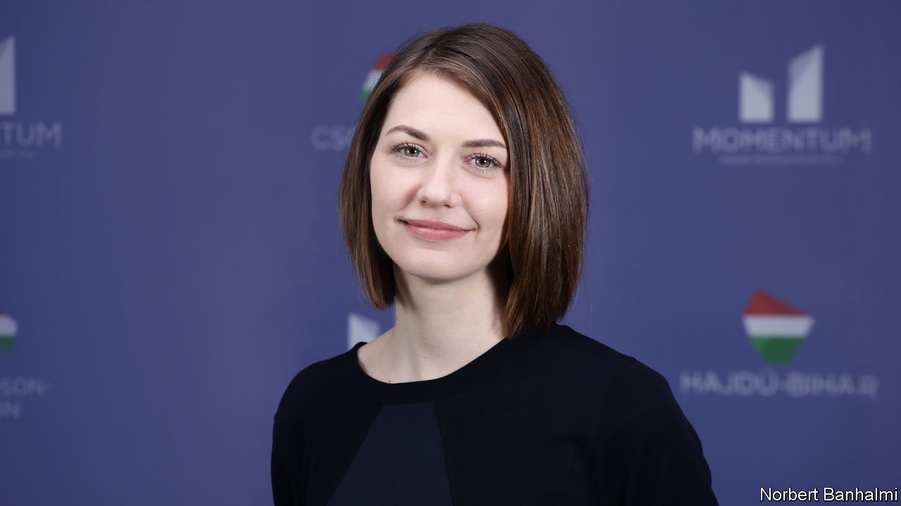
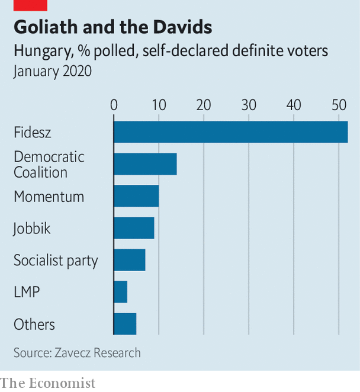

###### Unite or die

# The plight of Hungary’s opposition 

##### Taking on Viktor Orban will be no easy matter 

 

> Feb 1st 2020 

IN THEORY VIKTOR ORBAN, who has ruled Hungary with a rod of iron since 2010, ought to be running scared. In October he suffered the humiliation of losing control of the capital, Budapest, as well as ten of the 23 other county-level cities in the country. That happened because Hungary’s perennially fractured opposition for once managed to unite, holding a primary election in Budapest to decide on a single contender and elsewhere forming pacts to achieve the same goal.

Now plans are afoot to pull off the same trick at parliamentary elections that are due in 2022. If that happens, Mr Orban’s ruling party, Fidesz, could lose its current huge majority. Mr Orban is already sounding chastened: his new year’s message was largely about mundane issues like education and health, a far cry from his usual ranting about enemies within and without.


Still, those plans for 2022 involve a very big “if”. Agreeing on a few mayoral candidates is one thing: doing the same for each of the country’s 106 single-member constituencies, as well as drawing up a joint party list for the 93 proportionally elected MPs, is a lot harder. If the dozen or so opposition parties run separate lists, quirks that favour big parties in the electoral system Mr Orban rammed through in 2012 will continue to hammer them. Hardest of all, of course, will be to choose a candidate to be prime minister.

 


Who might it be? One obvious possibility is Gergely Karacsony, the newly ensconced mayor of Budapest. Looking every bit the university lecturer he used to be, dressed down in jeans, jacket and open-neck shirt, the 44-year-old Mr Karacsony has a platform to campaign from. But Mr Orban is already tying him in knots, linking money for the city to the construction of a new stadium for the World Athletics Championships in 2023, which the mayor said on the campaign trail that he did not want to build. Besides, Mr Karacsony insists that he doesn’t want the job, and would rather complete his term. His Dialogue party is tiny outside the capital.

Some instead look for a return of a former prime minister, Ferenc Gyurcsany, who leads the largest opposition party, Democratic Coalition. Largest, though, is a relative term. In recent polls it struggles to get far into double figures, while Fidesz manages around 50% in most polls. Mr Gyurcsany’s chaotic time as prime minister is not remembered fondly by most Hungarians, and even he admits that he is “a very polarising person, very much loved, and very much hated”. Instead, he says, “we need an integrator.” He offers his wife, Clara Dobrev, as a possible prime minister. She is currently a vice-president of the European Parliament, having scored a remarkable success at the head of the Democratic Coalition’s list in last year’s Euro-election. Mr Orban refers to her, incorrectly, as “Mrs Gyurcsany”. She, too, may be reluctant to put herself forward.

The woman to watch is less well known. Anna Donath is just 32, and is also an MEP, in her case for Hungary’s most interesting new party, with the pleonastic moniker Momentum Movement. Momentum was the big surprise in the European election; founded only in 2017, it won just under 10% of the vote. Insiders, however, worry that she may not want to run, either.

The real problem is that Mr Orban does not really look beatable in 2022. He has shrugged off his difficulties with the rest of the EU over Hungary’s erosion of the rule of law (a task made easier because Poland is now behaving worse). The economy is booming; it grew by around 5% last year. Corruption ought to be his Achilles’ heel. Last week Transparency International, a watchdog, rated Hungary the second-most corrupt country in the EU, beaten only by Bulgaria. “But,” sniffs one diplomat, “as long as incomes are going up, Hungarians don’t seem to care.” ■

