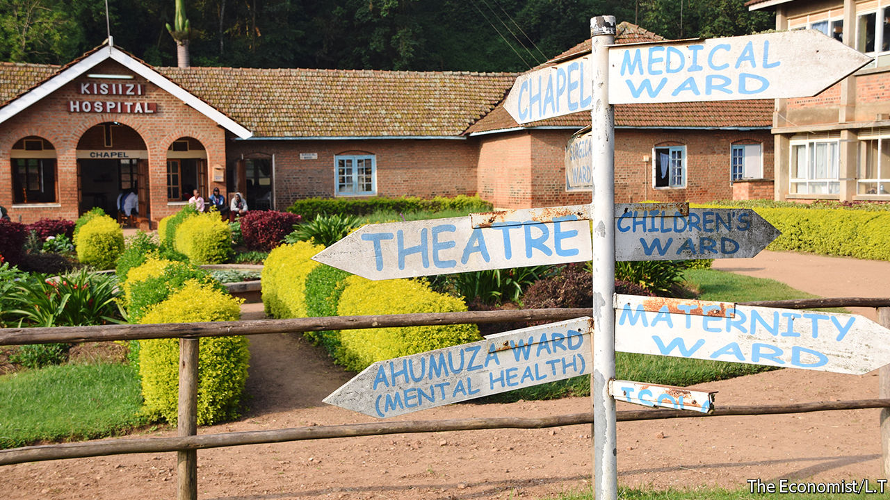

###### Why wait for death?

# How a Ugandan hospital delivers health insurance through burial groups 

##### The insured are healthier, and their finances are too 

 

> Feb 1st 2020 

A  SICK PERSON would once have to sell land or cows to pay hospital bills, says Owen Orishaba, a teacher in the Kigezi highlands of Uganda. But now “a goat can solve your problem.” Four years ago he joined a community health-insurance scheme managed by Kisiizi Hospital, a church-run institution. With 45,000 members, it is the largest of its kind in the country. Its success illustrates a wider truth: to deliver services to poor, rural people, begin with the systems they have built themselves.

In principle, Ugandans can get free health care at public clinics. In practice, government health centres are short of money, medicine and staff. The state accounts for only 15% of health spending, with another 42% coming from donor aid. Almost all the rest comes straight out of people’s pockets at private or faith-based facilities. Uninsured patients sometimes run from their beds to evade bills, says Moses Mugume, an administrator at Kisiizi Hospital. Even as he talks, a tearful woman, who is not in the insurance scheme, is brought into his office after being caught doing so.


How to reduce the burden on patients while generating steadier funding for the hospital? The answer lay in the hills. For generations, villagers had carried the sick down from the steep slopes and thick banana groves on an engozi, a stretcher made from vines and bamboo. They also pooled their savings to cover burial costs and to support bereaved relatives. As Mr Mugume tells it, the hospital went to these informal societies and asked them a question: “Why do you wait for death to occur? Why don’t you prevent death?”

In 1996 the hospital began enrolling engozi groups in health insurance. Group leaders register members and collect premiums, which range from 11,000 to 17,000 shillings ($3-4.50) per person a year. Members make a small co-payment to access services, such as 3,000 shillings for a basic examination or 40,000 shillings to deliver a baby. Chronic conditions are not covered, to keep costs down. Group enrolment is a way to enlist the strong alongside the sickly.

The impacts are not just financial. Patients with insurance are less likely to be admitted to hospital than those without. That is because they show up earlier, when their conditions are more easily treated. A study by Emmanuel Nshakira-Rukundo and colleagues at the University of Bonn estimates that child stunting falls by 4.3 percentage points for every year that a household is in the scheme.

The cost still puts off the very poorest. Only about a quarter of the hospital’s patients are insured. But Kisiizi shows the potential to build on institutions which, as Mr Nshakira-Rukundo puts it, “emanate from a place of social solidarity”. In neighbouring Rwanda five-sixths of the population are enrolled in state-run health insurance delivered through local groups. By contrast the Ugandan government’s plan for a national health-insurance scheme, currently before parliament, says little about community models. Schemes like that at Kisiizi could continue alongside state initiatives, says Walimbwa Aliyi, a health official, but are too thinly spread to be the basis for it.

