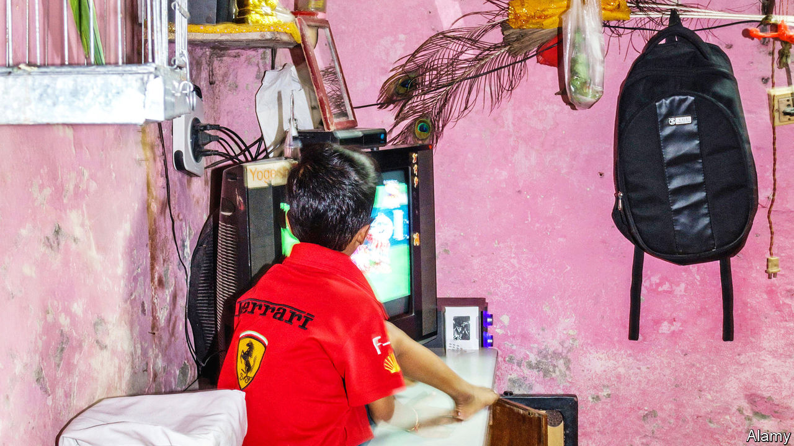

###### Tales of a city

# A mystery that uncovers the underside of modern India 

##### Deepa Anappara’s debut novel is narrated by an ebullient nine-year-old boy 

 

> Feb 8th 2020 

Djinn Patrol on the Purple Line. By Deepa Anappara. Random House; 368 pages; $27. Chatto &amp; Windus; £14.99.

JAI LOVES a mystery. He watches true-crime shows on television, even though his mother says that, at the age of nine, he is not old enough.


He cannot be banished from the television, for Jai lives with his parents and 12-year-old sister Runu-Didi in one room in an unnamed Indian city. There is joy in this small home: “Papa likes to say that this room has everything we need for our happiness to grow.” But then children begin vanishing from the neighbourhood, and Jai decides it is up to him to solve their disappearance.

Deepa Anappara’s debut novel has echoes of others in which children’s curiosity casts light on the prejudices and perils of their society. Harper Lee’s “To Kill a Mockingbird” is the most famous example—Stephen Kelman’s “Pigeon English” also comes to mind—but Jai’s sprightly narrative voice is all his own. As he applies his abundant energy to his self-imposed and secret task, readers get a tour of his city and its residents. The place bears some resemblance to Delhi (where, as in the novel, the metro lines are known by their colours).

As well as Jai’s, Ms Anappara tells the stories of the disappeared: brief, third-person portraits which efficiently sketch lives of a kind that are seldom chronicled in literature. Her prose is full of fine, vivid images. A flush of shame spreads across a character’s chest “as if someone has spilled a hot cup of tea on her”. When Jai senses his mother is upset with him, her “eyes loop me like a red-ink pen around a wrong answer”.

This moving and stylish book pulls off a difficult trick. It is an engaging, amusing tale, powered by Jai’s ebullient personality; at the same time it is an insightful portrait of the underside of 21st-century India. The author worked there as a journalist before settling in Britain and studying creative writing at the University of East Anglia. Her novel was inspired by the struggles she encountered during her reporting (an afterword gives details of children’s-rights charities in India). As Dickens did, Ms Anappara understands the power of fiction to bring alive the plights of people readers might otherwise overlook.

