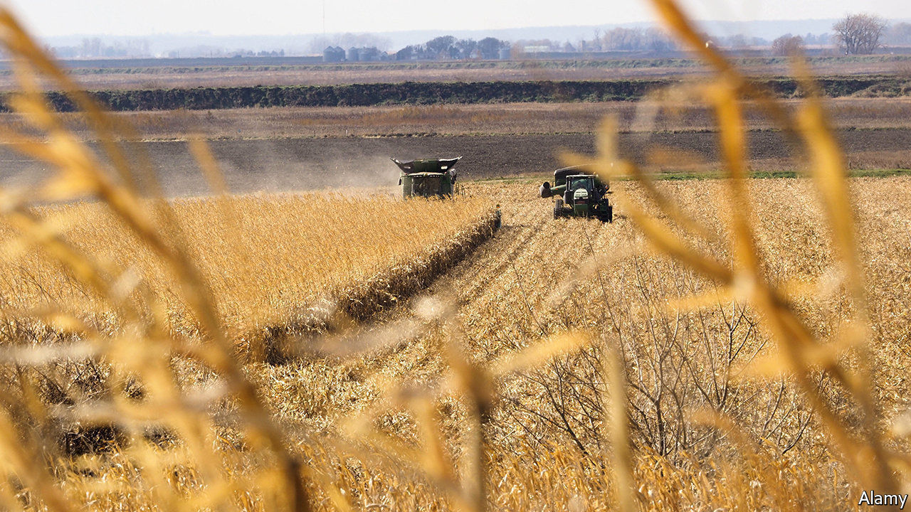

###### As you sow

# How seed-rustling in Iowa fed American fears of China 

##### Mara Hvistendahl’s account of a commercial-espionage scandal reads like a thriller 

 

> Feb 8th 2020 

The Scientist and the Spy. By Mara Hvistendahl. Riverhead Books; 336 pages; $28

IN THE AUTUMN of 2011 two ethnic Chinese men were seen digging up seeds in a cornfield in Iowa. When approached, they sped away in a hired car. A routine report of trespassing quickly spiralled into a long FBI investigation that uncovered a plot by DBN, a Chinese agricultural company, to reverse-engineer seed lines belonging to two American firms, Monsanto and DuPont Pioneer. When the probe became public, America’s media had a field day. “Hey China!” screamed Bloomberg Businessweek. “Stop Stealing Our Stuff.”


Mara Hvistendahl’s compelling account of the drama reads in parts like a spy thriller, replete with car chases, phone-tapping and aerial surveillance as agents track the shovel-carrying suspects across America. The anti-hero is Robert Mo, an American-based Chinese research scientist who took a job with DBN to help pay his mortgage. Pressed into seed-rustling, he darts from field to field, yanking genetically modified strains from the ground, while posing as a grower to buy others from wholesalers for thousands of dollars in cash.

He ends up with almost comically large quantities—wrapped in napkins swiped from Subway or stashed in microwave-popcorn boxes. Some of the seeds are taken to be grown and monitored on a plot in Illinois, conveniently close to Chicago’s international airport. Later arrested and accused of conspiring to steal trade secrets, Mr Mo would plead guilty and serve a three-year sentence. None of his suspected co-conspirators was prosecuted.

As Ms Hvistendahl explains, industrial espionage goes back centuries. Early examples often involved the West stealing from the East, such as undercover efforts to learn about Chinese tea and porcelain production. For much of the 20th century America and Europe worried most about each other’s spies. The idea of China as thief-in-chief is new. So is America’s tough legislation against stealing trade secrets, which was not a federal crime until 1996. Before then it was regulated by state laws and civil suits brought by aggrieved companies.

Fears over Chinese pilfering of intellectual property (IP) and technology have soared under President Donald Trump, fuelling trade tensions and a tech stand-off. In 2018 there was talk in the White House of banning all students from China out of concerns over spying. The recent charging of a Harvard academic for failing to disclose Chinese state funding highlights anxieties about Beijing-backed “talent programmes” at American universities.

But the picture is not as clear as Mr Trump paints it. Both China and America are locked in internal struggles as well as with each other, says Ms Hvistendahl—in China’s case between “the duelling forces of copying and innovation” (it has oodles of its own patents) and in America’s between openness and security. Nor are motives simple to unpick. The seed plot was driven in part by Chinese ambition (to be a world leader in GM crops) but also by fear. Shortfalls of grain to feed their people, as well as poor yields, are a huge food-security headache for Communist Party leaders.

Nor, indeed, is the source and size of the threat always clear. DBN is a private outfit, albeit one with the mission of “rewarding the state with agricultural development”. Some firms have their own incentives to steal; others may be responding to what they see as official incitement, as when President Xi Jinping urged Chinese businesses to master “core technologies”. Not all of these are acquired through subterfuge. In 2016 ChemChina, a state-owned group, paid $43bn for Syngenta, a Swiss seeds-to-pesticides company. Estimates of the scale of Chinese IP theft, which value it as high as $600bn a year, are based on wild extrapolations, Ms Hvistendahl shows.

She also questions whether safeguarding IP is an unalloyed good. Sometimes tight protection may benefit the powerful but hamper innovation. One reason cited for Silicon Valley’s success is its ban on non-compete agreements, which makes it easier for whizzes to start their own firms.

What is clear from this book is that America’s response to China has often been misguided. The FBI and CIA, looking for new threats after the cold war, piled resources into combating economic espionage, often hamfistedly. Ms Hvistendahl describes overzealous investigations that skimped on science and relied on racial profiling. The agencies have yet to eschew the idea that China relies mostly on its vast population, an army of amateur snoops, rather than technology or covert operations. This, she says, is “as if China were to develop a theory of how the CIA functioned based on American individualism”. ■

