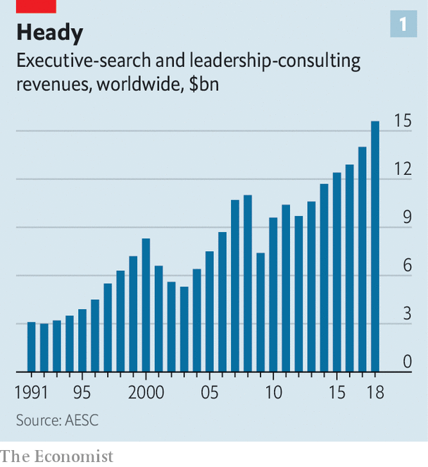
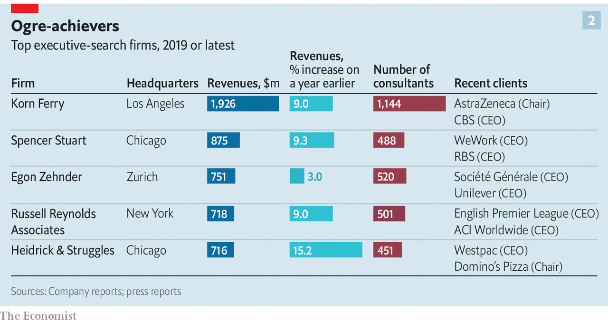
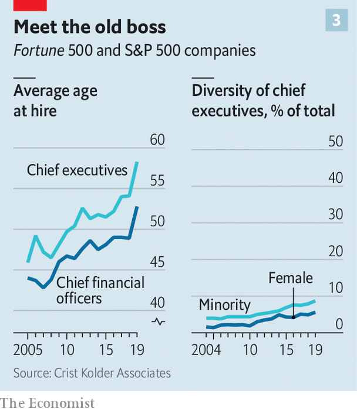

###### Take me to a leader

# Corporate headhunters are more powerful than ever 

##### The benefits of using them are hard to measure. They may be most useful as diplomats 

 

> Feb 6th 2020 

FOR A FEW months last year Matthieu (not his real name) was on the most important team in finance. SWIFT, a global payments-messaging service owned by 11,000 banks, was looking for a new chief. So was CLS, an institution that settles four-fifths of worldwide foreign-exchange turnover. Each had hired Matthieu’s firm to find one. He was aware of the stakes. Both outcomes were going to “impact everything” that money touches, he told The Economist at the time. His voice barely rose over the mellow music of a Manhattan hotel’s bar but nonetheless it carried a bass note of self-importance.

The firm got the job done. Javier Pérez-Tasso, SWIFT’s former Americas head, took over as boss in July. Marc Bayle de Jessé, an official at the European Central Bank, started at CLS in December. The placements testify to the brokering brawn of executive-search firms. The industry’s top tier is busier than ever. The bosses of 311 of America’s 3,600 listed firms left their jobs in 2019—the highest share on record. Someone needs to find their replacements.

 


Like Matthieu, the search industry is secretive, and numbers are hard to pin down. Estimates from AESC, a trade body, suggest that the business has enjoyed strong growth for much of the past 30 years—with the exception of slumps after the dotcom bust in 2000 and the financial crisis of 2007-09 (see chart 1). AESC reckons global executive-search revenues grew by 12% in 2018 and that many firms had their best year ever in 2019 (for which it is still crunching the numbers).


Today, the biggest search firms hold sway over who rules many of the world’s most potent organisations. The best deserve their hefty fees, clients say. But the industry is facing increased scrutiny, amid suspicions that it may be holding back performance and diversity at the top.

Executive search—headhunting, in the vernacular—emerged in the post-war boom, when fast-growing firms in Europe and America began fighting over experienced leaders. The battle intensified in the 1970s as the internationalisation of business turned a consulting backwater into a mainstream profession. One recruiter’s ex-boss recalls opening 30 outposts that decade, from Singapore to Sydney.

Just as quickly, the business earned a reputation for sloppiness. Recruiters were “golf-course, back-slapping sales guys”, as one veteran admits. Candidates in their Rolodexes were lazily recycled. Criteria for drawing up shortlists were often a mystery, says Angeles Garcia-Poveda of Spencer Stuart, a search firm.

Fifty years later they have become tightly woven into the fabric of corporate life, and are seen by most multinationals as indispensable. Five giants—Spencer Stuart, Heidrick &amp; Struggles, Russell Reynolds Associates, Egon Zehnder and Korn Ferry—dominate CEO search. This quintet, known as the “Shrek” firms, earned fees of $4.8bn in 2018, 14% more than the year before and 43% more than in 2014, according to Hunt Scanlon Media, a trade publisher. Spencer Stuart places an executive in a leadership role or boardroom 11 times a day, says Ben Williams, its boss. (The Economist Group has recently employed Egon Zehnder and Heidrick &amp; Struggles to fill senior roles, including CEO and chairman.)

Interviews with more than 50 insiders suggest that 80-90% of Fortune 250 or FTSE 100 companies pay headhunters to find their CEO, even when the successful candidate is likely to come from within a firm’s own ranks. Among the next tier of companies, perhaps half do. Universities, sports clubs and officialdom enlist them, too. Last year their clients included English football’s Premier League and the International Paralympic Committee.

As the big headhunters have grown bigger, boutique firms have struggled to keep up. Nonetheless, some with deep expertise in specific industries or corporate functions have thrived, says Nancy Garrison Jenn, who helps multinationals headhunt the right headhunters. True Search, a tech-focused outfit, saw its revenues jump by 64% in 2018. Lower down the scale, the rise of online social networks has clobbered recruiters specialising in mere mortals like department heads and middle managers—since, as one puts it, “anyone can buy a computer, get a LinkedIn licence and call themselves a search expert”.

The big headhunters have benefited from the confluence of four forces. First, boards are looking for an ever broader skillset in modern CEOs. Bosses should be physically fit to withstand the brutal workload, comfortable dealing with the media and, increasingly, woke. They must grapple with complexity as big firms get bigger and industries converge—giants like Apple or Amazon are at once retailers, consumer-goods companies and tech firms—and with new threats, such as cybercrime.

Second, the rise of private equity (PE) means greater management churn at firms subject to buy-outs. America has some 8,000 PE-backed companies, double the number in 2006. Headhunters hustle in the hope of supplying bosses for PE firms’ entire portfolios. A partner at a buy-out giant says it works with just three providers because it wants VIP treatment.

The third reason for the headhunting boom lies in emerging markets. Scions of business dynasties in places like India increasingly want to devolve control of subsidiaries to professional managers, says Dinesh Mirchandani of Boyden, one of the oldest search firms. Startups like Ola, a ride-hailing firm, are looking for executives to help them conquer foreign markets. China, too, has champions keen to expand abroad but lacks managers with international expertise.

Lastly, boards and regulators are increasingly urging firms to plan for succession years in advance—and not, as in the past, to rely on a name in an envelope, to be unsealed should the boss be hit by a bus. Headhunters gladly help by benchmarking internal stars against potential external candidates. The pressure to plan ahead has led to the growth of all sorts of other ancillary services too, from leadership development to board-effectiveness assessment. Those now account for 43% of revenue at Korn Ferry, the largest Shrek.

Growth in demand has affected headhunting’s supply-side. Nobody has ever studied to become a headhunter but the profession is becoming more diverse. Those serving in its ranks include ex-engineers, a former Olympic gymnast and an erstwhile neuroscientist. The big five are big employers of former McKinsey consultants. New recruits like the fast pace and the opportunity to interact with boards.

They also enjoy the money. A median partner at the Shrek five typically earns $600,000 a year, according to industry veterans. The top 1% get $3m-4m, most of it bonus. Those hiring for finance usually earn the most.

Seven-figure slice

Generous pay comes courtesy of eye-watering fees. For decades headhunters charged one-third of the chosen candidate’s first-year compensation (including any bonus). Caps became more common over the past decade as CEOS’ salaries climbed into the stratosphere, fees more often exceeded $1m—and clients started to rebel. Now fees at the top end are typically limited to between $500,000 and $1m, though the boom in ancillary fees means overall revenues continue to grow fast.

The search for a CEO takes anywhere from 90 days to a year. The board forms a committee to oversee the process, which the headhunter helps shape. It then helps directors crystallise what they want the new boss to achieve, such as boosting profits or expanding into new markets, and draws up a list of required competencies.

Once the actual headhunting begins, recruiters hire armies of researchers to comb through databases containing millions of profiles; gone are the days when a cabinet full of CVs and organograms of superstar firms like IBM would suffice. Lists of candidates who look good on paper are then compared against tips from informants, who are typically former colleagues or chatty middlemen.

To whittle down a longlist of 15 or so people, consultants quiz candidates’ suppliers, clients, ex-bosses and subordinates. They check Glassdoor, a website which lets workers rate employers. The phone is fine, but visits are better—valuable information can emerge in the last minutes of a meeting, or on the way to the lift.

 


It is often only at this point that candidates are contacted. Since the most desirable hires typically already hold plush posts, and are constantly wooed by rival recruiters, headhunters must fight hard for their attention. They look to breakfast regularly with high-fliers, and mark their job anniversaries and dates when bonuses are due—discreet inquiries may elicit news of a disappointing payout, and signal that an executive may be looking for a change. They offer a shoulder to cry on when the going gets tough. Denis Marcadet of Vendôme Associés, a search firm in Paris, remembers humbled financiers weeping for hours in his office during the subprime meltdown.

In interviews headhunters deploy their charms to get candidates to lower their guard. But face-to-face assessment can be “a bit of voodoo”, says one. (It can also go awry if the chemistry is wrong. In his memoir, Robert Iger, Disney’s boss, recalls his interview for the job with Gerry Roche of Heidrick &amp; Struggles as “one of the most insulting experiences of my career” because he viewed the questions as irrelevant and, worse, there was no food.) So recruiters have acquired tools to make it more scientific. They administer psychometric tests. Questionnaires gauge candidates’ norms and values. Synthesis, an advisory firm inspired by the recruitment of elite units in the Israeli army, even has shrinks dissect candidates’ answers to seemingly innocuous questions about their life stories.

Boards or headhunters sometimes outsource deeper probing to specialists such as Hakluyt or StoneTurn, two British firms staffed with former spies, journalists and cops. (Paul Deighton, The Economist Group’s chairman, also chairs Hakluyt.) These corporate sleuths aim to tease out how bosses do deals, how they behave under pressure and whether they have ever crossed any ethical lines.

Simulations are also becoming increasingly popular with clients (if not with candidates). Frontrunners might, for instance, be sent reports about an imaginary company, then asked to run mock board meetings, calm down emotional managers of troubled divisions or weather earnings calls with aggressive analysts.

In the end, though, closing a big deal still often requires the human touch. Jill Ader, the chairwoman of Egon Zehnder, recalls taking an ideal but hesitant candidate off-site for three days to discuss the purpose of his life.

For the headhunters, their candidate’s signature on a new contract equals success. For their clients, it’s more complicated. Plenty of data exist on would-be CEOs. Korn Ferry estimates that 87% of all executives aspire to become bosses; over one-third of applicants had career blow-ups before winning a top role, reckons ghSMART, an advisory firm; and so on. Yet it is trickier to measure the wisdom of choosing one candidate over another; it is impossible to know whether one of the rejected candidates might have done the job better.

Getting it wrong can be costly. The Conference Board, a think-tank, finds that the costs of changing bosses (severance, search, lost productivity during the transition, and so on) are generally equivalent to 5% of annual profit.

Lacking objective measures on which to judge headhunters’ performance, board members often rely on their own impressions. And although some praise the service they receive, among others frustration is mounting.

Plenty of the things that hamper the industry are no fault of its own. Many companies make exasperating demands of headhunters and candidates. Some, for instance, want would-be CEOs to have a tête-à-tête with each member of the board, which in America and Britain typically numbers at least ten people. They may also demand regular testing of in-house candidates, which can poison a firm’s internal politics. Others request assessments that seem bizarre to candidates. After being asked to take a graphology test, one contender for the top job at Alstom, a French engineering giant, asked sarcastically if he would also be subjected to an intrusive medical examination, recalls a recruiter.

Another problem stems from contracts that bar headhunters from poaching people from firms they have previously recruited for, usually for at least a year. As the Shrek firms grow, in other words, their hunting-ground shrinks. It is clients who demand such clauses, but it does not stop those shortchanged by them from getting irate. “They tell me the candidates aren’t there,” fumes an executive who has chaired several companies. “Then I find there’s an ideal candidate at PepsiCo, but they already work for PepsiCo so they can’t touch it.”

Some of the big recruiters’ problems, though, are of their own making. Growth, especially at the Shreks, also leaves senior partners with less time for any one client. They jet around to sign contracts, but leave underlings who have less access and experience to do most of the heavy lifting. Moreover, since the rainmakers pocket the largest cut of the fee, their subordinates have less incentive to do a fine job. “Clients pay for haute couture but they get prêt-à-porter,” says a former chief of a Shrek firm.

And although headhunters have grown less languorous since the easy-going 1970s, in one way they remain as lazy as before: many still seek to score easy wins by rehashing past work. A PE partner recounts being sent the same shortlist for two different finance-chief searches. A disproportionate share of CEOs are old-timers from a handful of blue chips, not all of which have had a stellar run (think of GE, several of whose past executives went on to Boeing).

 


Senior headhunters admit the industry is sometimes too quick to recommend the safe option when boards are reluctant to gamble on unconventional candidates. Despite progress in recent years, just 38 of the bosses of America’s 675 largest listed firms are women, and 59 non-white. It has grown harder for bright young things to get a look in. The average age of incoming CEOs has risen sharply, to 58, since 2005 (see chart 3). A survey by AESC, which represents 16,000 search professionals, ranks “attracting diverse talent” as the seventh-most-pressing issue for their firms in 2019, behind such things as “attracting digital talent” or “creating a culture of innovation”.

The search within

Growing doubts about the value headhunters bring has led some clients to take the work in-house. An expanding list of corporate titans, including all of the tech giants, are building private squads of headhunters—often by poaching from the Shrek firms. Having focused at first on junior hires, these are working their way up to the C-suite, says Ms Garrison Jenn.

 


Some company chairmen may wonder why they need an outside recruiter at all, when the ideal candidate is often staring them in the face. A recent Conference Board survey of executives and corporate secretaries found that 73% thought there was no need for a firm with a strong internal candidate for CEO to conduct an outside search. There appears to be no shortage of such talent within. Last year almost four-fifths of new S&amp;P 500 bosses came from inside the firm, including that of Intel, a chipmaker. IBM recently picked the head of its cloud division to replace Ginni Rometty.

Yet most large companies will continue to use search firms—even if they do not fully buy the science, or harbour other doubts. That is because external validation has a value all of its own. Recruiters can be crucial in helping build consensus when, as is so often the case, boards are split. It is as diplomats that the best headhunters earn their keep.■

