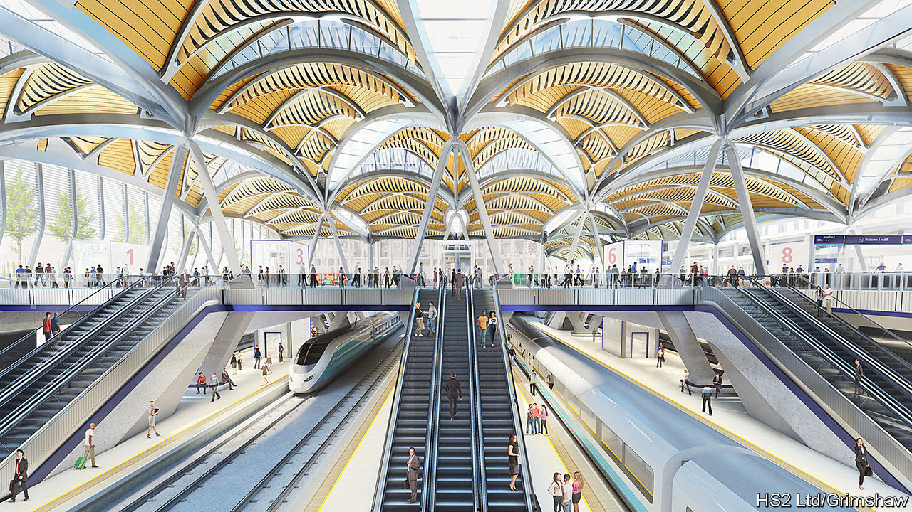

###### Urban infrastructure

# How HS2 will transform a forlorn part of London 

##### Euston, we have a solution 

 

> Feb 8th 2020 

WHEN EUSTON STATION was built in 1837 it was an elegant terminus for the London and Birmingham Railway, with a much-admired Doric arch at its entrance on Drummond Street. But all that was knocked down half a century ago, to be replaced by a concrete carbuncle that destroyed the arch and chunks of nearby streets and has been making commuters miserable since 1968. Now HS2, whose terminus is at Euston, offers a chance to remedy those errors.

Unlike the redevelopments of London’s grand Victorian stations, Euston is not hampered by heritage concerns. Last month Camden council, within whose boundaries the station wholly lies, published a draft planning brief, which envisages up to 3,800 new homes, a quarter of a million square metres of commercial space and as many as 14,000 new jobs in a project that has the potential to become not only a massive transport hub but also what the plan calls “a new piece of the city”.


Partly because the station has blighted the area, Somers Town—jammed between Euston to the west, St Pancras to the east and the roaring traffic of the Euston Road to the south—is among the most deprived neighbourhoods in England. A woman born there can expect to live a decade less than her counterpart in leafy Hampstead, three miles to the north. Those leaving the station to its east are greeted by a row of porn shops.

The plan imagines green spaces, housing, offices and retail above the new station, as well as building over exposed, below-street-level tracks that extend north for nearly a mile. It foresees bringing back the ancient street pattern to reconnect Somers Town and Regent’s Park with pedestrian and cycle routes over the roofs of the stations. Camden council has experience in such matters. The redevelopment of King’s Cross, a nearby station, transformed a huge chunk of derelict land into a vibrant quarter of the city. Google is building its London headquarters there.

Like that project, Euston will involve multiple agencies, ministries and companies working together. Unlike it, Euston will prioritise what Danny Beales, a Camden councillor, calls “inclusive retail”—or shops that sell things Somers Town residents can actually afford. King’s Cross may be great for boutiques, but it is rubbish for daily necessities. If all goes to plan, few will lament the disappearance of 20th-century Euston, as they did the 19th-century version.

