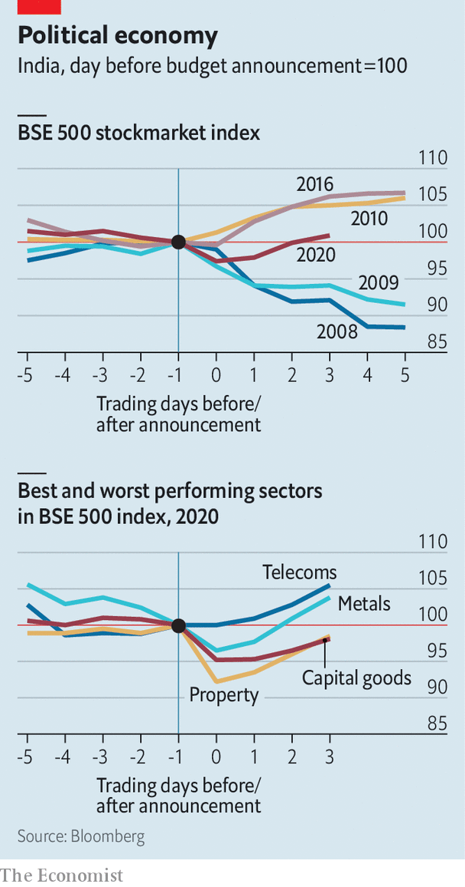

###### Buy and sell tax-and-spend

# Why India’s annual budget is a powerful market force 

##### Each year bosses and investors are glued to TV screens to learn whose business found favour and whose fell out of it 

 

> Feb 8th 2020 

IN MOST BIG economies the government’s budget plans seldom drive large movements in the stockmarket. Except in India. Bosses and investors parse the documents for clues about which industries or firms gained favour and which fell out of it. Markets react accordingly. In February 2008 the Mumbai bourse’s main index fell by 12% in five days after India’s then-rulers were perceived to have responded inadequately to the global financial crisis. This year’s budget came on February 1st, a Saturday. Stockmarkets held a special weekend session. Bosses and investors were glued to TV screens as the finance minister, Nirmala Sitharaman, recited the provisions—until, after a record two hours and 41 minutes, she was too exhausted to go on.

 


The viewers apparently felt as deflated; share prices sagged. New duties were imposed on, among others, paper clips, crockery, fridge compressors and circuit boards, and lifted on thoroughbred horses, for example. Over the next three days shares rebounded, perhaps out of optimism that measures such as the sale of state assets might actually come to pass for once. ■

