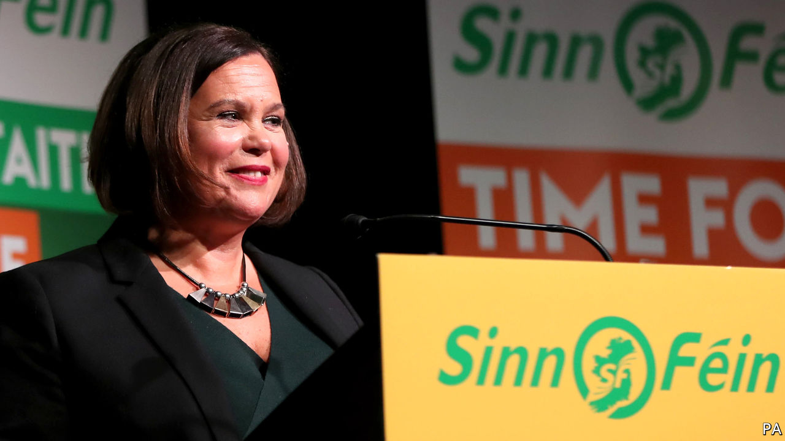

###### From handguns to handouts

# The rise of Sinn Fein, an Irish party that once espoused violence 

##### Young voters like its promises of free money 

 

> Feb 8th 2020 

NOT SINCE the days of Eamon de Valera has Ireland had a leader as globally recognisable as Leo Varadkar. Both men owe their prominence to vexed Irish relations with Britain. De Valera emerged as the senior surviving leader of the Easter uprising against British rule in 1916. Mr Varadkar rallied EU support in a stand-off with Boris Johnson over the terms of Brexit last year.

Yet whereas de Valera spent half a century in and out of high office, building modern Ireland in the process, Mr Varadkar faces the sack. Polls suggest that his centre-right Fine Gael party will slump to third place in an election on February 8th, falling behind not only its traditional rival, Fianna Fail, another party of the centre-right, but also Sinn Fein, the shock leader. If so, it would be the first time since the 1930s that Fianna Fail and Fine Gael have not been the top two.


Mr Varadkar’s career may have peaked at the tender age of 41, less than three years after he became not only Ireland’s youngest ever taoiseach (prime minister) but also its first openly gay one, and the first to have non-European heritage (his father, a doctor, is originally from Mumbai).

Fine Gael had based its re-election campaign on Mr Varadkar’s success in negotiating a deal with Britain over Brexit and on GDP growth of almost 5% last year, compared with 1.8% for the rest of the EU. But, says Professor Jane Suiter of Dublin City University, a series of unfortunate events have interfered with Mr Varadkar’s plans. Voters fret about a health service near collapse, and a cost-of-living and housing crisis. Ireland has some of the highest rents in the world, and soaring homelessness.

Theresa Reidy of University College Cork says that conservative voters who want to punish the government can look to Fianna Fail’s Micheal Martin as another leader who would probably do a similar job to Mr Varadkar. Since 2016 Fianna Fail has supported Fine Gael’s minority government in a confidence-and-supply arrangement that it is now tired of.

Angry younger voters are turning to a range of green and centre-left parties, but most of all to Sinn Fein. Formerly the political wing of the Provisional Irish Republican Army (IRA), the party is led by Mary Lou McDonald, a personable Dubliner with no history of involvement in the IRA. The other two big parties have both pledged to shun Sinn Fein for its past support for violence, but making a government without it will be hard, since Fianna Fail has vowed not to continue its arrangement with Fine Gael. Most of Sinn Fein’s policies are well to the left. It promises a rent freeze, earlier retirement and lavish public spending on nearly everything. It is also committed to a referendum on uniting Ireland.

“Sinn Fein have never been in government in Dublin before, so they are not held responsible for the present problems in the way that Fianna Fail and Fine Gael are,” says Ms Reidy. ��They are responsible for some other things, for sure, which is why older people, who remember the Troubles, aren’t flocking to them in the same numbers. But young people don’t remember that. And [they] are the ones who can’t afford to buy or rent homes, and who are being quoted €3,000 for car insurance.”■

