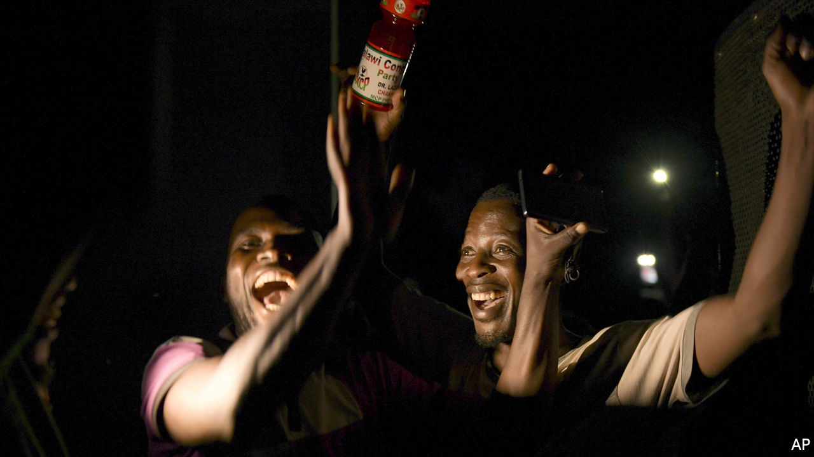

###### Let’s do this again

# A historic day for Malawi’s democracy 

##### For only the second time in African history, judges nullify a flawed general election 

 

> Feb 8th 2020 

THERE ARE many ways to rig an election. Voters can be beaten or bribed. Ballot boxes can be stuffed. Computers tallying results can be hacked. But few methods are more rudimentary than that used last year in Malawi’s general election. In the southern African country of 18m people the dastardly tool was Tipp-Ex, the correction fluid that has saved many a teenager’s error-strewn homework.

On May 27th the Malawi Electoral Commission (MEC) announced a victory for the 79-year-old incumbent president, Peter Mutharika. The MEC said it had received 147 reports of “irregularities”, including the use of Tipp-Ex on results sheets, but refused to call for another vote. Opposition candidates petitioned the country’s constitutional court, asking judges to nullify the election. Protesters, many of them young Malawians born after the end of dictatorship in 1994, took to the streets to keep up the pressure on the bench.


It worked. On February 3rd the court said there had been “widespread, systematic and grave” flaws in the electoral process. It ordered a re-run of the general election to be held within 150 days. For months millions of Malawians have followed the twists and turns of the case live on radio broadcasts—but few could have hoped for such a decisive verdict.

The judgment is a historic moment for one of the world’s poorest countries. Income per person is just $389 a year according to the World Bank, a quarter of the amount in neighbouring Zambia. The flawed democracy that replaced the one-man rule of Hastings Banda has done much to enrich an elite, but little to lift the vast majority out of poverty. The hope is that the court’s verdict ushers in a new era in which politicians must govern well rather than cheat to stay in power.

Malawi’s case matters beyond its borders. African courts and international election observers have a history of accepting suspicious results. Last year, for example, the constitutional court in the Democratic Republic of Congo affirmed that Félix Tshisekedi had won the presidency fairly despite bucketloads of evidence to the contrary. Regional political organisations have proved similarly short of backbone. The invertebrate Southern African Development Community quickly endorsed Malawi’s election, echoing its hurried acceptance of Zimbabwe’s iffy count in 2018.

A single verdict will change only so much. But the Malawian judgment follows that of Kenya’s Supreme Court, which in 2017 declared void the victory of President Uhuru Kenyatta. “Two African courts have now set tougher standards for elections than international election observers,” says Nic Cheeseman, an expert in African politics at the University of Birmingham. In doing so they have made it a little more difficult for politicians to rig elections.

Malawians will hope that the aftermath of their historic court verdict is smoother than it was in Kenya. Raila Odinga, Kenya’s main opposition leader, boycotted the re-run, citing yet more irregularities. In Malawi there are obstacles to a clean and peaceful second vote: the MEC will need new leadership, and Mr Mutharika says he will appeal the court’s decision.

For now, though, Malawians are proud that the rule of law has prevailed. The verdict shows that though Tipp-Ex may hide the truth, it cannot erase it. ■

